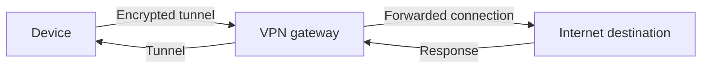

# Virtual Private Networks (VPNs)

A virtual private network (VPN) creates a tunnel between a device and a VPN gateway. The device routes selected traffic through the tunnel; the gateway forwards that traffic to destinations. The tunnel protects traffic between the device and gateway from local-network observers, but it shifts trust to the VPN operator and does not make a user anonymous.

## Basic Traffic Flow

The destination generally sees the VPN gateway's public egress address for tunneled traffic. The VPN operator can observe the source address connecting to the gateway and may see destination or DNS metadata, depending on the protocol, DNS configuration, and end-to-end encryption.

## Full-Tunnel and Split-Tunnel Routing

- **Full tunnel:** Routes the default internet route through the VPN. This provides broader coverage but can add latency and centralize more traffic at the gateway.
- **Split tunnel:** Routes only selected networks, apps, or destinations through the VPN. It can improve performance and preserve local access, but non-tunneled traffic intentionally uses another path and must not be mistaken for a leak.

The security question is not simply “Is the VPN connected?” It is “Which routes, protocols, apps, DNS queries, and address families are actually covered?”

## Common Leak Types

| Leak | Why it happens | What to check |
|---|---|---|
| IPv4 leak | A route or app bypasses the tunnel, or fallback occurs during reconnect | Public IPv4 from apps expected to be tunneled |
| IPv6 leak | VPN lacks IPv6 routing or blocks only IPv4 | Public IPv6 while connected |
| DNS leak | DNS goes to the local/ISP resolver or a separately configured resolver | Resolver path and configured DNS behavior |
| WebRTC leak | Browser ICE traffic or candidates use a path not protected by the VPN | WebRTC candidates and peer connection behavior |
| Disconnect leak | Traffic resumes over the ordinary interface when the tunnel drops | Behavior during interruption and reconnect |

## How to Avoid VPN IP Leaks

1. Use a maintained VPN client and enable its always-on, network-lock, or kill-switch feature where available.
2. Prefer a provider and configuration that explicitly support IPv6. If IPv6 is not supported, use a deliberate block while connected rather than assuming IPv4 routing also covers IPv6.
3. Configure DNS to use a resolver reachable through the tunnel. Check browser-level DNS-over-HTTPS separately; it can use a different resolver from the operating system.
4. Review split-tunnel rules, excluded apps, local-network exceptions, and per-app VPN settings.
5. Check WebRTC in the browser. Ensure the VPN protects its network path, or use an appropriate TURN-relayed call configuration when hiding the endpoint from a peer is required.
6. Test failure behavior. A kill switch should block traffic that is supposed to stay private while the tunnel is down; it should not silently fall back to the ISP route.
7. Repeat tests after VPN, operating-system, browser, or network changes.

Disabling IPv6 globally can break services and is not the preferred first fix. Prefer a VPN that supports IPv6; if that is unavailable, apply a documented block only in the relevant connected state and verify that reconnect and disconnect behavior remain safe.

## How to Check for Leaks

1. Note the normal public IPv4 and IPv6 addresses and DNS behavior before connecting.
2. Connect the VPN and verify the public addresses from a browser and any important app. The observed addresses should match the VPN exit or the configured split-tunnel policy.
3. Check DNS independently. A resolver's displayed country or organization is not definitive proof, so compare it with the provider's documented DNS configuration.
4. Run a WebRTC leak test or inspect ICE candidates. Check for an unintended ISP public address; understand that private candidates or mDNS names are not equivalent to a public IP leak.
5. Briefly interrupt the VPN in a controlled environment. Protected traffic should stop if the expected policy is fail-closed. Check again after reconnection.

Do not use sites that ask for credentials or installation of unknown software to perform a leak test. A test website itself can see the public address used to reach it.

## What a VPN Does Not Solve

- HTTPS is still important: VPN encryption usually ends at the VPN gateway, not at the destination.
- Websites can recognize signed-in accounts, cookies, device/browser fingerprints, and behavior.
- A VPN operator may be able to associate a tunnel with a source network and observe metadata.
- Malware, compromised devices, and application-level data sharing are not fixed by tunneling.
- A VPN does not guarantee that every protocol or app uses the tunnel; routes and exceptions determine coverage.

## Advantages and Trade-offs

### Advantages

- Protects traffic on the local link between device and gateway.
- Can provide broader app and protocol coverage than an application proxy.
- Can connect users to private organizational networks.
- Can centralize access policy and egress routing.

### Trade-offs

- Adds a trusted operator or gateway that can observe connection metadata.
- Adds latency, bandwidth overhead, and potential availability dependency.
- Split routes, IPv6, DNS, and reconnect behavior require careful configuration.
- A consumer privacy VPN does not replace organizational access controls or endpoint security.

## Interview Questions and Answers

### Q1: What does a VPN hide from a local Wi-Fi operator?

* **Answer:** A correctly configured VPN hides the contents of tunneled traffic and its destination details to the extent those details are protected by the tunnel. The local operator can still see that the device connects to a VPN gateway, along with timing and volume metadata.

### Q2: What does a destination see when traffic uses a VPN?

* **Answer:** The destination normally sees the VPN gateway's egress IP. If the application bypasses the tunnel, the destination may see the device's ordinary public IP instead.

### Q3: What is the difference between full-tunnel and split-tunnel VPN?

* **Answer:** Full-tunnel routing sends the default route through the VPN. Split tunneling sends only specified traffic through it. Split tunneling can improve performance or allow local access, but requires explicit decisions about traffic that stays outside the tunnel.

### Q4: What is a VPN kill switch?

* **Answer:** A kill switch blocks traffic that is expected to be tunneled when the VPN is unavailable, instead of allowing it to fall back to the ordinary network. Its exact scope varies by client, so interruption behavior should be tested.

### Q5: How can IPv6 cause a VPN leak?

* **Answer:** A device may have both IPv4 and IPv6 connectivity. If the VPN tunnels IPv4 but leaves IPv6 routed through the ISP, a destination supporting IPv6 can see the ISP-assigned IPv6 address. The VPN must support IPv6 or deliberately block it while connected.

### Q6: Does a VPN prevent WebRTC leaks?

* **Answer:** Not automatically. It depends on whether the VPN routes the WebRTC traffic and how the browser exposes ICE candidates. Verify WebRTC behavior while connected instead of inferring it from a successful public-IP check.
