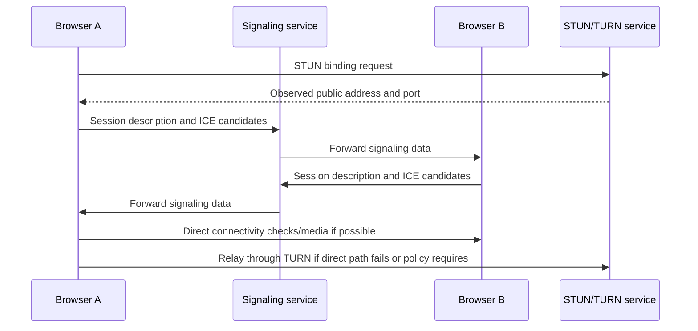

# WebRTC and IP Address Exposure

Web Real-Time Communication (WebRTC) is a set of browser and application technologies for real-time audio, video, and data connections. It is designed to find a usable network path between peers, often across NAT devices and firewalls. That path discovery can reveal network addresses that ordinary HTTP requests do not expose.

## WebRTC Connection Setup

WebRTC commonly uses Interactive Connectivity Establishment (ICE) to gather and test possible connection paths. A signaling service exchanges session descriptions and candidates between peers; media may then flow directly between peers or through a relay.

The signaling server does not necessarily carry media. It helps peers exchange the information needed to negotiate a path.

## ICE Candidate Types

| Candidate type | What it represents | Address visibility |
|---|---|---|
| Host | An address on a local network interface | May identify local network details; browsers commonly use mDNS names to obscure host addresses from web pages |
| Server-reflexive (`srflx`) | A public address and port observed by a STUN server | Can reveal the public address used to reach the STUN server |
| Relay (`relay`) | An address allocated on a TURN relay | The remote peer can connect to the relay instead of directly learning the endpoint's address |

Candidate exposure depends on browser implementation, permissions, network topology, VPN routing, and application policy. Modern browsers apply privacy mitigations such as mDNS host candidates, but this does not mean every public address is always hidden or all WebRTC packets use a proxy.

## What Is a WebRTC Leak?

A WebRTC leak is an unintended disclosure of a network address through candidate gathering or connectivity checks when a user expects the address to remain hidden behind a proxy or VPN. For example:

1. A browser loads a page through an HTTP proxy, so ordinary page requests use the proxy's egress IP.
2. Page code creates a peer connection, which gathers ICE candidates.
3. A candidate or direct connectivity check uses a network path outside the proxy.
4. A page, signaling service, or peer may learn an address associated with that direct path.

This does not mean every site can always retrieve every address. Browser privacy changes, candidate policy, permissions, and routing affect what is exposed. The key risk is the mismatch between the expected protected path and the actual WebRTC path.

## Example: Direct Peer vs. TURN Relay

Two browsers behind NAT may use STUN-discovered public candidates and attempt a direct peer connection. If direct connectivity succeeds, each peer can observe the address used for that path. With TURN relay-only policy, each browser sends media to a TURN server and the peer connects to the relay instead. This can hide each endpoint's network address from the other peer, while the TURN operator still handles the relayed traffic and can observe its own connection metadata.

TURN relaying can increase latency, bandwidth consumption, and service cost. It is appropriate when an application requires relay-only connectivity or direct peer address concealment; it is not automatically necessary for every call.

## How to Reduce WebRTC IP Exposure

- Use a VPN that routes the browser's WebRTC traffic and has effective IPv4, IPv6, and disconnect protections; verify this with a test.
- Prefer browsers with current WebRTC privacy protections and keep them updated.
- For an application that must conceal peer addresses, use a trusted TURN service and configure relay-only ICE transport where the application supports it.
- If WebRTC is not needed, disabling it can reduce exposure but will break video calls, voice chat, and other WebRTC features. Prefer a targeted application policy rather than a blanket browser change when possible.
- Do not rely on an HTTP proxy alone to cover WebRTC; verify UDP routing and candidate behavior.
- Avoid untrusted extensions that promise to “fix” WebRTC without explaining their permissions and limitations.

## How to Check for WebRTC Leaks

1. Record the public IPv4/IPv6 addresses with the VPN or proxy disconnected.
2. Connect the intended proxy/VPN and confirm ordinary requests use its expected egress.
3. Visit a trusted WebRTC leak test or a test page that displays ICE candidate types. Check whether an unintended ISP public address appears.
4. Distinguish private host candidates and mDNS names from public ISP addresses. A private candidate does not by itself prove the public IP leaked.
5. Check IPv4 and IPv6, and repeat after VPN reconnects, browser changes, or switching networks.
6. If peer privacy matters, validate a real call configured for TURN relay-only; a generic browser test cannot prove every application uses the same transport policy.

A WebRTC test page can receive the candidate information it displays. Do not paste candidate strings, screenshots, or public addresses into public forums.

Browser diagnostics can help inspect a test call without relying only on an external test page. Firefox provides `about:webrtc`; Chromium-based browsers provide `chrome://webrtc-internals`. Their details can include candidate addresses, so treat exported logs as sensitive and share them only after reviewing and redacting them.

## Advantages and Trade-offs

### Advantages

- Enables low-latency voice, video, and data communication in browsers.
- Can connect peers directly when network policies permit.
- ICE can select among multiple paths to improve connectivity.
- TURN relays allow communication when direct connectivity is blocked.

### Trade-offs

- Candidate gathering can expose addresses or network topology.
- Direct connections can reveal endpoint network addresses to peers.
- TURN relaying adds bandwidth cost and may add latency.
- Privacy mitigations and routing differ across browsers and applications.
- Disabling WebRTC reduces functionality and is not a substitute for secure routing.

## Interview Questions and Answers

### Q1: What is WebRTC used for?

* **Answer:** WebRTC provides real-time audio, video, and data communication between browsers or applications, with ICE for path discovery and STUN/TURN commonly used to traverse NATs and relays.

### Q2: What is an ICE candidate?

* **Answer:** It is a possible network address and transport path that a peer can try when establishing a connection. Candidates can represent local host addresses, public addresses observed through STUN, or relay addresses allocated by TURN.

### Q3: What roles do STUN and TURN play?

* **Answer:** STUN helps a client discover the public address and port observed by an external server. TURN relays traffic when direct connectivity is unavailable or when policy requires relaying. STUN does not itself relay media.

### Q4: Why can WebRTC reveal an IP when a proxy is enabled?

* **Answer:** A browser proxy usually configures HTTP traffic, while ICE connectivity checks may use UDP or other paths not handled by that proxy. Candidate gathering can therefore expose addresses from a direct interface or route.

### Q5: How can an application hide a peer's address?

* **Answer:** Configure the application to require TURN relay candidates and avoid direct peer connectivity, where supported. The remote peer then connects to the relay instead of the endpoint, though the TURN operator still handles the traffic and relay use adds cost and latency.

### Q6: Does a private candidate mean the public IP leaked?

* **Answer:** No. A private host candidate can reveal local-network information but is not a globally routable public address; modern browsers may represent it using an mDNS name. Evaluate public server-reflexive candidates and actual route behavior separately.

### Q7: Should a browser user always disable WebRTC?

* **Answer:** No. Disabling it breaks real-time communication features. Prefer updated browser privacy protections, correct VPN routing, and TURN-relay policy when peer address concealment is a requirement.
