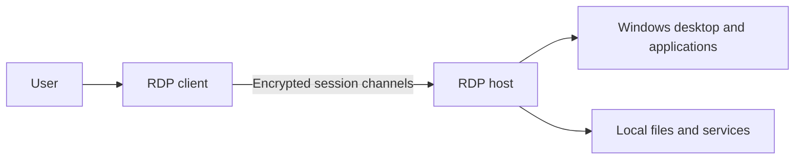
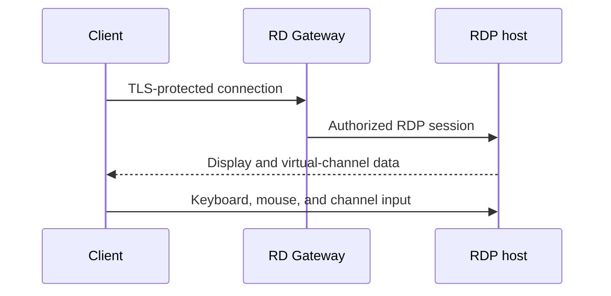
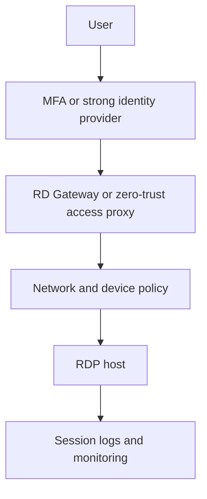

# RDP: Remote Desktop Protocol

RDP lets a client interact with a remote Windows desktop or application session. It carries display, keyboard, mouse, clipboard, device, audio, and other session data through protocol channels.

## Why RDP Was Born

Organizations needed centralized Windows applications and desktops that users could access remotely. RDP moves presentation and input across network while computation runs near remote data and applications.

## Core Architecture

RDP supports multiple virtual channels for different traffic:

- Display updates
- Keyboard and mouse input
- Clipboard
- Audio
- Printer and drive redirection
- Licensing
- Device and application channels

This differs from a protocol that only sends raw screen pixels. The server can use knowledge of Windows graphics and session features to optimize interaction.

## When Use RDP

- Windows server administration
- Remote employee desktops
- Published applications
- Help desk support
- Centralized workloads in data centers
- Remote access through Remote Desktop Gateway

## Authentication and Transport

RDP deployments commonly use Windows authentication and can use Network Level Authentication (NLA), where authentication occurs before a full desktop session is created. RDP traffic should be protected with TLS or an approved secure transport and controlled through gateway or private-network access.

Never treat TCP port `3389` being reachable as a security design. Public exposure increases brute-force, credential theft, and vulnerability risk.

## Performance

RDP performance depends on:

- Resolution and display count
- Image and video activity
- Available bandwidth
- Latency and packet loss
- Client hardware
- Redirection settings

Disable unnecessary drive, printer, clipboard, audio, and device redirection when security or bandwidth matters.

## RDP Session Types

- **Remote desktop session:** user controls a desktop on remote host.
- **RemoteApp:** user sees a published application rather than a full desktop.
- **Administrative session:** controlled management access for authorized administrators.
- **Virtual Desktop Infrastructure:** brokered desktops hosted centrally.

## Security Architecture

Controls:

- NLA
- MFA
- Network Level access restrictions
- Just-in-time administrative access
- Privileged access workstations
- Patch management
- Session timeout and lock policy
- Clipboard and drive redirection restrictions
- Centralized audit logs

## Pros

- Strong Windows integration
- Rich virtual channels
- Supports centralized desktops and applications
- Often efficient for business interfaces
- Integrates with enterprise identity and policy

## Cons

- Windows-centric
- Configuration can expose sensitive redirection paths
- Public exposure creates high attack value
- Licensing and infrastructure cost
- Session brokers, gateways, and profiles add operational complexity

## Cost

Cost includes Windows licensing, Remote Desktop Services or virtual desktop licensing, host capacity, gateway infrastructure, identity controls, monitoring, and support. Bandwidth and concurrent-session capacity determine infrastructure sizing.

## Interview Questions and Answers

### Q1: RDP versus VNC?

* **Answer:** RDP provides a richer Windows-aware session with virtual channels for display, input, audio, clipboard, devices, and applications. VNC commonly transfers framebuffer changes and input events, making it broadly cross-platform but often less integrated.

### Q2: What is Network Level Authentication?

* **Answer:** NLA authenticates the user before creating a full remote desktop session. This reduces exposure to unauthenticated session creation and saves resources, but it does not replace patching, MFA, authorization, or network controls.

### Q3: Why is exposing RDP port 3389 dangerous?

* **Answer:** Internet exposure makes the service a target for password spraying, brute force, stolen credentials, exploit attempts, and denial-of-service activity. Put RDP behind a VPN, RD Gateway, or controlled zero-trust access path.

### Q4: Why disable clipboard and drive redirection?

* **Answer:** Redirection creates data paths between local and remote environments. It can enable data theft, malware transfer, or accidental disclosure. Disable unused channels and allow only business-required paths.

### Q5: How improve poor RDP performance?

* **Answer:** Measure latency, packet loss, bandwidth, host CPU, and session count. Reduce visual effects and resolution, limit redirection, use a nearby host or gateway, avoid congested paths, and verify host resource capacity.

## References

- [Microsoft Learn: Understanding Remote Desktop Protocol](https://learn.microsoft.com/en-us/troubleshoot/windows-server/remote/understanding-remote-desktop-protocol)
