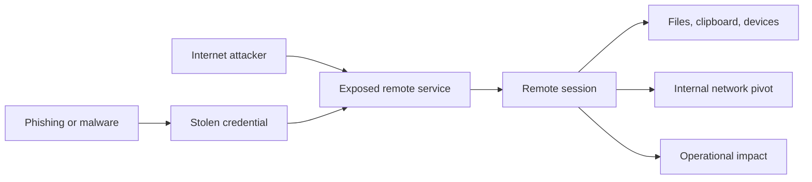
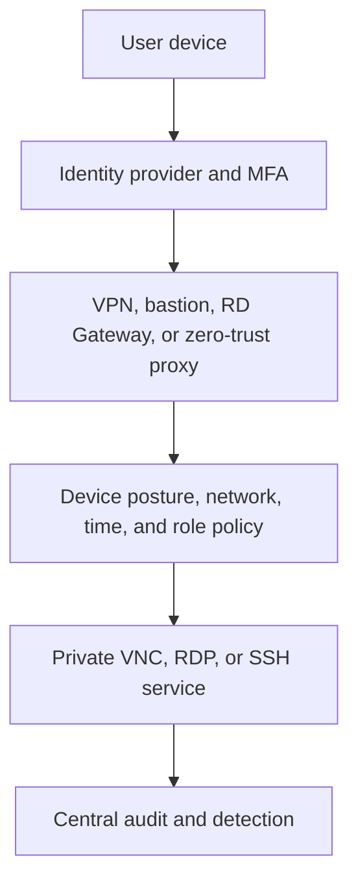

# Remote Access Security: Securing VNC, RDP, SSH, and Other Remote Sessions

Remote access is powerful because it crosses trust boundaries. A compromised remote-access account can expose desktops, servers, credentials, internal networks, and production systems.

## Threat Model

Main risks:

- Credential theft and password spraying
- Unpatched protocol or gateway vulnerabilities
- Man-in-the-middle attacks from unverified server identity
- Excessive privileges
- Clipboard, drive, printer, and device data leakage
- Session hijacking or unattended sessions
- Lateral movement after initial access
- Weak logging and delayed detection

## Secure Architecture

Do not expose VNC, RDP, or SSH directly to the public internet unless risk is explicitly accepted and controls are strong. Prefer layered access:

## Control 1: Strong Identity

- Use phishing-resistant MFA where possible.
- Prefer SSH keys or certificates over passwords for automation.
- Use separate admin identities.
- Disable inactive accounts.
- Apply least privilege.
- Rotate secrets and revoke lost credentials.
- Prevent shared accounts when individual accountability matters.

MFA lowers credential-reuse risk but does not fix excessive authorization or compromised endpoints.

## Control 2: Network Exposure

- Keep remote services on private networks.
- Allow only approved source networks or access gateways.
- Use firewall rules and security groups.
- Put internet-facing access behind hardened gateways.
- Restrict east-west movement after login.
- Use short-lived, just-in-time access for privileged work.

Port hiding is not security. Changing SSH or RDP port may reduce noise but does not replace authentication, patching, and access control.

## Control 3: Encryption and Identity Verification

Encryption protects confidentiality and integrity in transit. Authentication verifies who is on the other side.

- Verify SSH host keys.
- Validate TLS certificates.
- Use modern protocol versions and approved ciphers.
- Avoid plain FTP and unencrypted remote desktop variants.
- Do not disable certificate or host-key warnings as a routine workaround.

## Control 4: Session Restrictions

Disable features not needed:

- Clipboard
- Drive mapping
- Printer mapping
- USB or smart-card redirection
- Local file transfer
- Audio and camera redirection
- SSH agent forwarding
- SSH port forwarding

These features can be legitimate, but every channel expands data-exfiltration and lateral-movement paths.

## Control 5: Endpoint and Server Hardening

- Patch operating system, client, server, gateway, and protocol implementation.
- Enable host firewall.
- Remove unused remote services.
- Use endpoint detection and response.
- Lock screen after inactivity.
- Limit concurrent sessions.
- Block direct root or administrator login where policy allows.
- Restrict service accounts from interactive login.

## Control 6: Monitoring and Response

Log:

- Authentication success and failure
- Source address and device identity
- MFA decisions
- Session start and end
- Privilege changes
- File transfer and redirection events
- Command execution for SSH
- Gateway policy decisions

Alert on password spraying, impossible travel, new source countries, unusual login times, privilege escalation, mass file transfer, and repeated failed access.

## Protocol-Specific Baseline

| Protocol | Baseline controls |
|---|---|
| VNC | Private network, encrypted tunnel, strong authentication, no public exposure, session logging |
| RDP | NLA, MFA, RD Gateway or private access, patching, restricted redirection, account lockout and monitoring |
| SSH | Host-key verification, key or certificate authentication, restricted forwarding, least privilege, command audit |
| SFTP | Separate transfer identity, chroot or restricted path, key authentication, checksum and audit logging |

## Incident Response

If remote access compromise is suspected:

1. Disable or isolate affected account and endpoint.
2. Revoke keys, tokens, sessions, and certificates.
3. Block suspicious source paths.
4. Preserve gateway, identity, endpoint, and target logs.
5. Check lateral movement and data access.
6. Rotate credentials that may have been exposed.
7. Patch exploited systems.
8. Restore access only after validation and monitoring.

## Pros and Cons of Remote Access

### Benefits

- Fast administration
- Centralized support
- Access to systems without physical presence
- Reduced need for local hardware
- Useful disaster-recovery capability

### Risks

- Remote compromise scales quickly
- Credentials become high-value targets
- Data can cross organizational boundaries
- Misconfiguration can expose internal systems
- Availability depends on identity, network, and gateway layers

## Cost

Security cost includes gateway or VPN infrastructure, MFA licensing, privileged access management, endpoint management, logging storage, monitoring staff, patching, incident response, and user training. Cheap direct exposure often creates expensive breach risk.

## Interview Questions and Answers

### Q1: Is VPN alone enough to secure RDP or VNC?

* **Answer:** No. VPN reduces network exposure but does not prove user intent, enforce least privilege, patch vulnerabilities, or prevent abuse after account compromise. Add MFA, authorization, endpoint controls, logging, and restricted session features.

### Q2: Why is MFA not a complete solution?

* **Answer:** MFA helps prevent password-only compromise, but attackers may steal session tokens, abuse approved sessions, compromise endpoints, exploit vulnerabilities, or use excessive privileges. Defense in depth remains necessary.

### Q3: Which is safer: SSH, RDP, or VNC?

* **Answer:** Protocol name alone does not determine safety. A patched SSH service with strong keys and restricted access can be safer than a poorly protected RDP gateway. A VNC service inside a secured private tunnel can be safer than any internet-exposed remote service. Compare identity, exposure, encryption, patching, authorization, and monitoring.

### Q4: Why restrict clipboard and drive redirection?

* **Answer:** They create direct data paths between local and remote systems. Attackers or careless users can use them to move secrets, malware, or sensitive files across trust boundaries.

### Q5: How design least-privilege remote access?

* **Answer:** Give each person or automation identity only required permissions, target systems, commands, channels, and time window. Use separate admin accounts, just-in-time elevation, approval for sensitive actions, and regular access review.

### Q6: What logs matter during remote-access investigation?

* **Answer:** Identity provider events, MFA results, gateway decisions, source and destination addresses, host-key or certificate changes, session start and end, commands, privilege changes, file transfers, redirection activity, and endpoint alerts.

### Q7: Why use a bastion host?

* **Answer:** A bastion centralizes controlled access to private systems. It reduces exposed targets, provides one place for authentication and policy, and improves auditability. It must still be hardened, patched, monitored, and protected.

### Q8: What is secure remote access trade-off?

* **Answer:** Stronger controls add latency, setup work, licensing cost, and operator friction. The goal is not maximum restriction everywhere; it is risk-based access that protects high-impact systems while keeping approved work usable.

### Q9: How would you design remote access for a fully remote company?

* **Answer:** Start with identity, not network location. Require individual accounts, phishing-resistant MFA, managed devices, device posture checks, least-privilege roles, and private access through a VPN, bastion, RD Gateway, or zero-trust proxy. Keep production systems off the public internet, separate employee access from administrative access, log every privileged session, and review access regularly.

### Q10: How should remote employees access internal applications without putting the whole network on VPN?

* **Answer:** Publish only required applications through an identity-aware access proxy or zero-trust application gateway. Enforce user, device, application, time, and location policy per request. This reduces broad network reach compared with placing every employee device directly inside one flat VPN network.

### Q11: What should happen when a remote employee loses a laptop?

* **Answer:** Revoke device access, invalidate active sessions and refresh tokens, disable or rotate exposed credentials, verify recent sign-ins, and trigger remote lock or wipe through endpoint management. Investigate whether certificates, SSH keys, cached passwords, browser sessions, or local files were accessible.

### Q12: How do you handle contractors who need temporary remote access?

* **Answer:** Create named accounts with an owner, explicit scope, expiration time, and separate role. Require MFA and managed-device or gateway controls where possible. Grant access only to required systems, disable clipboard and file redirection unless needed, log activity, and automatically remove access at contract end.

### Q13: How do you protect production access for remote engineers?

* **Answer:** Separate production identity from normal development identity. Require stronger authentication, approval or just-in-time elevation, a hardened administrative workstation, private connectivity, command and session logging, short access windows, and emergency break-glass accounts with monitored use.

### Q14: How would you prevent remote access from becoming a lateral-movement path?

* **Answer:** Segment networks, restrict identity permissions, isolate management planes, deny unnecessary east-west traffic, disable unused forwarding and redirection, use separate credentials per environment, monitor unusual access sequences, and require reauthentication for sensitive actions.

### Q15: What remote-work security metrics would you monitor?

* **Answer:** MFA enrollment and failures, unmanaged-device attempts, privileged-session count, public remote-service exposure, patch age, access-review completion, dormant accounts, failed login patterns, anomalous geolocation, session duration, file-transfer volume, and time to revoke access after offboarding.

### Q16: How should remote access work during an outage?

* **Answer:** Maintain two controlled access paths with separate failure domains, such as primary identity-aware access and a protected emergency bastion. Test break-glass accounts, store recovery procedures securely, limit emergency privileges, alert on every use, and review afterward. Do not solve availability by leaving permanent public access enabled.

### Q17: How do you balance employee productivity with strict remote-access controls?

* **Answer:** Make safe access easy: single sign-on, reliable MFA, self-service device enrollment, clear access-request workflows, short-lived approvals, and fast support. Apply stronger controls to sensitive systems instead of forcing identical friction on every application.

### Q18: What is the biggest remote-company mistake?

* **Answer:** Treating VPN membership as trust. A VPN can provide network reach, but it does not prove device health, user intent, authorization, or safe behavior. Use identity, device, application, and session controls together.

## Final Checklist

- No unnecessary public exposure
- MFA enabled
- Strong individual identity
- Least privilege enforced
- Private target network
- Encryption verified
- Host identity verified
- Unused redirection disabled
- Systems patched
- Sessions logged
- Alerts tested
- Access reviewed and revoked when no longer needed

## References

- [RFC 6143: The Remote Framebuffer Protocol](https://datatracker.ietf.org/doc/html/rfc6143)
- [Microsoft Learn: Understanding Remote Desktop Protocol](https://learn.microsoft.com/en-us/troubleshoot/windows-server/remote/understanding-remote-desktop-protocol)
