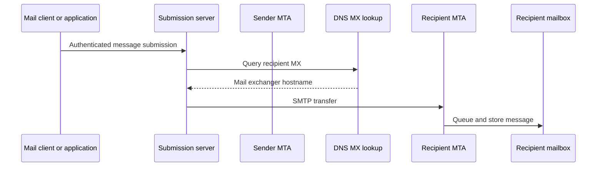

# SMTP: Sending Email

## Why SMTP Was Born

Email needs store-and-forward delivery between independent mail systems. SMTP defines how a sender submits a message and how mail servers transfer it toward a recipient domain.

## Mail Flow



## SMTP Roles and Ports

- `25`: server-to-server SMTP, often restricted for end-user submission
- `587`: message submission with authentication and usually STARTTLS
- `465`: implicit TLS submission in modern deployments

SMTP commonly uses commands such as:

```text
EHLO client.example
MAIL FROM:<sender@example>
RCPT TO:<recipient@example>
DATA
...
.
QUIT
```

## Store and Forward

If destination server is temporarily unavailable, sender server queues the message and retries. This makes email asynchronous. A successful SMTP submission means acceptance by the next server, not necessarily delivery to the user's inbox.

## TLS and Sender Authentication

SMTP may use:

- STARTTLS to upgrade a connection
- Implicit TLS on a TLS submission port
- SMTP AUTH for submission
- SPF to authorize sending IPs
- DKIM to sign message content and selected headers
- DMARC to publish domain policy and align SPF/DKIM identity

These mechanisms address different problems. TLS protects a connection. SPF, DKIM, and DMARC help receivers evaluate sender legitimacy and message integrity.

## Pros

- Decentralized store-and-forward design
- Works across organizations
- Queue and retry behavior
- Mature ecosystem

## Cons

- Delivery can be delayed
- Spam and spoofing are persistent problems
- Many servers and policies participate
- SMTP acceptance does not guarantee inbox placement

## Interview Questions

### SMTP versus IMAP?

SMTP sends and relays email. IMAP lets a user agent access and synchronize messages stored in a mailbox.

### Why query MX records?

MX records identify mail exchangers responsible for receiving mail for a domain. SMTP senders use them to choose recipient mail servers.

### What does DKIM do?

DKIM attaches a cryptographic signature to selected message content and headers. A receiver retrieves the sender domain's public key from DNS and verifies the signature.

### Why can email be accepted but not arrive in inbox?

Later filtering, policy checks, reputation systems, mailbox rules, bounces, or provider processing can reject, quarantine, classify, or delay the message after an earlier SMTP server accepted it.

---
