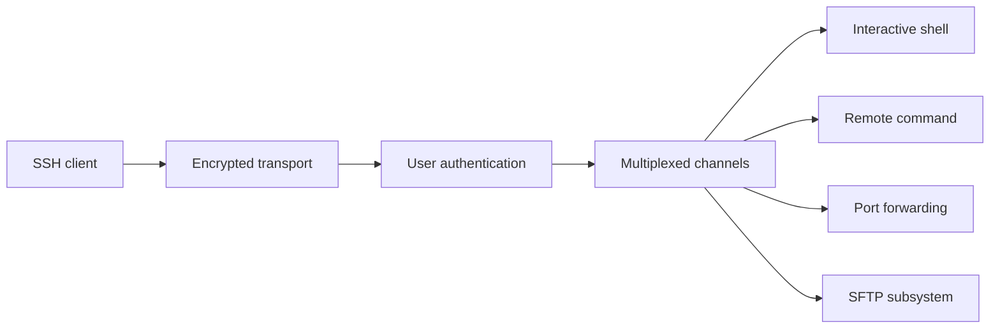

# SSH: Secure Shell

## Why SSH Was Born

Older remote-login tools sent credentials and commands without strong protection. SSH provides secure remote access over an untrusted network.

SSH supports:

- Interactive shell
- Remote command execution
- File transfer through SFTP or SCP
- Port forwarding
- Agent forwarding
- Public-key authentication

## Connection Architecture

SSH separates:

1. Transport security and server identity
2. User authentication
3. Logical channels such as shell, command, and forwarding

## Host Keys

The server proves its identity with a host key. Clients store a known-hosts record and warn when a key changes unexpectedly. Blindly accepting all changed keys defeats important security guarantees.

## Authentication

Common methods:

- Public-key authentication
- Password authentication
- Hardware-backed keys
- Certificates
- Multi-factor mechanisms

Public-key authentication avoids sending a reusable password for every login. Private keys still need protection with file permissions, passphrases, or hardware-backed storage.

## Port Forwarding

### Local Forwarding

Client opens a local port that forwards through SSH to a destination reachable from server.

### Remote Forwarding

Server opens a port that forwards through SSH to a destination reachable from client.

### Dynamic Forwarding

SSH acts as a SOCKS proxy for selected connections.

Forwarding is powerful and can bypass network boundaries. Restrict it according to operational and security policy.

## Pros

- Strong encryption and integrity
- Host and user authentication
- Multiple channels over one connection
- Secure administration and tunneling
- Mature automation support

## Cons

- Credential and key management burden
- Compromised keys can provide broad access
- Tunnels can hide unauthorized traffic
- Long-lived sessions need timeout and audit controls

## Interview Questions

### SSH versus TLS?

SSH is a complete remote-access protocol with host authentication, user authentication, channels, shells, and forwarding. TLS secures transport for application protocols but does not itself define a remote shell.

### Why verify SSH host keys?

Host-key verification helps detect man-in-the-middle attacks. A changed key can be legitimate, but it requires independent verification before trust is updated.

### SFTP versus SSH?

SFTP runs inside SSH as a file-transfer subsystem. SSH can also provide shells, commands, and forwarding; SFTP is one channel use.

---
