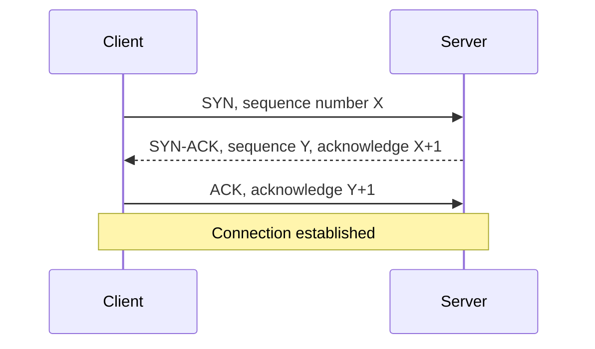

# TCP and UDP: Transport Protocols

## Why TCP Was Born

IP can lose, reorder, duplicate, or delay packets. Applications such as file transfer, web pages, SSH, and email usually need a reliable ordered stream. TCP provides that abstraction.

## Core Services

TCP provides:

- Connection establishment
- Ordered byte stream
- Retransmission of lost data
- Duplicate suppression
- Receiver flow control
- Network congestion control
- Full-duplex communication

TCP is a **byte stream**, not a message protocol. If an application sends three writes, the receiver may read them as one read or several reads. Applications need framing when message boundaries matter.

## Three-Way Handshake



The handshake synchronizes sequence numbers and confirms that both endpoints can send and receive.

## Reliability

TCP numbers bytes. The receiver acknowledges received data. If an acknowledgment does not arrive before retransmission timeout, or duplicate acknowledgments indicate a gap, TCP retransmits missing data.

```text
Sender:   [1] [2] [3] [4]
Network:  [1] [2]    [4]
Receiver: ACK 3, missing data after byte 2
Sender:              retransmit [3]
```

## Flow Control and Congestion Control

These solve different problems:

- **Flow control:** protects receiver buffer from an overly fast sender.
- **Congestion control:** protects network paths from overload.

TCP effective sending window is constrained by both receiver capacity and network congestion.

## Connection Teardown

TCP endpoints close directions independently. A normal close often uses FIN and ACK messages. A reset (RST) aborts a connection.

## When TCP Is Used

- HTTP/1.1 and HTTP/2
- SSH
- SMTP, IMAP, and POP3
- FTP control and data connections
- Database connections
- File transfer where correctness matters

## Pros

- Reliable ordered delivery
- Mature implementations and tooling
- Congestion and flow control built in
- Simple byte-stream abstraction

## Cons

- Handshake adds latency
- Retransmission adds delay
- Ordered delivery creates head-of-line blocking
- Kernel state and connection tracking consume resources
- Application message boundaries are not preserved

## Cost

TCP cost is mostly latency, memory, CPU, and operational state:

- Connection setup round trips
- Per-connection buffers
- Encryption often layered above TCP
- Retransmissions during packet loss
- Head-of-line blocking for multiplexed application streams

HTTP/3 uses QUIC over UDP to solve some TCP limitations while reimplementing reliability and congestion control in user space.

## Interview Questions and Answers

### Q1: TCP versus IP?

* **Answer:** IP routes packets between hosts. TCP provides a reliable ordered byte stream between application endpoints using IP as its network layer.

### Q2: Why can TCP be slow on a lossy network?

* **Answer:** Lost packets trigger retransmission. Because TCP presents an ordered stream, later bytes may wait until missing earlier bytes arrive. This creates delay even when later packets already reached the receiver.

### Q3: Why does TCP need congestion control?

* **Answer:** Without congestion control, many senders could overload shared links and routers. TCP reduces sending rate when loss, delay, or explicit congestion signals indicate network pressure.

---

# UDP: Lightweight Datagram Transport

## Why UDP Was Born

Some applications do not want TCP's connection setup, retransmission, ordering, or congestion behavior. UDP provides a minimal datagram transport over IP.

## Core Concept

UDP preserves application datagram boundaries:

```text
Application message A -> UDP datagram A
Application message B -> UDP datagram B
```

UDP header is only 8 bytes:

```text
+-------------------+-------------------+
| Source port       | Destination port  |
+-------------------+-------------------+
| Length            | Checksum          |
+-------------------+-------------------+
```

UDP does not guarantee:

- Delivery
- Ordering
- Duplicate suppression
- Retransmission
- Congestion control

The application or a higher protocol must add any required behavior.

## When UDP Is Used

- DNS queries
- Voice and video where late data has little value
- Online games
- Service discovery
- DHCP
- QUIC and HTTP/3
- Telemetry where occasional loss is acceptable

## Example: Real-Time Voice

If one audio packet arrives late, retransmitting it may be useless because playback already moved forward. The application may prefer a small concealment or skipped audio segment over waiting.


## Pros

- Very small header
- No connection handshake
- Low protocol overhead
- Preserves message boundaries
- Application controls reliability and timing

## Cons

- No built-in reliability or ordering
- No built-in congestion control
- Packets may be dropped or duplicated
- Security and abuse controls need careful design
- Application must implement extra features when needed

## Important Correction

UDP is not inherently faster. It removes TCP features, but the application may need to rebuild reliability, encryption, congestion control, and connection management. QUIC is an example: it uses UDP as a substrate but adds sophisticated transport behavior above it.

## Interview Questions and Answers

### Q4: When choose UDP over TCP?

* **Answer:** Choose UDP when low latency, message boundaries, multicast, or application-specific recovery matters more than automatic reliable ordering. Real-time media and DNS are common examples.

### Q5: Can UDP be reliable?

* **Answer:** Yes, but not by itself. An application protocol can add sequence numbers, acknowledgments, retransmission, integrity checks, and congestion control.

### Q6: Why does QUIC use UDP?

* **Answer:** UDP gives QUIC control over transport behavior in user space and avoids requiring a new network-layer protocol. QUIC adds encrypted, multiplexed, reliable streams above UDP.

---
