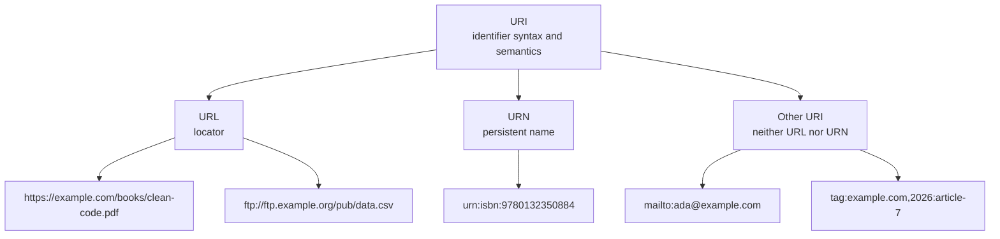

# The Anatomy of a URL & Domain Architecture

This guide provides an advanced architectural deep-dive into Uniform Resource Locators (URLs), their structural sub-components, Domain Name System (DNS) levels, percent-encoding mechanics, and browser-side client address parsing.

---

## 1. URI vs. URL vs. URN

These terms answer different questions:

- **URI (Uniform Resource Identifier):** What string identifies this resource?
- **URL (Uniform Resource Locator):** Where is it, and what access method can locate it?
- **URN (Uniform Resource Name):** What persistent name identifies it, independent of location?



### How to classify an example

1. Does it identify something? If no, it is not a URI.
2. Does it provide a locator: scheme plus location/access instructions such as `https://host/path`? It is a URL.
3. Does it use the `urn:` scheme and name a resource in a persistent namespace? It is a URN.
4. Otherwise, it is another URI. `mailto:` identifies an email address; it does not locate a web resource.

| Example                           |  URI   | URL  | URN | Why                                               |
| --------------------------------- | :----: | :--: | :-: | ------------------------------------------------- |
| `https://example.com/docs/a.pdf`  |  Yes   | Yes  | No  | HTTPS locator with host and path                  |
| `ftp://ftp.example.org/pub/a.csv` |  Yes   | Yes  | No  | FTP locator                                       |
| `urn:isbn:9780132350884`          |  Yes   |  No  | Yes | Persistent ISBN name; no server location          |
| `mailto:ada@example.com`          |  Yes   | No\* | No  | Identifies mailbox; mail client can handle it     |
| `tag:example.com,2026:article-7`  |  Yes   |  No  | No  | URI identifying resource by tag                   |
| `/docs/a.pdf`                     | No\*\* |  No  | No  | Relative reference; no scheme, not a complete URI |

\* Some libraries use “URL” broadly for any URI with a scheme. For precise standards discussion, call `mailto:` a URI, not an HTTP URL.  
\*\* It is a **relative reference**, which can resolve to a URI when combined with a base URI, for example `https://example.com` + `/docs/a.pdf`.

### Key rule

Every URL is a URI. Every URN is a URI. Not every URI is a URL or URN. URL and URN are classification terms based on semantics, not merely on whether a string contains `://`.

Example:

```text
Resource: Clean Code book
URL:      https://books.example.com/clean-code
          location may change
URN:      urn:isbn:9780132350884
          identity stays stable
```

---

## 2. Structural Breakdown of a URL

An exemplary URL is dissected into its fundamental logical sub-components:

```
 https://admin.blog.example.com:443/posts/index.html?sort=desc&limit=10#comments
 ──┬──   ──┬─────── ──┬──── ─┬─ ─┬─ ──────┬────────── ──────────┬─────── ───┬────
   │       │          │      │   │        │                     │           │
 Scheme Subdomain    SLD   TLD Port      Path                 Query      Fragment
```

### A. Scheme / Protocol

- **Example:** `https` (or `http`, `ftp`, `ws`, `wss`, `mailto`, `ldap`).
- **Mechanism:** Specifies URI interpretation and, for network schemes, the access protocol. Hierarchical URLs such as `https://host/path` use `://` before the authority block; schemes such as `mailto:ada@example.com` do not.

### B. User Information (Optional Authority Block)

- **Example:** `username:password@` (placed immediately preceding the host).
- **Mechanism:** A legacy authentication mechanism. It transmits credentials in cleartext over the wire, making it highly insecure. It is widely deprecated by modern browsers, which block inline credential parsing to prevent phishing attacks.

### C. Domain Name & Hierarchy Levels

The hostname is organized hierarchically from right to left, separated by periods:

1. **Top-Level Domain (TLD):**
    - **Example:** `com` (or `org`, `net`, `gov`, `edu`, `vn`, `uk`).
    - **Mechanism:** The root level of the DNS namespace managed globally by ICANN/IANA. Primarily split into **gTLDs** (generic TLDs like `.com`, `.info`) and **ccTLDs** (country-code TLDs like `.uk`, `.jp`).
2. **Second-Level Domain (SLD):**
    - **Example:** `example` in `example.com`.
    - **Mechanism:** The core domain name registered by an individual or organization from an accredited domain registrar.
3. **Subdomain:**
    - **Example:** `blog.example.com` (Subdomain: `blog`), or `admin.blog.example.com` (Subdomain: `admin.blog`).
    - **Mechanism:** A nested domain partition created under the authority of the parent SLD. Used to segregate logical segments of a platform (e.g., API gateway, blog, admin dashboard).

### D. Port Number

- **Example:** `:443` (or `:80`, `:8080`).
- **Mechanism:** Specifies the target TCP port on the server's network card where the application daemon is listening. If omitted, the browser automatically injects standard defaults based on the scheme (**80** for raw HTTP, **443** for secure HTTPS).

### E. Path / Resource Location

- **Example:** `/posts/index.html` (separated by `/` slashes).
- **Mechanism:** The absolute path pointing to the requested resource on the server. In legacy static systems, this mapped directly to physical directories on disk. In modern web architectures, the path represents a logical routing identifier processed by an API Gateway or application router (e.g., mapping to a specific controller action).

### F. Query Parameters / Query String

- **Example:** `?sort=desc&limit=10` (prefixed strictly by **`?`**).
- **Mechanism:** A string of key-value pairs formatted as `key=value`, separated from one another by the **`&`** character. Query strings are sent to the server to filter, paginate, or parameterize the requested resources.

### G. Fragment Identifier (Anchor)

- **Example:** `#comments` (prefixed strictly by **`#`**).
- **Mechanism:** Points to a specific named anchor or section within the retrieved document (e.g., scroll directly to an element with `id="comments"`).
- **The Transmit Rule:** **The fragment identifier is strictly processed client-side. Browsers strip the fragment before compiling the HTTP request, meaning fragments are NEVER sent to the server over the network.**

---

## 3. Advanced URL-Encoding (Percent-Encoding)

Because URLs are designed to be transmitted over diverse internet protocols, they must strictly utilize a restricted subset of the US-ASCII character set.

### A. Reserved vs. Unreserved Characters

To prevent parser ambiguity, characters are split into two categories:

- **Unreserved Characters:** Standard alphanumeric characters (`a-z`, `A-Z`, `0-9`) alongside four specific safe marks: `-` (hyphen), `.` (period), `_` (underscore), and `~` (tilde). These are never encoded.
- **Reserved Characters:** Characters that possess syntactic structural meanings in URLs, acting as delimiters: `:`, `/`, `?`, `#`, `[`, `]`, `@`, `!`, `$`, `&`, `'`, `(`, `)`, `*`, `+`, `,`, `;`, `=`.

### B. The Percent-Encoding Mechanism (RFC 3986)

If a reserved character is used to transmit raw data rather than acting as a delimiter (e.g., transmitting an email address `user+test@site.com` inside a query string), it **must be percent-encoded**.

- **Mechanism:** The browser translates the non-ASCII or reserved character into its raw byte equivalent in UTF-8, and represents each byte as a `%` symbol followed by its two-digit hexadecimal value.

| Character       | Real-world Context             | Percent-Encoded Value              |
| :-------------- | :----------------------------- | :--------------------------------- |
| **Space (` `)** | Plain text spacing             | `%20` (or `+` in some query specs) |
| **`?`**         | Delimiter for Query Strings    | `%3F`                              |
| **`&`**         | Delimiter for Query Parameters | `%26`                              |
| **`#`**         | Delimiter for Fragments        | `%23`                              |
| **`/`**         | Delimiter for Path Segments    | `%2F`                              |
| **`@`**         | Delimiter for User Info        | `%40`                              |
| **`+`**         | Delimiter for spaces or math   | `%2B`                              |

---

## 4. Browser-Side URL Parsing Lifecycle

When a user pastes or types a address into the browser's address bar, the browser executes a rigorous validation and parsing pipeline before triggering DNS name lookups:

```
[Typing Address] ──> [Parser State Machine] ──> [Protocol Check] ──> [HSTS Check] ──> [DNS Resolver]
```

1. **Syntax Parsing State Machine:**
   The browser runs a deterministic state-machine parser to dissect the raw string. It identifies the scheme boundary (`://`), isolates the authority host from the path, parses out the port if specified, and splits the query variables from any fragment anchors.
2. **Standardization & Normalization:**
   The browser converts the parsed hostname to lowercase (e.g., `EXAMPLE.COM` $\rightarrow$ `example.com`), strips redundant trailing dots, and standardizes path slashes.
3. **IDN (Internationalized Domain Names) Translation:**
   If the domain contains non-ASCII characters (like Cyrillic, Chinese, or diacritics, e.g., `bücher.de`), the browser translates it using **Punycode** (converting Unicode characters into an ASCII-compatible encoding prefixed with `xn--`, e.g., `xn--bcher-kva.de`). This ensures legacy DNS servers can parse the hostname.
4. **HSTS (HTTP Strict Transport Security) Preload List Check:**
   Before opening a socket, the browser checks its local HSTS database. If the hostname is registered in the list, the browser automatically upgrades the request scheme from insecure `http` to secure `https` _before_ transmitting any packets over the network, mitigating SSL Strip attacks.
5. **DNS Host Isolation:**
   The browser strips all path, query, and fragment parameters, isolating the clean, standardized hostname (e.g., `admin.blog.example.com`) and passes it down to the OS system resolver daemon to initiate name resolution.

---

## 5. Interview Masterclass: High-Impact Q&As

### Q1: What is the architectural difference between a URI, a URL, and a URN? Give concrete examples.

- **Answer:**
    - **URI (Uniform Resource Identifier):** The broad identifier category. Example: `mailto:ada@example.com` identifies a mailbox but does not locate a web resource.
    - **URL (Uniform Resource Locator):** A URI carrying location and access information. Example: `https://example.com/books/design-patterns.pdf` tells a client to use HTTPS, contact `example.com`, and request that path.
    - **URN (Uniform Resource Name):** A URI carrying a persistent name in a namespace, independent of network location. Example: `urn:isbn:9780132350884` identifies a book even if its copies move between servers.
    - **Classification test:** `https://...` is URI + URL; `urn:...` is URI + URN; `mailto:...` is URI only in this practical classification.

### Q2: Why is the fragment identifier (`#`) never transmitted to the server in HTTP requests, and how do Single Page Applications (SPAs) leverage this behavior?

- **Answer:**
    - **The Reason:** By standard specification (RFC 3986), the fragment identifier (`#`) is designated strictly as a client-side layout anchor to point to a specific section within the retrieved document. Browsers are required to strip the `#` and all subsequent characters from the URL _before_ compiling and sending the HTTP request over the network socket.
    - **SPA Hash Routing:** Single Page Applications (like early React or Angular routers) leveraged this behavior to implement **Hash Routing** (e.g., `http://myapp.com/#/dashboard`). Because changing the hash fragment triggers the browser's `hashchange` event but does **not** send a new request to the server, JavaScript can intercept the change, dynamically mount the `/dashboard` UI component, and update the URL bar without triggering a slow, page-clearing browser refresh.

### Q3: What is URL-Encoding (Percent-Encoding), and why is it critical when transmitting raw parameters in query strings?

- **Answer:**
    - **The Reason:** URLs are strictly limited to a safe subset of the US-ASCII character set. Any characters outside this set (non-ASCII characters like UTF-8 Chinese characters or emojis) or **Reserved Characters** that possess functional structural meanings as delimiters in URLs (such as `?`, `&`, `=`, `/`, `#`) must be encoded if they are being transmitted as raw payload data.
    - **The Risk:** If a client attempts to pass a search term containing raw delimiters, such as querying a name: `?name=Smith&Jones`, the browser's URL parser will misinterpret the `&` as a delimiter separating two distinct query variables (`name=Smith` and a new variable `Jones`), corrupting the parameter payload. To prevent this, the browser must encode the reserved character: `?name=Smith%26Jones` (converting `&` to its hex byte equivalent `%26`), ensuring the backend parser reads the value as a single, unified string.

### Q4: Explain Punycode, and why it is necessary during the browser's URL parsing phase.

- **Answer:**
    - **The Role:** The global Domain Name System (DNS) is a legacy infrastructure designed to only support standard, un-accented ASCII characters (`a-z`, `0-9`, `-`). It cannot parse Unicode characters (such as Cyrillic, Chinese, or accented vowels like `ö` or `á`).
    - **The Punycode Solution:** **Punycode** is a standardized translation algorithm (RFC 3492) that converts Internationalized Domain Names (IDNs) containing non-ASCII Unicode characters into an ASCII-Compatible Encoding (ACE) string, prefixed with `xn--`.
    - _Example:_ If a user loads `https://bücher.de`, the browser's URL parser instantly translates the Unicode domain to its Punycode ASCII equivalent: `https://xn--bcher-kva.de` before querying the local DNS client resolver, ensuring legacy internet routing servers can resolve the domain without crashing.
