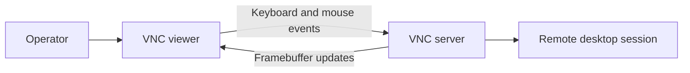
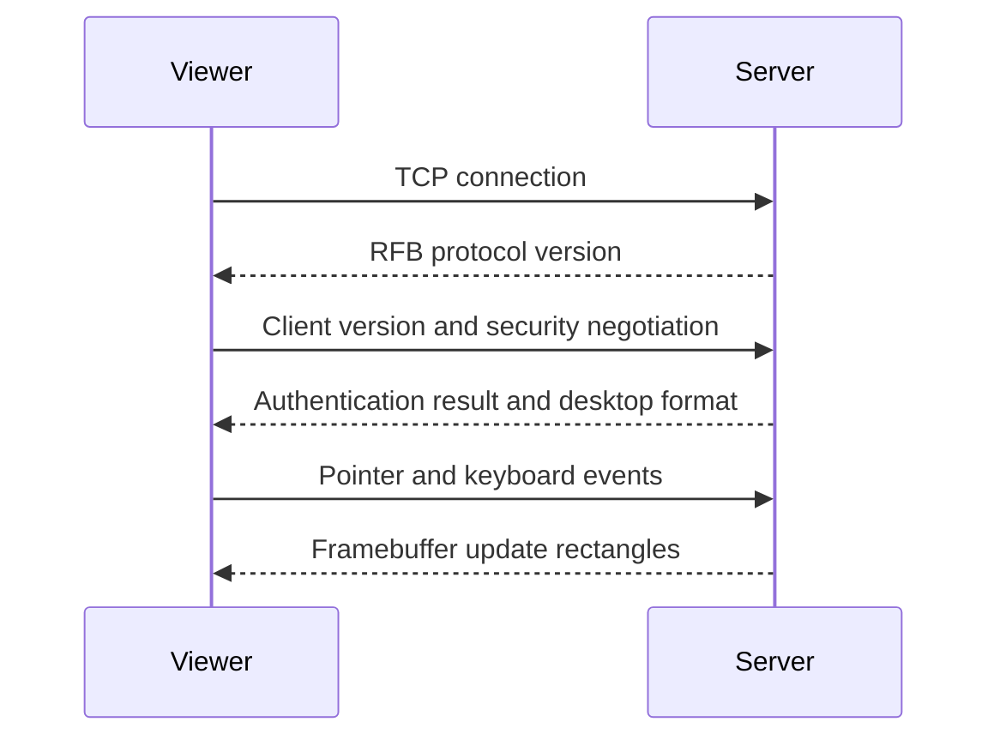
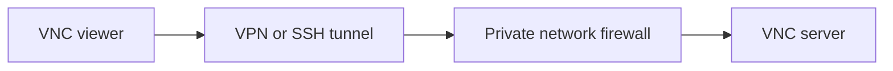

# VNC: Virtual Network Computing

VNC provides remote graphical access by sending framebuffer updates from server to client and input events from client to server.

## Why VNC Was Born

Administrators needed to view and control a graphical desktop from another machine. VNC works at the **remote framebuffer (RFB)** layer, so it can support different window systems instead of depending on one desktop application.

## Core Architecture

VNC normally has:

- **VNC server:** captures display changes and accepts input events.
- **VNC viewer:** displays remote pixels and sends keyboard or mouse input.
- **RFB protocol:** describes handshake, pixel formats, encodings, updates, and input events.

The server does not need to send the whole screen after every input. It can send changed rectangles, compressed with an encoding supported by both sides.

## When Use VNC

- Remote support
- Access to Linux or embedded graphical systems
- Lab and classroom administration
- Headless machine troubleshooting
- Cross-platform desktop viewing

## Example

A support engineer can connect to a remote Linux workstation, inspect a GUI-only failure, and operate the desktop without physically visiting the machine.

## Pixel Encodings and Performance

VNC performance depends on:

- Screen resolution and color depth
- Number of changed pixels
- Network bandwidth and round-trip time
- Compression and encoding
- Viewer and server CPU capacity

Static screens work well because only changed regions need transmission. Video, 3D graphics, and rapidly changing dashboards create large framebuffer traffic.

## Security

Plain VNC exposure to the public internet is unsafe. Password-only authentication, weak implementations, or unencrypted transport can expose desktop content and control.

Safer pattern:

Use strong access control, network restriction, encryption provided by implementation or tunnel, MFA at the access gateway, session logging, and patch management.

## Pros

- Cross-platform
- Simple mental model
- Useful for graphical support
- Works with many operating systems and embedded devices

## Cons

- Pixel transfer can consume significant bandwidth
- High latency harms interaction
- Weak deployments create severe remote-control risk
- Desktop sharing can expose secrets on screen
- Session and clipboard behavior vary by implementation

## Cost

Cost includes VNC software, support, bandwidth, gateway or VPN infrastructure, endpoint hardening, and operator time. The largest cost may be security exposure if VNC is directly reachable from untrusted networks.

## Interview Questions and Answers

### Q1: What does VNC actually transmit?

* **Answer:** VNC transmits framebuffer updates, not application-level UI controls. The server sends changed screen regions; the viewer renders them. The viewer sends keyboard and pointer events back.

### Q2: Why is VNC slow for video?

* **Answer:** Video changes many pixels per frame. VNC must capture, encode, transmit, decode, and render those changes. Bandwidth, CPU, compression, and latency become bottlenecks.

### Q3: Is VNC encrypted by default?

* **Answer:** It depends on implementation and configuration. Do not assume security from the VNC name. Use a VNC implementation with strong encryption or place VNC inside a properly secured VPN or SSH tunnel.

### Q4: How secure VNC deployment?

* **Answer:** Keep service off public internet, restrict source networks, require strong authentication, use MFA at an access gateway, encrypt traffic, disable unused features, patch server and viewer, log sessions, and enforce least privilege.

### Q5: VNC versus RDP?

* **Answer:** VNC usually transports framebuffer changes and is broadly cross-platform. RDP uses a richer, virtual-channel-oriented protocol optimized for Windows remote sessions. RDP often provides better Windows integration; VNC can be simpler for heterogeneous environments.

## References

- [RFC 6143: The Remote Framebuffer Protocol](https://datatracker.ietf.org/doc/html/rfc6143)
