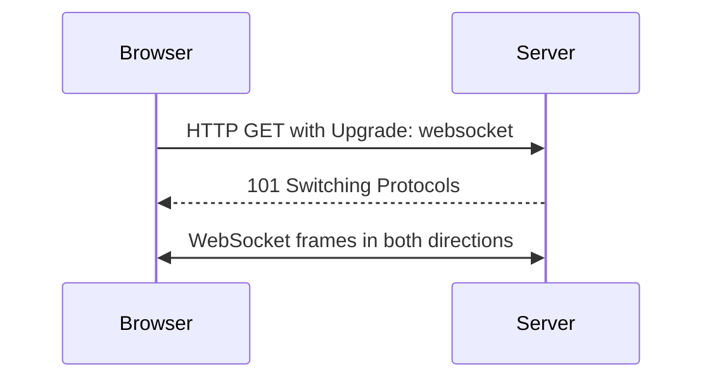
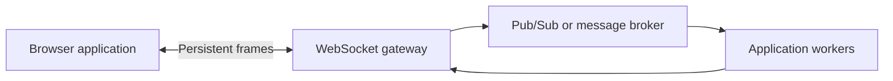

# WebSocket: Long-Lived Bidirectional Web Communication

## Why WebSocket Was Born

HTTP request-response works well when clients ask and servers answer. It is inefficient for frequent server-to-client updates because clients must poll repeatedly.

WebSocket provides a persistent, bidirectional channel after an HTTP-compatible opening handshake.

## Opening Handshake

After the `101 Switching Protocols` response, traffic uses WebSocket frames rather than ordinary HTTP request-response messages.

## Frame Model

WebSocket frames carry:

- Text or binary payload
- Frame type
- Length
- Masking information
- Final-fragment flag

Clients mask frames sent to servers. Servers do not normally mask frames sent to clients.

## Use Cases

- Chat
- Live dashboards
- Multiplayer game state
- Collaborative editing
- Notifications
- Trading or monitoring screens

## Production Concerns

- Heartbeats detect dead connections.
- Backpressure prevents slow clients from accumulating unlimited messages.
- Authentication must be checked during or immediately after connection setup.
- Proxies and load balancers need WebSocket upgrade support.
- Horizontal scaling often needs sticky routing or shared pub/sub.
- Connection limits and per-message size limits prevent resource exhaustion.
- Reconnect logic must avoid thundering herds.

WebSocket provides a channel, not guaranteed business delivery. If a client disconnects, the application needs message IDs, replay, or durable queues when loss is unacceptable.

## WebSocket versus Server-Sent Events

| Feature | WebSocket | Server-Sent Events |
|---|---|---|
| Direction | Bidirectional | Server to client |
| Transport style | WebSocket frames | HTTP stream |
| Binary data | Yes | Text-oriented |
| Browser reconnect support | Application-managed | Built-in event stream reconnect behavior |
| Good fit | Interactive two-way sessions | Notifications and live feeds |

## Pros

- Low-latency server push
- Bidirectional communication
- One long-lived connection
- Works with browser security model and HTTP infrastructure

## Cons

- Persistent connection consumes server resources
- Scaling and deployment become stateful
- Reconnection and message delivery need application design
- Proxy timeout and load-balancer configuration matter

## Interview Questions and Answers

### Q1: WebSocket versus HTTP polling?

* **Answer:** Polling creates repeated requests and responses, adding latency and overhead. WebSocket keeps one connection and allows either side to send frames when needed.

### Q2: Does WebSocket guarantee message delivery?

* **Answer:** The WebSocket transport provides ordered delivery over its connection, but disconnection can lose messages not yet processed. Business-level durability requires acknowledgments, replay, or a durable broker.

### Q3: How scale WebSocket servers?

* **Answer:** Use connection-aware load balancing, shared authentication and session state, pub/sub for cross-node events, connection limits, heartbeat timeouts, and controlled reconnect behavior.

---
