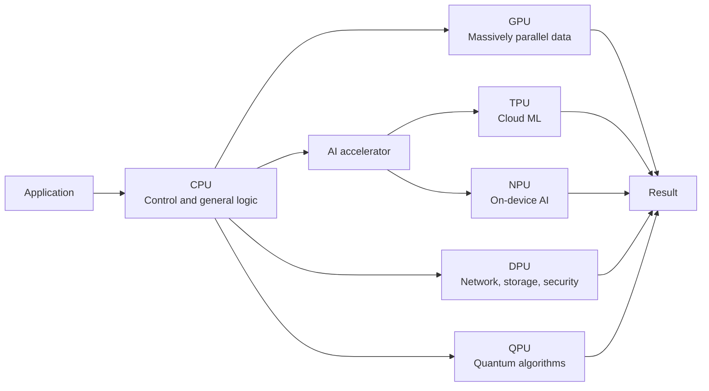
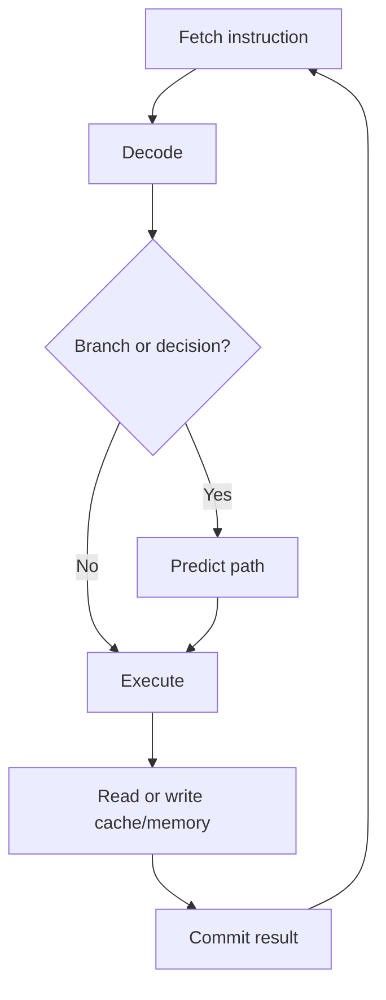
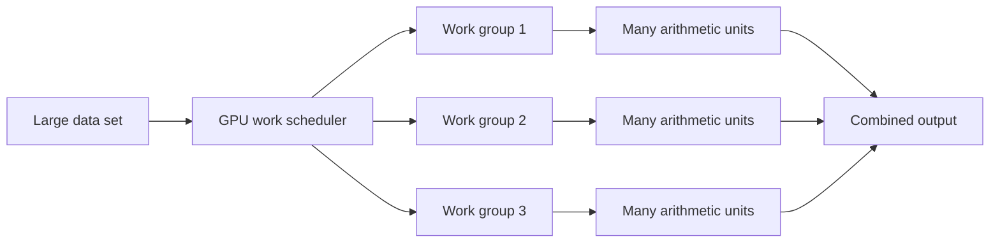
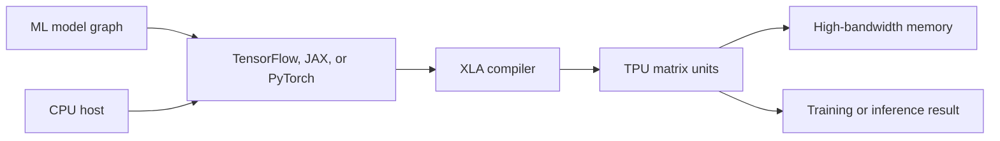
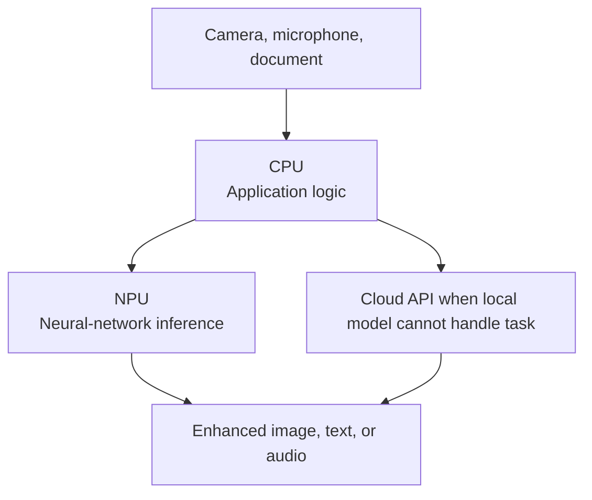
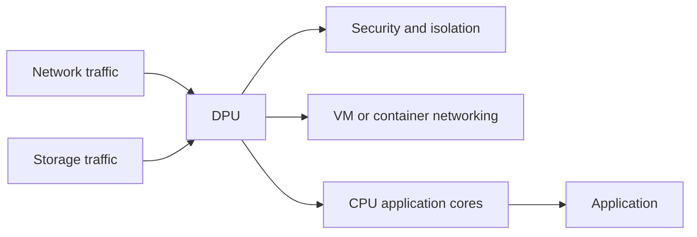
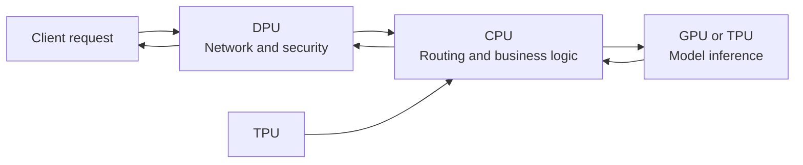
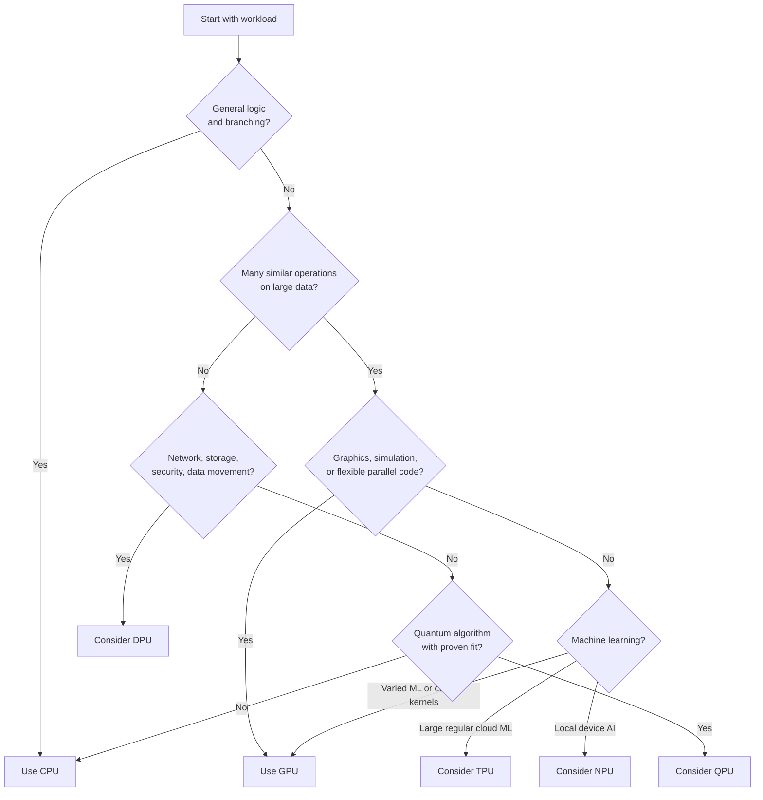

# CPU, GPU, TPU, NPU, DPU, and QPU

## Why Do We Need Different Processors?

Why not build one extremely powerful processor and use it for everything?

Because **"powerful" depends on workload**.

A processor optimized for one kind of work can be much faster, more energy-efficient, and cheaper for that work than a general-purpose processor. However, specialization creates trade-offs:

- Less flexibility
- More complex software support
- Hardware that may sit idle when workload does not match it
- More data movement between processors
- Extra cost for manufacturing, cooling, and operations

Modern computers therefore use a **heterogeneous architecture**: several processor types cooperate, each handling work it performs well.



Main idea:

> Do not memorize processor names first. Remember the problem each processor solves.

## Quick Comparison

| Processor | Best at | Typical environment | Main trade-off |
|---|---|---|---|
| **CPU** | General-purpose logic, branching, orchestration | Every computer and server | Flexible, but less efficient for massive uniform parallel work |
| **GPU** | Huge numbers of similar operations in parallel | PCs, workstations, servers, supercomputers | High throughput, weaker for irregular control-heavy work |
| **TPU** | Tensor and matrix operations for machine learning | Large-scale Google Cloud infrastructure | Excellent for supported ML graphs, narrow workload fit |
| **NPU** | Efficient neural-network inference on local devices | Phones, laptops, cameras, edge systems | Lower power, but limited by model support and device resources |
| **DPU** | Networking, storage, security, and infrastructure data movement | Cloud and data centers | Offloads infrastructure work; adds another programming target |
| **QPU** | Quantum algorithms for selected problem classes | Quantum research systems and specialized services | Not a general CPU replacement; fragile and problem-specific |

---

## 1. CPU: Central Processing Unit

### What Problem Did CPU Solve?

Early computers needed one flexible machine that could execute many kinds of instructions:

- Read input
- Compare values
- Branch based on conditions
- Execute business logic
- Access files and databases
- Coordinate devices
- Run operating-system code

The CPU became the general-purpose engine because software changes more often than hardware. Developers can write a new program without manufacturing a new processor.

### Core Concept

CPU design prioritizes:

- Broad instruction support
- Low response time for individual tasks
- Strong branch prediction
- Large caches
- Fast handling of irregular control flow
- Multiple privilege levels and operating-system features

A CPU can execute several instructions at once using multiple cores, superscalar execution, SIMD instructions, and hardware threads. Still, its major strength is **flexibility and low-latency decision-making**, not maximum throughput for one repetitive mathematical operation.



### Use Case

For an API request:

1. Accept network input.
2. Authenticate the user.
3. Validate fields.
4. Check permissions.
5. Query a database.
6. Apply business rules.
7. Format and return a response.

This workload contains branching, I/O waits, pointer-heavy data structures, and changing control flow. CPU fits well.

### Pros

- Runs almost any software
- Good at branching and sequential logic
- Low latency for small or unpredictable tasks
- Mature tools, operating systems, and programming models
- Available in every computing system

### Cons

- Less throughput than GPU or AI accelerators for large uniform calculations
- General-purpose control logic consumes silicon and power
- Parallel programming can be difficult
- Memory latency can dominate performance

### Cost

CPU cost includes more than purchase price:

- Chip or virtual-machine price
- RAM and motherboard cost
- Power and cooling
- License cost for cloud instances
- Performance lost when CPU handles infrastructure work or unsuitable workloads

CPU usually remains the default because flexibility has high business value.

---

## 2. GPU: Graphics Processing Unit

### Why Was GPU Born?

Rendering one image requires operations over millions of pixels. Many pixels can be processed with similar calculations:

- Transform geometry
- Calculate lighting
- Apply textures
- Blend colors
- Run image filters

Instead of using a few powerful general-purpose cores, GPUs use many simpler arithmetic units designed to process large batches of data.

### Core Concept: Throughput Over Individual Latency

GPU programming commonly follows a data-parallel model. One operation runs across many data elements:

```text
pixel[0] = shade(vertex[0], light, texture)
pixel[1] = shade(vertex[1], light, texture)
pixel[2] = shade(vertex[2], light, texture)
...
```

Modern GPUs execute groups of threads together, often called SIMT: **Single Instruction, Multiple Threads**. This works best when threads follow similar paths and access memory efficiently.



### Why GPUs Matter for AI

Neural networks perform enormous numbers of operations such as:

- Matrix multiplication
- Convolution
- Vector addition
- Activation functions

These operations apply similar arithmetic across large tensors. GPU parallelism and high memory bandwidth make GPUs useful for training and inference.

### Use Cases

- Video-game rendering
- 3D and scientific visualization
- Video encoding and decoding
- Image and signal processing
- Machine-learning training
- Large-batch machine-learning inference
- Scientific simulation

### Pros

- Very high throughput for parallel workloads
- High memory bandwidth
- Mature AI software ecosystem
- Useful across graphics, simulation, and machine learning

### Cons

- Poor fit for heavy branching and irregular workloads
- Data transfer between CPU and GPU can add latency
- High power and cooling requirements
- GPU memory is separate or limited compared with system memory
- Programming requires parallel algorithms and hardware-aware optimization

### Cost

GPU cost has several dimensions:

- Accelerator purchase or cloud rental
- GPU memory capacity
- Power, cooling, and rack density
- CPU-to-GPU and GPU-to-GPU data transfer
- Engineering effort to parallelize code

A GPU can be expensive but cheaper per completed training job when its utilization is high.

---

## 3. TPU: Tensor Processing Unit

### Why Was TPU Born?

Google designed TPUs as application-specific integrated circuits (ASICs) for machine-learning workloads. The goal was not to run every program. The goal was to accelerate common tensor operations at large scale.

### Core Concept

TPUs are built around operations common in neural networks, especially matrix multiplication. Google Cloud documentation describes TPU workloads as best suited to models dominated by matrix computations and large effective batch sizes.

Many TPU programs are compiled by **XLA (Accelerated Linear Algebra)**. The compiler transforms an ML computation graph into code for TPU hardware.



### Use Case

A large recommendation model trains on huge batches for weeks. Most work is matrix computation, tensor shapes are predictable, and the framework supports TPU compilation. TPU can provide strong throughput and efficiency.

### TPU vs. GPU

| Question | GPU | TPU |
|---|---|---|
| Main design goal | Broad parallel compute | ML tensor computation |
| Flexibility | Usually broader | Narrower |
| Software | Many mature APIs and kernels | Strongest when graph fits compiler and supported operations |
| Best fit | Graphics, custom kernels, varied ML | Large, regular, matrix-heavy ML |
| Common access | Local hardware and many clouds | Primarily Google Cloud and Google infrastructure |

### Pros

- High efficiency for supported tensor workloads
- High-bandwidth memory
- Scales into connected TPU slices
- Good fit for large, regular training jobs

### Cons

- Not suitable for general software
- Unsupported operations can reduce performance or force host execution
- Dynamic shapes, frequent branching, and high-precision workloads may fit poorly
- Requires compiler and framework compatibility
- Access and ecosystem are narrower than GPU access

### Cost

Cost includes TPU runtime price, storage, host machines, data transfer, compilation time, and model changes needed for good utilization. A TPU is economical only when workload keeps its matrix units busy.

---

## 4. NPU: Neural Processing Unit

### Why Was NPU Born?

AI features increasingly run outside data centers:

- Phone camera enhancement
- Speech recognition
- OCR
- Object detection
- Background blur during video calls
- Generative features on laptops

Sending every input to cloud servers adds network latency, recurring service cost, and privacy concerns. NPU provides local neural-network acceleration with lower power usage than using CPU or GPU for every AI operation.

### Core Concept

NPU is a broad industry term, not one universal architecture. An NPU commonly includes specialized matrix or vector engines, local memory, and low-power data paths optimized for neural-network inference.



### Use Case: Video Meeting

- CPU manages the application and user interface.
- NPU detects the person.
- NPU creates a segmentation mask.
- NPU applies background blur.
- GPU may render the final video frame.

The result appears locally without uploading every camera frame.

### Pros

- Low latency
- Lower energy use for supported AI operations
- Better privacy because data can stay on device
- Frees CPU and GPU for other work
- Enables offline AI features

### Cons

- Limited model operators, precision formats, and memory
- Device-specific software support
- May need model conversion or quantization
- Not automatically faster for every AI model
- Small devices have strict thermal limits

### Cost

NPU cost is mainly paid during device design and manufacturing. For users, it can reduce battery use and cloud inference fees. For developers, cost moves toward model optimization, compatibility testing, and maintaining multiple execution paths.

---

## 5. DPU: Data Processing Unit

### Why Was DPU Born?

Data centers move enormous amounts of data between:

- Network interfaces
- Storage systems
- Virtual machines
- Containers
- Hosts
- Security services

If the CPU performs every packet, storage, encryption, isolation, and virtualization task, application performance suffers. DPU offloads infrastructure work so CPU cores can focus on application logic.

### Core Concept

A DPU usually combines networking hardware, processor cores, memory, and acceleration engines. It can handle tasks such as:

- Packet processing
- Virtual switching
- Storage protocol processing
- Encryption and security checks
- Tenant isolation
- Infrastructure telemetry



### Use Case: Cloud Server

Without DPU, host CPU handles virtual switching, encryption, storage protocol work, and tenant isolation. With DPU, infrastructure traffic is processed on the DPU. CPU spends more time serving the customer application.

### Pros

- Frees CPU cycles
- Improves isolation between tenants
- Predictable infrastructure performance
- Accelerates networking and storage
- Helps scale high-bandwidth data centers

### Cons

- Extra hardware and operational complexity
- New firmware, drivers, and programming model
- Data may need to cross another device boundary
- Benefits are smaller for simple low-bandwidth systems
- Debugging distributed hardware paths is harder

### Cost

DPU cost includes hardware, firmware, deployment, monitoring, support, and engineering expertise. It becomes valuable when network, storage, security, or virtualization overhead consumes meaningful CPU capacity.

---

## 6. QPU: Quantum Processing Unit

### Why Was QPU Born?

Classical processors represent information with bits: `0` or `1`. QPUs use qubits, which can exhibit quantum properties such as:

- Superposition
- Entanglement
- Interference

Quantum algorithms use these properties in ways that differ fundamentally from classical algorithms.

### Core Concept

QPU is not simply a faster CPU or GPU. It is an accelerator for selected algorithms, connected to classical control systems.


### Potential Use Cases

- Quantum-system simulation
- Selected optimization problems
- Cryptography-related research
- Materials and chemistry research
- Algorithm research

### Important Limits

Quantum computers are difficult to build and operate. Qubits can be sensitive to noise, measurement changes the state, and useful algorithms often need error correction. A QPU does not replace CPU, GPU, or cloud infrastructure. A classical system prepares jobs, controls execution, reads measurements, and interprets results.

### Pros

- New computation model
- Possible advantages for selected algorithms
- Useful for studying systems that are difficult to simulate classically

### Cons

- Not a general-purpose replacement
- Hardware is fragile and expensive
- Error correction creates large overhead
- Few workloads have proven practical advantage
- Programming and algorithm design are specialized

### Cost

Cost includes quantum hardware, cryogenic or specialized control systems, access time, error mitigation, algorithm research, and classical orchestration. Today, QPU access is commonly treated as specialized research infrastructure rather than ordinary server capacity.

---

## 7. Other Important Accelerators

### ASIC

An **ASIC (Application-Specific Integrated Circuit)** is hardware designed for a narrow purpose. TPU is one example. ASICs can provide excellent performance and efficiency, but changing their function after manufacturing is difficult.

### FPGA

An **FPGA (Field-Programmable Gate Array)** contains configurable logic that can be reprogrammed after manufacturing. It offers more flexibility than an ASIC and often lower latency than software on a CPU, but development and optimization are harder.

### ISP

An **ISP (Image Signal Processor)** handles camera pipelines such as demosaicing, autofocus support, noise reduction, HDR, and color processing. Smartphones often combine ISP, GPU, NPU, CPU, and other accelerators.

---

## 8. How Processors Work Together

Processors are not competitors in one machine. They form a pipeline.

### Data-Center AI Example



Typical responsibility:

- **DPU** receives packets, applies network and security processing.
- **CPU** authenticates, applies business rules, and coordinates work.
- **GPU or TPU** executes model inference.
- **Storage** provides model and application data.
- **CPU** formats the response.
- **DPU** sends the response back.

### Smartphone Camera Example

- CPU manages camera application state.
- ISP converts sensor data into usable frames.
- NPU detects objects or segments a person.
- GPU renders preview effects.
- CPU stores the image or sends it to another application.

### The Hidden Cost: Data Movement

An accelerator is not automatically useful. Moving data to it and back can cost more time and energy than computation.

```text
Total time =
    transfer input
  + launch accelerator work
  + compute
  + transfer output
```

For small jobs, CPU may win because it avoids transfer and startup overhead. For large batches, accelerator throughput can dominate.

---

## 9. Choosing the Right Processor

Ask these questions:

1. Is workload general-purpose or specialized?
2. Is latency or total throughput more important?
3. Can work be split into many similar operations?
4. Does workload need frequent branches?
5. How much data must move between processors?
6. Which precision, operators, and frameworks are supported?
7. What are power, thermal, and memory limits?
8. Is workload local, edge, cloud, or quantum?
9. What software, drivers, and operational skills are available?
10. What is full cost: hardware, cloud time, energy, engineering, and maintenance?



The right answer can be hybrid: CPU plus GPU, CPU plus NPU, or CPU plus DPU plus GPU.

---

## 10. Common Misunderstandings

### "More cores always means faster."

No. Software must expose enough parallel work. Synchronization, memory bandwidth, branching, and data transfer can limit speedup.

### "GPU replaces CPU."

No. GPU handles selected parallel kernels well. Operating-system work, control flow, I/O, and orchestration still need CPU.

### "TPU is always faster than GPU for AI."

No. TPU wins when model operations, shapes, compiler, batch size, and deployment environment fit TPU well. GPU is often better for varied models and custom operations.

### "NPU means all AI runs locally."

No. NPU accelerates supported local operations. Applications may still use CPU, GPU, or cloud services.

### "DPU is only a faster network card."

No. DPU can combine networking, storage, security, virtualization, and programmable processing.

### "QPU is the next CPU."

No. QPU uses a different computation model and targets selected algorithms.

---

## 11. Interview Questions and Answers

### 1. Why do modern systems use multiple processor types?

Different workloads have different shapes. CPU provides flexibility, GPU provides parallel throughput, TPU and NPU accelerate ML, DPU handles infrastructure traffic, and QPU explores a different computation model. Specialization improves performance or efficiency when workload matches hardware.

### 2. Why not build one very large CPU?

A large general-purpose CPU would spend silicon and power supporting flexibility that specialized workloads do not need. It would still be less efficient for regular matrix operations, graphics, or packet processing than dedicated hardware. One processor also cannot optimize all latency, throughput, memory, and power goals at once.

### 3. What is the main difference between CPU and GPU?

CPU uses a smaller number of powerful, flexible cores optimized for low-latency and irregular control flow. GPU uses many parallel execution units optimized for high throughput over large, similar data sets.

### 4. Can CPU perform GPU work?

Yes. CPU can execute the same algorithm, often with multiple cores or SIMD instructions. GPU usually wins when enough parallel work exists and transfer overhead is acceptable.

### 5. Why is GPU useful for neural networks?

Neural networks perform many repeated operations on tensors, especially matrix multiplication and convolution. GPUs can execute many of these operations concurrently and provide high memory bandwidth.

### 6. What makes TPU different from GPU?

TPU is an ASIC designed specifically for tensor operations and commonly relies on compiler-generated execution through XLA. GPU is a more general parallel accelerator with broader graphics, simulation, and custom-kernel support.

### 7. When should a team choose NPU instead of cloud AI?

Choose local NPU processing when low latency, offline operation, privacy, battery efficiency, or reduced per-request cloud cost matters, and when model size and supported operators fit the device.

### 8. What does DPU offload?

DPU offloads infrastructure work such as networking, virtual switching, storage processing, encryption, security, and tenant isolation. This leaves host CPU cores available for application workloads.

### 9. What is the biggest risk when adding an accelerator?

Data movement and software integration. If transferring data, launching kernels, converting models, or synchronizing devices costs more than computation, accelerator performance will not improve the application.

### 10. Why can a faster accelerator make a system slower?

The accelerator may wait for input, contend for memory, force CPU synchronization, or produce output that must be copied back. End-to-end performance depends on the whole pipeline, not peak arithmetic throughput.

### 11. What is heterogeneous computing?

Heterogeneous computing uses different processor types in one system, assigning each part of workload to hardware suited to it.

### 12. Is QPU faster than CPU?

That question is incomplete. QPU and CPU use different computation models. A QPU may offer an advantage for a specific algorithm, but it is not generally faster for ordinary software.

### 13. How would you benchmark processor choice?

Measure end-to-end workload, not only theoretical FLOPS or TOPS:

- Input-to-output latency
- Throughput
- Power and energy per operation
- Memory use
- Data-transfer time
- Accelerator utilization
- Failure and fallback behavior
- Total cost per request or completed job

### 14. What should an engineer remember about processor names?

Remember the workload:

- **CPU:** flexible control
- **GPU:** massive parallel data
- **TPU:** large-scale tensor math
- **NPU:** efficient local neural networks
- **DPU:** infrastructure data movement
- **QPU:** selected quantum algorithms

---

## Final Mental Model

```text
CPU  = decide and coordinate
GPU  = repeat many calculations in parallel
TPU  = accelerate regular tensor math at scale
NPU  = run supported AI locally with low power
DPU  = move and protect data in infrastructure
QPU  = compute with quantum mechanics for selected algorithms
```

Best system uses right processor for each bottleneck. Processor names matter less than workload shape, data movement, software support, power, and total cost.

## Sources and Further Reading

- [Google Cloud: Introduction to Cloud TPU](https://docs.cloud.google.com/tpu/docs/intro-to-tpu)
- [Microsoft Learn: Introduction to DirectML](https://learn.microsoft.com/en-us/windows/ai/directml/dml)
- [NVIDIA: Data Processing Unit platform](https://www.nvidia.com/en-us/networking/products/data-processing-unit/)
- [IBM Quantum](https://www.ibm.com/quantum)
