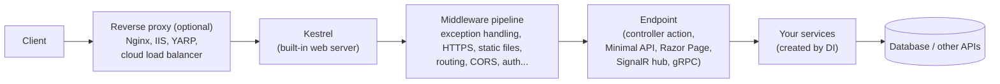
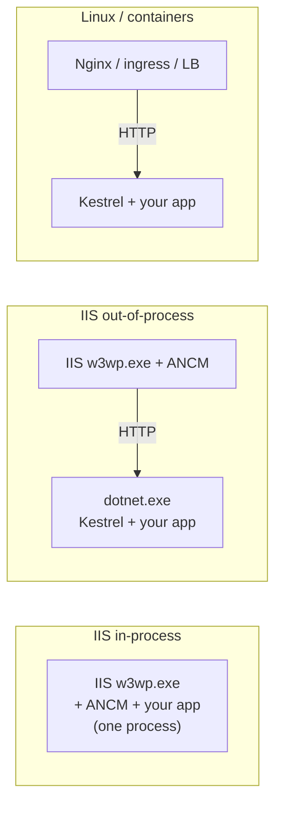
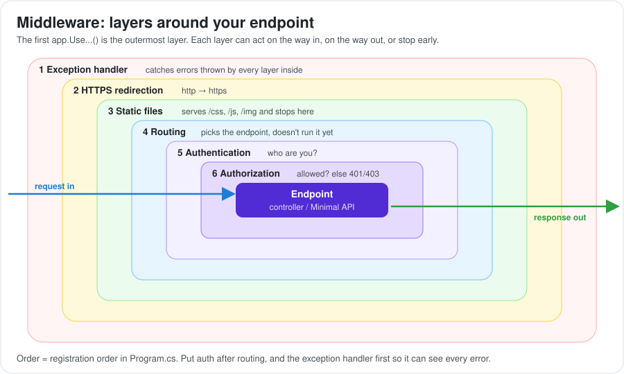
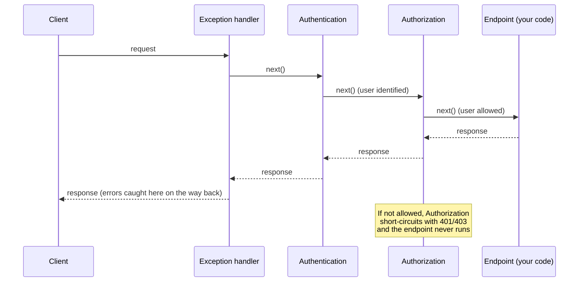
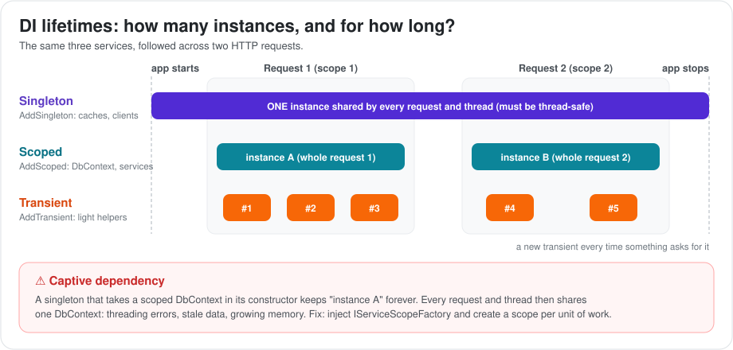
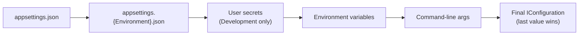
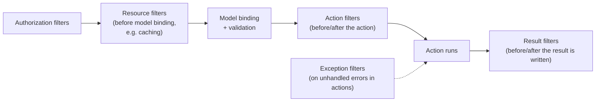

# Modern ASP.NET Core: From .NET Core 1.0 to .NET 10

This guide covers ASP.NET Core, the modern, cross-platform web framework of .NET. It explains how a request travels through the app (hosting, Kestrel, middleware, routing), how the app is built (dependency injection, configuration, logging), the two ways to build APIs (Controllers and Minimal APIs), how to secure the app, and how to make it fast and production-ready.

The examples use the modern `Program.cs` style (.NET 6 and later). Where older versions worked differently (for example the `Startup` class), the guide says so, because you will still find that code in many projects.

Related guides:

- [ASP.NET: From 4.5 to Modern ASP.NET Core](../index.md): the big-picture comparison and the migration plan.
- [Classic ASP.NET on .NET Framework](../aspnet-framework/index.md): what ASP.NET Core replaced, and why.
- [.NET Platform](../../index.md): the runtime, GC and thread pool under ASP.NET Core.
- [C# Language Deep Dive](../../csharp/index.md): async/await, records and other features used everywhere here.
- [Data Access in .NET](../../data-access/index.md): EF Core and `DbContext` lifetimes in web apps.

---

## 1. What ASP.NET Core Is and Why It Was Created

ASP.NET Core (first released in 2016, originally called "ASP.NET 5") is a full rewrite of ASP.NET. It is open source, runs on Windows, Linux and macOS, and no longer depends on IIS or `System.Web`.

### A. Problems It Solved

| Classic ASP.NET problem | ASP.NET Core answer |
| :--- | :--- |
| Windows + IIS only | Cross-platform. Runs in Linux containers. |
| Heavy `System.Web`, every feature always loaded | Small core. You add only the middleware you need. |
| Separate MVC and Web API stacks | One framework, one controller base, one filter system |
| No built-in dependency injection | DI built in and used by the framework itself |
| `web.config` XML, app restarts on change | JSON, environment variables, secrets, reload without restart |
| Fixed pipeline events | A middleware pipeline you build in code |
| Machine-wide framework updates | Each app chooses its .NET version |
| Average performance | One of the fastest mainstream web frameworks (TechEmpower benchmarks) |

### B. Version Highlights

| Version | Year | What changed for web developers |
| :--- | :--- | :--- |
| **1.0 / 1.1** | 2016 | First release. Ran on .NET Core **and** .NET Framework. `Startup` class, Kestrel, built-in DI. |
| **2.0 / 2.1 / 2.2** | 2017 to 2018 | Razor Pages, `[ApiController]`, `ActionResult<T>`, SignalR Core, `IHttpClientFactory`, HTTPS by default, health checks, IIS in-process hosting |
| **3.0 / 3.1 LTS** | 2019 | **Runs only on .NET Core.** Generic Host, endpoint routing, System.Text.Json, gRPC, Blazor Server |
| **5** | 2020 | Performance work, Blazor improvements, OpenAPI (Swagger) in templates |
| **6 LTS** | 2021 | **Minimal APIs**, `WebApplication` builder (no more `Startup` in templates), hot reload |
| **7** | 2022 | Rate limiting middleware, output caching, route groups, endpoint filters, typed results |
| **8 LTS** | 2023 | **Native AOT** for Minimal APIs, Blazor Web App (render modes), Identity API endpoints, keyed DI services, `IExceptionHandler` |
| **9** | 2024 | `MapStaticAssets`, built-in OpenAPI document generation, `HybridCache` |
| **10 LTS** | 2025 | Built-in validation for Minimal APIs, OpenAPI 3.1, Server-Sent Events results, passkey support in Identity |

---

## 2. The Big Picture: How a Request Flows

Before looking at each piece, it helps to see the whole journey of a request.

### A. From the Network to Your Code



### B. The Main Building Blocks

| Building block | Job | Section |
| :--- | :--- | :--- |
| **Host** | Starts the app, owns DI, configuration, logging and lifetime | 3 |
| **Server (Kestrel)** | Accepts HTTP connections and turns bytes into an `HttpContext` | 4 |
| **Middleware** | Components that each handle part of the request, in order | 5 |
| **Routing / endpoints** | Picks the code that should handle the URL | 6 |
| **Dependency injection** | Creates your services with the right lifetime | 7 |
| **Configuration and options** | Reads settings from JSON, environment variables and secrets | 8 |
| **Controllers / Minimal APIs** | Your request handlers | 9, 10 |

---

## 3. The Host and `Program.cs`

The **host** is the object that owns everything the app needs to run: the DI container, configuration, logging, the web server and background services. `Program.cs` builds the host and then defines the request pipeline.

### A. A Modern `Program.cs` (.NET 6+)

```csharp
var builder = WebApplication.CreateBuilder(args);   // 1. Set up config, logging, DI, Kestrel

// 2. Register services in DI
builder.Services.AddControllers();
builder.Services.AddDbContext<ShopDbContext>(o =>
    o.UseSqlServer(builder.Configuration.GetConnectionString("Shop")));
builder.Services.AddScoped<IOrderService, OrderService>();
builder.Services.AddAuthentication().AddJwtBearer();
builder.Services.AddAuthorization();

var app = builder.Build();                          // 3. Build the host

// 4. Build the middleware pipeline (ORDER MATTERS)
if (!app.Environment.IsDevelopment())
{
    app.UseExceptionHandler("/error");
    app.UseHsts();
}
app.UseHttpsRedirection();
app.UseAuthentication();
app.UseAuthorization();

// 5. Map endpoints
app.MapControllers();
app.MapGet("/health", () => Results.Ok("healthy"));

app.Run();                                          // 6. Start listening
```

The file has two halves:
1. **Before `Build()`**: register services (`builder.Services...`). This is like a shopping list for the DI container.
2. **After `Build()`**: describe what happens to each request (`app.Use...`, `app.Map...`).

### B. The Older `Startup` Class (ASP.NET Core 1.0 to 5)

You will see this in many existing projects. It does the same thing, split into two methods:

```csharp
public class Startup
{
    public Startup(IConfiguration configuration) => Configuration = configuration;
    public IConfiguration Configuration { get; }

    public void ConfigureServices(IServiceCollection services)   // = builder.Services...
    {
        services.AddControllers();
    }

    public void Configure(IApplicationBuilder app, IWebHostEnvironment env)   // = app.Use...
    {
        if (env.IsDevelopment()) app.UseDeveloperExceptionPage();
        app.UseRouting();
        app.UseAuthorization();
        app.UseEndpoints(endpoints => endpoints.MapControllers());
    }
}
```

### C. What `CreateBuilder` Sets Up for You

- **Configuration** from `appsettings.json`, `appsettings.{Environment}.json`, user secrets (in Development), environment variables and command-line arguments.
- **Logging** to the console and debug output, configured from the `Logging` section.
- **Kestrel** as the web server, with IIS integration when running behind IIS.
- **The environment** from `ASPNETCORE_ENVIRONMENT` (or `DOTNET_ENVIRONMENT`): `Development`, `Staging` or `Production` (the default).
- **DI scope validation** in Development, which catches lifetime mistakes early.

### D. App Lifetime and Graceful Shutdown

When the app is stopped (for example by Kubernetes sending `SIGTERM`), the host:
1. Stops accepting new connections.
2. Lets in-flight requests finish.
3. Stops hosted services (calls `StopAsync`).
4. Waits up to `HostOptions.ShutdownTimeout` (30 seconds by default in recent versions), then exits.

```csharp
app.Lifetime.ApplicationStopping.Register(() => logger.LogInformation("Shutting down..."));
builder.Services.Configure<HostOptions>(o => o.ShutdownTimeout = TimeSpan.FromSeconds(20));
```

Make sure Kubernetes' `terminationGracePeriodSeconds` is longer than this timeout.

---

## 4. Hosting: Kestrel, IIS and Reverse Proxies

ASP.NET Core ships its own cross-platform web server, **Kestrel**. You can expose it directly or put it behind a reverse proxy.

### A. Hosting Options

| Option | How it works | When to use |
| :--- | :--- | :--- |
| **Kestrel alone** | Kestrel listens on a port directly | Containers behind a cloud load balancer or ingress. Most common today. |
| **Behind Nginx / Apache / YARP** | The proxy handles TLS, routing and buffering, then forwards to Kestrel | Linux VMs, several apps on one host |
| **IIS in-process** (default with IIS since 2.2) | The ASP.NET Core Module (ANCM) loads your app **inside** `w3wp.exe`. Uses `IISHttpServer`, not Kestrel. | Windows servers. Fastest IIS option. |
| **IIS out-of-process** | IIS forwards requests to a separate Kestrel process | When you need process isolation from IIS |
| **HTTP.sys** | Uses the Windows kernel driver directly, without IIS | Windows-only features (for example Windows auth without IIS) on Windows services |



**Note for people coming from classic ASP.NET:** in IIS, the app pool for an ASP.NET Core site uses **"No Managed Code"**, because the app brings its own runtime. IIS only acts as the front door.

### B. Forwarded Headers: A Very Common Bug Behind Proxies

Behind a proxy, Kestrel sees the **proxy's** IP address and plain HTTP. Without configuration, `Request.Scheme` is `http` and `RemoteIpAddress` is the proxy. That breaks HTTPS redirects, generated links, OAuth callbacks and IP-based rate limits.

```csharp
builder.Services.Configure<ForwardedHeadersOptions>(o =>
{
    o.ForwardedHeaders = ForwardedHeaders.XForwardedFor | ForwardedHeaders.XForwardedProto;
    o.KnownProxies.Add(IPAddress.Parse("10.0.0.10"));   // only trust your own proxies
});

app.UseForwardedHeaders();   // put this FIRST in the pipeline
```

### C. Useful Kestrel Settings

| Setting | Default | Note |
| :--- | :--- | :--- |
| `Limits.MaxRequestBodySize` | About 28.6 MB (30,000,000 bytes) | Override per endpoint with `[RequestSizeLimit]` or `[DisableRequestSizeLimit]` |
| `Limits.MaxConcurrentConnections` | Unlimited | Protects against connection floods |
| `Limits.KeepAliveTimeout` | 130 seconds | |
| `Limits.RequestHeadersTimeout` | 30 seconds | Defends against slow-header (Slowloris) attacks |
| Protocols | HTTP/1.1 + HTTP/2. HTTP/3 (QUIC) is opt-in. | |
| Default container port | **8080** (since .NET 8 images) | Set with `ASPNETCORE_HTTP_PORTS` or `ASPNETCORE_URLS` |

---

## 5. The Middleware Pipeline

Middleware is the heart of ASP.NET Core. Each middleware is a small component that receives the request, can do something before and after the next component, and can decide to stop the pipeline ("short-circuit").

### A. How the Pipeline Works



Think of it as a set of nested layers. The request goes in through each layer, and the response comes back out through the same layers in reverse order.



### B. Writing Middleware

**1. Inline (quick and simple):**
```csharp
app.Use(async (context, next) =>
{
    var sw = Stopwatch.StartNew();
    await next(context);                                   // call the rest of the pipeline
    app.Logger.LogInformation("{Path} took {Ms} ms", context.Request.Path, sw.ElapsedMilliseconds);
});
```

**2. Convention-based class (the most common):**
```csharp
public class CorrelationIdMiddleware(RequestDelegate next)
{
    public async Task InvokeAsync(HttpContext context, ILogger<CorrelationIdMiddleware> logger)
    {
        var id = context.Request.Headers["X-Correlation-Id"].FirstOrDefault() ?? Guid.NewGuid().ToString();
        context.Response.Headers["X-Correlation-Id"] = id;
        using (logger.BeginScope(new Dictionary<string, object> { ["CorrelationId"] = id }))
        {
            await next(context);
        }
    }
}

app.UseMiddleware<CorrelationIdMiddleware>();
```

Convention-based middleware is created **once** (like a singleton). Inject scoped services (such as `DbContext`) as parameters of `InvokeAsync`, **not** in the constructor.

**3. `IMiddleware` (factory-based):** registered in DI and created per request, so scoped dependencies can go in the constructor.

### C. `Use`, `Run`, `Map`, `MapWhen`, `UseWhen`

| Method | What it does |
| :--- | :--- |
| `app.Use(...)` | Adds middleware that can call `next` |
| `app.Run(...)` | Adds **terminal** middleware. Nothing after it runs. |
| `app.Map("/path", branch => ...)` | Creates a separate pipeline branch for a path prefix |
| `app.MapWhen(predicate, branch => ...)` | Branches on any condition. Does not rejoin. |
| `app.UseWhen(predicate, branch => ...)` | Runs extra middleware on a condition, then **rejoins** the main pipeline |

### D. The Recommended Order

The order of `app.Use...` calls is the order in which middleware runs. Getting it wrong causes real bugs, for example authorization that never sees the user, or CORS headers missing on errors.

```csharp
app.UseForwardedHeaders();          // 1. Fix scheme and IP behind proxies
app.UseExceptionHandler("/error");  // 2. Catch everything below
app.UseHsts();                      // 3. HTTPS-only header (production)
app.UseHttpsRedirection();          // 4. Redirect http -> https
app.UseStaticFiles();               // 5. Serve files early, skip the rest (or MapStaticAssets in .NET 9+)
app.UseRouting();                   // 6. Pick the endpoint (implicit in .NET 6+ if omitted)
app.UseCors();                      // 7. After routing, before auth
app.UseAuthentication();            // 8. Who are you?
app.UseAuthorization();             // 9. Are you allowed? (needs the endpoint from routing)
app.UseRateLimiter();               // 10. Throttle
app.UseOutputCache();               // 11. Cache responses
app.MapControllers();               // 12. Endpoints
```

### E. Middleware vs Filters

| | Middleware | Filters (MVC / endpoint filters) |
| :--- | :--- | :--- |
| Runs for | Every request in its branch | Only requests that reach MVC actions or the filtered endpoints |
| Knows about | `HttpContext` only | The action, its arguments, model state, the result |
| Use for | Cross-cutting HTTP concerns: logging, headers, CORS, auth | Concerns tied to actions: validation, transforming results, per-action auditing |

---

## 6. Routing and Endpoints

Routing matches the incoming URL and HTTP method to an **endpoint**: the piece of code that will handle the request. Since ASP.NET Core 3.0, all frameworks (MVC, Razor Pages, Minimal APIs, SignalR, gRPC, health checks) share one **endpoint routing** system.

### A. Two Steps: Select, Then Execute

1. **`UseRouting`** looks at the URL and chooses the endpoint. It doesn't run it yet.
2. Middleware between the two steps (CORS, authentication, authorization, rate limiting) can **read the chosen endpoint and its metadata**, for example its `[Authorize]` policy.
3. **The endpoint middleware** (added by `MapControllers`, `MapGet` and so on) runs it.

That's why authorization middleware knows which policy to apply: routing has already picked the endpoint.

### B. Route Templates and Constraints

```csharp
app.MapGet("/orders/{id:int}", (int id) => ...);                    // only integers
app.MapGet("/files/{*path}", (string path) => ...);                 // catch-all
app.MapGet("/products/{slug:regex(^[a-z0-9-]+$)}", (string slug) => ...);
app.MapGet("/reports/{year:int:min(2000)}/{month:range(1,12)}", ...);
```

Common constraints: `int`, `long`, `guid`, `bool`, `datetime`, `alpha`, `minlength(n)`, `range(a,b)`, `regex(...)`.

**Tip:** constraints are for telling routes apart, not for input validation. A failed constraint returns a 404, not a helpful 400.

### C. Route Groups (.NET 7+)

```csharp
var orders = app.MapGroup("/api/orders")
                .RequireAuthorization()
                .WithTags("Orders");

orders.MapGet("/", GetAll);
orders.MapGet("/{id:int}", GetById);
orders.MapPost("/", Create).RequireAuthorization("CanCreateOrders");
```

### D. Link Generation

Never hard-code URLs. Generate them from route names so they stay correct when routes change:

```csharp
app.MapGet("/orders/{id:int}", GetById).WithName("GetOrder");
// In a handler:
return TypedResults.CreatedAtRoute(order, "GetOrder", new { id = order.Id });
// Or anywhere: linkGenerator.GetPathByName("GetOrder", new { id = 5 })
```

---

## 7. Dependency Injection

Dependency injection (DI) means a class receives the objects it needs (its dependencies) from outside, usually through its constructor, instead of creating them itself. ASP.NET Core has a built-in DI container, and the framework itself uses it everywhere.

### A. Why DI Matters

```csharp
// Without DI: hard-wired, hard to test, hard to swap
public class OrderService
{
    private readonly SqlOrderRepository _repo = new SqlOrderRepository("Server=...;Password=***");
}

// With DI: depends on an abstraction; the container supplies the implementation
public class OrderService(IOrderRepository repo, ILogger<OrderService> logger) { }
```

Benefits: easy unit testing (pass a fake), swapping implementations through configuration, and one place to control object lifetimes. (See also [Dependency Injection as a design pattern](../../../../design/lv3-design-pattern%20(Local%20Object%20n%20Class%20Relationships)/creational-(object-creation)/dependency-injection/index.md).)

### B. The Three Lifetimes

| Lifetime | One instance per... | Good for | Example |
| :--- | :--- | :--- | :--- |
| **Transient** | Every time it is requested | Lightweight, stateless helpers | `AddTransient<IEmailBuilder, EmailBuilder>()` |
| **Scoped** | HTTP request (scope) | Per-request state, unit of work | `AddScoped<IOrderService, OrderService>()`, `DbContext` |
| **Singleton** | Whole application | Shared, thread-safe, expensive to create | `AddSingleton<IClock, SystemClock>()`, caches, `HttpClient` handlers |



### C. The Captive Dependency Problem

A service must never depend on a service with a **shorter** lifetime. If a singleton receives a scoped `DbContext` in its constructor, that one `DbContext` is "captured" and shared by every request and thread forever. You get threading errors, stale data and a memory leak.

```csharp
// BAD: singleton capturing a scoped DbContext
builder.Services.AddSingleton<PriceCache>();
public class PriceCache(ShopDbContext db) { }    // throws at startup in Development (scope validation)

// GOOD: create a scope when you need scoped services
public class PriceCache(IServiceScopeFactory scopes)
{
    public async Task RefreshAsync()
    {
        using var scope = scopes.CreateScope();
        var db = scope.ServiceProvider.GetRequiredService<ShopDbContext>();
        // ...
    }
}
```

| Consumer ↓ / Dependency → | Singleton | Scoped | Transient |
| :--- | :--- | :--- | :--- |
| **Singleton** | OK | **Captive dependency** | Captured (becomes a singleton in practice) |
| **Scoped** | OK | OK | OK |
| **Transient** | OK | OK | OK |

### D. Useful Registration Patterns

```csharp
// Several implementations: inject IEnumerable<INotifier> to get all of them
builder.Services.AddScoped<INotifier, EmailNotifier>();
builder.Services.AddScoped<INotifier, SmsNotifier>();

// Register only if nothing is registered yet (useful in libraries)
builder.Services.TryAddSingleton<IClock, SystemClock>();

// Open generics
builder.Services.AddScoped(typeof(IRepository<>), typeof(EfRepository<>));

// Factory registration
builder.Services.AddSingleton<IStorage>(sp =>
    new BlobStorage(sp.GetRequiredService<IOptions<StorageOptions>>().Value.ConnectionString));

// Keyed services (.NET 8+): pick an implementation by key
builder.Services.AddKeyedSingleton<IPaymentGateway, StripeGateway>("stripe");
builder.Services.AddKeyedSingleton<IPaymentGateway, PayPalGateway>("paypal");
public class CheckoutService([FromKeyedServices("stripe")] IPaymentGateway gateway) { }
```

### E. DI Best Practices

- Prefer **constructor injection**. Avoid calling `IServiceProvider.GetService` all over the code (the "service locator" anti-pattern hides dependencies).
- **Don't dispose** services you got from DI. The container owns them and disposes them at the end of the scope or app.
- Keep constructors cheap. Don't do I/O in constructors.
- Too many constructor parameters (more than 5 to 7) usually means the class does too much.
- The built-in container has no property injection, interception or convention-based scanning. If you need those, plug in Autofac, or use Scrutor for scanning.

---

## 8. Configuration and the Options Pattern

ASP.NET Core reads settings from several **providers** and merges them into one `IConfiguration`. The **options pattern** then binds sections of that configuration to strongly typed classes.

### A. Configuration Sources and Priority

Later sources override earlier ones:



```json
// appsettings.json
{
  "ConnectionStrings": { "Shop": "Server=.;Database=Shop;User Id=app;Password=***" },
  "Payments": { "BaseUrl": "https://payments.example.com", "TimeoutSeconds": 10 }
}
```

```bash
# Environment variables use a double underscore for nesting
export Payments__TimeoutSeconds=30
export ConnectionStrings__Shop="Server=prod-db;..."
```

**Secrets:** never commit real secrets in `appsettings.json`. Use user secrets (`dotnet user-secrets set ...`) for local development, and environment variables, Azure Key Vault, AWS Secrets Manager or Kubernetes secrets in production.

### B. The Options Pattern

```csharp
public class PaymentOptions
{
    public const string Section = "Payments";
    [Required, Url] public string BaseUrl { get; set; } = "";
    [Range(1, 120)] public int TimeoutSeconds { get; set; } = 10;
}

builder.Services.AddOptions<PaymentOptions>()
    .BindConfiguration(PaymentOptions.Section)
    .ValidateDataAnnotations()
    .ValidateOnStart();          // fail fast at startup instead of on the first request

public class PaymentClient(IOptions<PaymentOptions> options)
{
    private readonly PaymentOptions _opt = options.Value;
}
```

### C. `IOptions` vs `IOptionsSnapshot` vs `IOptionsMonitor`

| Interface | Lifetime | Sees config changes? | Use when |
| :--- | :--- | :--- | :--- |
| `IOptions<T>` | Singleton | **No**, read once | Settings that never change at run time (most cases) |
| `IOptionsSnapshot<T>` | Scoped | Yes, re-read **per request** | Per-request consumers that should see updates. Can't be used in singletons. |
| `IOptionsMonitor<T>` | Singleton | Yes, **live**, with an `OnChange` callback | Singletons and background services that must react to changes |

---

## 9. Building APIs With Controllers

Controllers are the MVC-style way to build APIs: classes that group related actions. They are feature-rich and familiar to anyone coming from MVC 5 or Web API 2.

### A. An API Controller

```csharp
[ApiController]
[Route("api/[controller]")]
public class OrdersController(IOrderService orders) : ControllerBase
{
    [HttpGet("{id:int}")]
    [ProducesResponseType<OrderDto>(StatusCodes.Status200OK)]
    [ProducesResponseType(StatusCodes.Status404NotFound)]
    public async Task<ActionResult<OrderDto>> Get(int id, CancellationToken ct)
    {
        var order = await orders.GetAsync(id, ct);
        return order is null ? NotFound() : order;
    }

    [HttpPost]
    public async Task<ActionResult<OrderDto>> Create(CreateOrderRequest request, CancellationToken ct)
    {
        var created = await orders.CreateAsync(request, ct);
        return CreatedAtAction(nameof(Get), new { id = created.Id }, created);
    }
}
```

### B. What `[ApiController]` Does for You

| Behavior | Without it | With it |
| :--- | :--- | :--- |
| Invalid model | You must check `ModelState.IsValid` yourself | Automatic **400** with a `ValidationProblemDetails` body |
| Binding sources | Complex types bound from the form by default | Complex types from the **body**, simple types from route/query (inferred) |
| Error responses | Plain status codes | `ProblemDetails` (RFC 9457, formerly 7807) JSON |
| Routing | Conventional routes allowed | **Attribute routing required** |

### C. Model Binding Sources

| Attribute | Reads from | Example |
| :--- | :--- | :--- |
| `[FromRoute]` | URL segment | `/orders/{id}` |
| `[FromQuery]` | Query string | `?page=2` |
| `[FromBody]` | Request body (JSON). Only **one** per action. | `CreateOrderRequest` |
| `[FromForm]` | Form fields and files | `IFormFile` uploads |
| `[FromHeader]` | HTTP header | `[FromHeader(Name = "X-Tenant")]` |
| `[FromServices]` | DI container | Rarely needed (inferred in .NET 7+) |

### D. Filters in ASP.NET Core

ASP.NET Core has one unified filter pipeline (no more separate MVC and Web API filters):



```csharp
public class AuditFilter(IAuditLog audit) : IAsyncActionFilter
{
    public async Task OnActionExecutionAsync(ActionExecutingContext ctx, ActionExecutionDelegate next)
    {
        var executed = await next();   // run the action
        if (executed.Exception is null)
            await audit.WriteAsync(ctx.HttpContext.User.Identity?.Name, ctx.ActionDescriptor.DisplayName);
    }
}

builder.Services.AddControllers(o => o.Filters.Add<AuditFilter>());   // global, with DI support
// Or per action: [ServiceFilter(typeof(AuditFilter))] / [TypeFilter(typeof(AuditFilter))]
```

### E. Razor Pages and MVC Views

For server-rendered HTML you have two options:
- **MVC with views:** controllers + `.cshtml` views. Same as MVC 5, with Tag Helpers (`<a asp-action="Details" asp-route-id="5">`) and View Components (the replacement for child actions).
- **Razor Pages** (2.0+): one page = one `.cshtml` file + a `PageModel` class with `OnGet` / `OnPost` handlers. Simpler for page-focused apps and the closest replacement for Web Forms pages.

---

## 10. Minimal APIs

Minimal APIs (.NET 6+) let you define endpoints as lambdas or methods directly on the app, without controllers. They have less ceremony, start faster, and are the only API style that fully supports Native AOT.

### A. Basic Usage

```csharp
var orders = app.MapGroup("/api/orders").WithTags("Orders");

orders.MapGet("/{id:int}", async Task<Results<Ok<OrderDto>, NotFound>> (int id, IOrderService svc, CancellationToken ct) =>
{
    var order = await svc.GetAsync(id, ct);
    return order is null ? TypedResults.NotFound() : TypedResults.Ok(order);
});

orders.MapPost("/", async (CreateOrderRequest req, IOrderService svc, CancellationToken ct) =>
{
    var created = await svc.CreateAsync(req, ct);
    return TypedResults.Created($"/api/orders/{created.Id}", created);
});
```

Parameters are bound automatically: route values, query string, headers, the JSON body for complex types, services from DI, and special types such as `HttpContext` and `CancellationToken`. Use `[AsParameters]` to group many parameters into one object.

**`TypedResults` vs `Results`:** `TypedResults.Ok(order)` returns a concrete type, so OpenAPI can describe the response and unit tests can check the type without reflection.

### B. Organizing Minimal APIs

The common worry is "everything ends up in `Program.cs`". The fix is to group endpoints by feature into extension methods:

```csharp
public static class OrderEndpoints
{
    public static IEndpointRouteBuilder MapOrderEndpoints(this IEndpointRouteBuilder app)
    {
        var group = app.MapGroup("/api/orders").RequireAuthorization();
        group.MapGet("/{id:int}", GetById);
        group.MapPost("/", Create);
        return app;
    }

    private static async Task<Results<Ok<OrderDto>, NotFound>> GetById(int id, IOrderService svc) { /* ... */ }
    private static async Task<Created<OrderDto>> Create(CreateOrderRequest req, IOrderService svc) { /* ... */ }
}

// Program.cs
app.MapOrderEndpoints();
```

### C. Endpoint Filters and Validation

```csharp
// Endpoint filter (.NET 7+): like an action filter for Minimal APIs
orders.MapPost("/", Create).AddEndpointFilter(async (ctx, next) =>
{
    var req = ctx.GetArgument<CreateOrderRequest>(0);
    if (req.Quantity <= 0) return TypedResults.ValidationProblem(new Dictionary<string, string[]>
        { ["Quantity"] = ["Quantity must be positive."] });
    return await next(ctx);
});

// .NET 10: built-in DataAnnotations validation for Minimal APIs
builder.Services.AddValidation();
```

Before .NET 10, people usually used FluentValidation or a custom endpoint filter for Minimal API validation.

### D. Controllers vs Minimal APIs

| | Controllers | Minimal APIs |
| :--- | :--- | :--- |
| Structure | Classes, attributes, conventions | Lambdas/methods, route groups |
| Filters | Rich MVC filter pipeline | Endpoint filters (simpler) |
| Model validation | Automatic with `[ApiController]` | Built-in since .NET 10, otherwise manual or a library |
| Performance and startup | Good | Slightly better, less overhead |
| Native AOT | Not supported | Supported |
| Best for | Large teams used to MVC, apps that also render views, heavy use of filters | New microservices, small focused APIs, vertical slice architecture, serverless |

Both can live in the same app, and both use the same routing, DI, auth and middleware.

---

## 11. Error Handling and ProblemDetails

A good API returns errors in a consistent, machine-readable format and never leaks stack traces in production. ASP.NET Core uses the **ProblemDetails** standard (RFC 9457) for this.

### A. Setting It Up

```csharp
builder.Services.AddProblemDetails();                       // standard error format
builder.Services.AddExceptionHandler<GlobalExceptionHandler>(); // .NET 8+

app.UseExceptionHandler();      // catches unhandled exceptions
app.UseStatusCodePages();       // gives bodies to empty 404/405 responses

public class GlobalExceptionHandler(ILogger<GlobalExceptionHandler> logger) : IExceptionHandler
{
    public async ValueTask<bool> TryHandleAsync(HttpContext ctx, Exception ex, CancellationToken ct)
    {
        var (status, title) = ex switch
        {
            NotFoundException   => (StatusCodes.Status404NotFound, "Resource not found"),
            ValidationException => (StatusCodes.Status400BadRequest, "Validation failed"),
            _                   => (StatusCodes.Status500InternalServerError, "Unexpected error")
        };
        if (status == 500) logger.LogError(ex, "Unhandled exception");

        ctx.Response.StatusCode = status;
        await ctx.Response.WriteAsJsonAsync(new ProblemDetails
        {
            Status = status,
            Title = title,
            Instance = ctx.Request.Path
        }, ct);
        return true;   // handled
    }
}
```

Example response:
```json
{
  "type": "https://tools.ietf.org/html/rfc9110#section-15.5.5",
  "title": "Resource not found",
  "status": 404,
  "instance": "/api/orders/999",
  "traceId": "00-4bf92f3577b34da6a3ce929d0e0e4736-00f067aa0ba902b7-01"
}
```

### B. Good Practices

- Show `UseDeveloperExceptionPage` only in Development (it is on by default there in .NET 6+).
- Don't use exceptions for expected outcomes like "not found" in hot paths. Return results instead.
- Include a `traceId` so support can find the matching logs.
- Map exceptions to status codes in **one** place, not in every controller.

(See also [HTTP Status Codes](../../../../backend/api/http-status/index.md).)

---

## 12. Authentication and Authorization

**Authentication** answers "who are you?". **Authorization** answers "what are you allowed to do?". ASP.NET Core handles them with two separate middleware components and a flexible policy system.

### A. Authentication Schemes and Handlers

A **scheme** is a named authentication method with a **handler** that knows how to read credentials and build a `ClaimsPrincipal` (the user plus their claims).

| Scheme | Typical use |
| :--- | :--- |
| **Cookies** | Server-rendered web apps (MVC, Razor Pages, Blazor Server) |
| **JWT Bearer** | APIs called by SPAs, mobile apps and other services |
| **OpenID Connect** | Sign-in through an identity provider (Entra ID, Auth0, Keycloak, Google) |
| **Negotiate / Windows** | Intranet apps with Active Directory |
| **API keys / certificates** | Service-to-service calls (custom handler or certificate auth) |

```csharp
builder.Services.AddAuthentication(JwtBearerDefaults.AuthenticationScheme)
    .AddJwtBearer(o =>
    {
        o.Authority = "https://login.example.com/";   // the token issuer; keys are fetched automatically
        o.Audience = "orders-api";
    });
```

**What each handler action means:**
- **Authenticate:** read the request and build the user (for example, validate the JWT).
- **Challenge:** the user is not authenticated. Returns **401**, or redirects to the login page for cookies.
- **Forbid:** the user is authenticated but not allowed. Returns **403**, or redirects to "access denied".

### B. Authorization: Roles, Claims and Policies

```csharp
builder.Services.AddAuthorizationBuilder()
    .AddPolicy("AdminOnly", p => p.RequireRole("Admin"))
    .AddPolicy("CanRefund", p => p.RequireClaim("permission", "orders.refund"))
    .AddPolicy("Adult", p => p.AddRequirements(new MinimumAgeRequirement(18)))
    .SetFallbackPolicy(new AuthorizationPolicyBuilder().RequireAuthenticatedUser().Build()); // secure by default

[Authorize(Policy = "CanRefund")]
[HttpPost("{id}/refund")]
public Task<IActionResult> Refund(int id) { /* ... */ }

app.MapDelete("/admin/cache", ClearCache).RequireAuthorization("AdminOnly");
app.MapGet("/public/info", GetInfo).AllowAnonymous();
```

**Custom requirement and handler:**
```csharp
public record MinimumAgeRequirement(int Age) : IAuthorizationRequirement;

public class MinimumAgeHandler : AuthorizationHandler<MinimumAgeRequirement>
{
    protected override Task HandleRequirementAsync(AuthorizationHandlerContext ctx, MinimumAgeRequirement req)
    {
        var birth = ctx.User.FindFirst("birthdate")?.Value;
        if (birth is not null && DateTime.Parse(birth).AddYears(req.Age) <= DateTime.Today)
            ctx.Succeed(req);
        return Task.CompletedTask;
    }
}
builder.Services.AddSingleton<IAuthorizationHandler, MinimumAgeHandler>();
```

### C. Resource-Based Authorization

Sometimes the decision depends on the data itself ("users can edit only **their own** orders"). Attributes can't know that, so you call `IAuthorizationService` inside the handler:

```csharp
public async Task<IActionResult> Edit(int id, [FromServices] IAuthorizationService auth)
{
    var order = await _orders.GetAsync(id);
    var result = await auth.AuthorizeAsync(User, order, "SameOwner");
    if (!result.Succeeded) return Forbid();
    // ...
}
```

### D. ASP.NET Core Identity

Identity is a membership system: users, password hashing, roles, lockout, two-factor authentication, external logins and (in .NET 10) passkeys. It stores data with EF Core.
- With Razor Pages UI: scaffold the Identity pages.
- For SPAs and mobile apps (.NET 8+): `app.MapIdentityApi<AppUser>()` adds `/register`, `/login` and `/refresh` endpoints that issue cookies or tokens.
- For larger systems, consider a dedicated identity provider (Entra ID, Auth0, Keycloak, Duende IdentityServer) instead of building token issuance yourself. (See also the [auth](../../../../auth/index.md) section.)

### E. Data Protection: The `machineKey` Replacement

The **Data Protection API** encrypts and signs auth cookies, antiforgery tokens and TempData. It manages a **key ring** that rotates automatically (every 90 days by default).

**Web farm trap:** by default, keys are stored locally per machine (or in memory in some containers). With several instances, a cookie created by server A can't be read by server B, and users get logged out randomly. In containers, keys are also lost on restart.

```csharp
builder.Services.AddDataProtection()
    .SetApplicationName("shop")                                   // same name on all instances
    .PersistKeysToStackExchangeRedis(redis, "DataProtection-Keys") // or Azure Blob, a database, a file share
    .ProtectKeysWithCertificate(cert);                            // encrypt keys at rest
```

### F. Other Built-in Protections

| Threat | ASP.NET Core feature |
| :--- | :--- |
| CSRF | Antiforgery tokens, automatic in Razor forms and validated by MVC/Razor Pages. `SameSite` cookies. Not needed for pure bearer-token APIs. |
| XSS | Razor HTML-encodes output by default. Add a Content Security Policy. |
| HTTPS | `UseHttpsRedirection`, `UseHsts` |
| CORS | `AddCors` + `UseCors` with explicit origins. Never combine `AllowAnyOrigin` with credentials. |
| Abuse | Rate limiting middleware (section 13) |
| Secrets | User secrets, Key Vault and other providers. Never commit secrets. |

(See also [CORS](../../../../backend/security/CORS/index.md), [CSRF](../../../../backend/security/CSRF/index.md), [XSS](../../../../backend/security/XSS/index.md) and [Rate Limit](../../../../backend/security/rate-limit/index.md).)

---

## 13. Performance and Scalability

ASP.NET Core is fast out of the box. Most real-world slowness comes from blocking calls, bad data access, missing caching or creating expensive objects per request.

### A. Async All the Way, and No SynchronizationContext

- ASP.NET Core has **no SynchronizationContext**, so the classic `.Result` deadlock of ASP.NET 4.x doesn't happen.
- Blocking is still harmful: `.Result`, `.Wait()`, `Thread.Sleep` and synchronous I/O hold thread pool threads and cause **thread pool starvation** under load.
- Synchronous I/O on the request or response body is **disabled by default** (`AllowSynchronousIO = false`). It throws instead of silently hurting performance.

### B. `HttpClient` Done Right: `IHttpClientFactory`

```csharp
builder.Services.AddHttpClient<PaymentClient>(c =>
{
    c.BaseAddress = new Uri("https://payments.example.com");
    c.Timeout = TimeSpan.FromSeconds(10);
})
.AddStandardResilienceHandler();   // Microsoft.Extensions.Http.Resilience: retries, circuit breaker, timeouts

public class PaymentClient(HttpClient http)   // typed client: HttpClient comes from the factory
{
    public async Task<PaymentResult?> PayAsync(PaymentRequest request, CancellationToken ct)
    {
        using var response = await http.PostAsJsonAsync("/pay", request, ct);
        response.EnsureSuccessStatusCode();
        return await response.Content.ReadFromJsonAsync<PaymentResult>(ct);
    }
}
```

| Approach | Problem |
| :--- | :--- |
| `new HttpClient()` per request | **Socket exhaustion**: closed connections linger in `TIME_WAIT` and the server runs out of ports |
| One static `HttpClient` forever | Never notices **DNS changes** (unless you set `PooledConnectionLifetime`) |
| `IHttpClientFactory` | Pools and recycles handlers. Fixes both. Central place for resilience policies. |

### C. Caching Options

| Cache | Where | Use for |
| :--- | :--- | :--- |
| `IMemoryCache` | In-process memory | Fast, per-instance data. Set size limits and expirations. |
| `IDistributedCache` (Redis, SQL Server) | Shared store | Data shared by all instances, sessions |
| **`HybridCache`** (.NET 9+) | Memory (L1) + distributed (L2) | Best default. Includes **stampede protection**: only one caller rebuilds a missing entry. |
| **Output caching** (.NET 7+) | Server-side response cache | Whole responses, with tag-based invalidation |
| Response caching | HTTP cache headers (`Cache-Control`) | Browser and CDN caching |

```csharp
builder.Services.AddHybridCache();

app.MapGet("/products/{id:int}", async (int id, HybridCache cache, IProductRepo repo, CancellationToken ct) =>
    await cache.GetOrCreateAsync($"product:{id}",
        async token => await repo.GetAsync(id, token),
        cancellationToken: ct));
```

(See also [Caching](../../../../caching/index.md).)

### D. Rate Limiting (.NET 7+)

```csharp
builder.Services.AddRateLimiter(o =>
{
    o.RejectionStatusCode = StatusCodes.Status429TooManyRequests;
    o.AddPolicy("per-user", ctx => RateLimitPartition.GetTokenBucketLimiter(
        ctx.User.Identity?.Name ?? ctx.Connection.RemoteIpAddress?.ToString() ?? "anon",
        _ => new TokenBucketRateLimiterOptions
        {
            TokenLimit = 100, TokensPerPeriod = 50, ReplenishmentPeriod = TimeSpan.FromSeconds(10)
        }));
});

app.UseRateLimiter();
app.MapPost("/api/orders", Create).RequireRateLimiting("per-user");
```

Algorithms: **fixed window, sliding window, token bucket, concurrency**. This limits per instance. For a global limit across many instances, use an API gateway or a Redis-based limiter.

### E. Other Performance Tools

| Tool | What it does |
| :--- | :--- |
| Response compression | Gzip/Brotli for responses (often done by the proxy or CDN instead) |
| `MapStaticAssets` (.NET 9+) | Pre-compressed, fingerprinted static files with good cache headers |
| Request timeouts middleware (.NET 8+) | Cancels requests that run too long |
| `System.Text.Json` source generation | Faster serialization, AOT-friendly |
| Native AOT | Faster startup and less memory for Minimal APIs |
| Object pooling, `ArrayPool<T>` | Fewer allocations in hot paths |
| Server GC / DATAS | Default for web apps; DATAS adapts heap count to load (.NET 9+) |

---

## 14. Background Work, Real-Time and Other Endpoint Types

### A. Hosted Services

Unlike IIS-hosted ASP.NET 4.x, background work in ASP.NET Core is a first-class part of the host, with proper startup and graceful shutdown.

```csharp
public class OutboxPublisher(IServiceScopeFactory scopes, ILogger<OutboxPublisher> logger) : BackgroundService
{
    protected override async Task ExecuteAsync(CancellationToken stoppingToken)
    {
        using var timer = new PeriodicTimer(TimeSpan.FromSeconds(5));
        while (await timer.WaitForNextTickAsync(stoppingToken))
        {
            try
            {
                using var scope = scopes.CreateScope();                   // scoped services need a scope
                var db = scope.ServiceProvider.GetRequiredService<ShopDbContext>();
                // read unpublished messages, publish them, mark as sent
            }
            catch (Exception ex) when (ex is not OperationCanceledException)
            {
                logger.LogError(ex, "Outbox publishing failed");          // don't let one error kill the loop
            }
        }
    }
}

builder.Services.AddHostedService<OutboxPublisher>();
```

**Watch out:**
- `BackgroundService` instances are **singletons**. Create a scope for scoped services.
- Before .NET 8, an unhandled exception in `ExecuteAsync` silently stopped the service. Since .NET 8 it stops the whole host by default (`BackgroundServiceExceptionBehavior.StopHost`). Catch and log errors inside the loop.
- With several instances, every instance runs the job. Use leader election, a distributed lock, or a job system (Hangfire, Quartz.NET) when a job must run only once.
- Never capture `HttpContext` in background work. It is tied to one request and is reused afterwards.

**Queues inside the app:** `Channel<T>` is a good in-memory queue between request handlers and a background worker. It is lost on restart, so use a durable broker (RabbitMQ, Kafka, Azure Service Bus) for important messages.

### B. SignalR: Real-Time Communication

```csharp
public class NotificationsHub : Hub
{
    public Task JoinOrder(int orderId) => Groups.AddToGroupAsync(Context.ConnectionId, $"order-{orderId}");
}

app.MapHub<NotificationsHub>("/hubs/notifications");

// Push from anywhere (e.g., a service) through IHubContext
await hubContext.Clients.Group($"order-{id}").SendAsync("statusChanged", newStatus);
```

- Transports: **WebSockets**, then Server-Sent Events, then long polling as fallbacks.
- **Scale-out:** connections are tied to one server. With several servers you need a **backplane** (Redis) or Azure SignalR Service, and usually sticky sessions unless only WebSockets is used.

(See also [WebSocket](../../../../network/index.md) in the network section.)

### C. Other Endpoint Types

| Type | Use for |
| :--- | :--- |
| **gRPC** (`MapGrpcService`) | Fast service-to-service calls with Protobuf contracts over HTTP/2. The modern replacement for WCF. |
| **Health checks** (`MapHealthChecks`) | Liveness and readiness probes for Kubernetes and load balancers |
| **Server-Sent Events** (`TypedResults.ServerSentEvents`, .NET 10) | One-way streaming to browsers |
| **Blazor** | Interactive web UI written in C#. Since .NET 8 one "Blazor Web App" mixes render modes: static server rendering, Interactive Server (over SignalR), Interactive WebAssembly, and Auto. |
| **YARP** | A reverse proxy / API gateway library built on ASP.NET Core |

```csharp
builder.Services.AddHealthChecks()
    .AddDbContextCheck<ShopDbContext>()
    .AddCheck("self", () => HealthCheckResult.Healthy());

app.MapHealthChecks("/health/live", new() { Predicate = c => c.Name == "self" });
app.MapHealthChecks("/health/ready");   // includes the database
```

---

## 15. Logging and Observability

You can't fix what you can't see. ASP.NET Core has built-in structured logging and first-class support for OpenTelemetry metrics and traces.

### A. Structured Logging With `ILogger<T>`

```csharp
public class OrderService(ILogger<OrderService> logger)
{
    public void Ship(int orderId, string carrier)
    {
        // GOOD: message template with named placeholders, stored as searchable fields
        logger.LogInformation("Order {OrderId} shipped with {Carrier}", orderId, carrier);

        // BAD: string interpolation loses the structure and always allocates
        logger.LogInformation($"Order {orderId} shipped with {carrier}");
    }
}
```

- Log levels: `Trace`, `Debug`, `Information`, `Warning`, `Error`, `Critical`. Configure them per category in `appsettings.json`.
- Use **scopes** (`BeginScope`) to attach a correlation ID or order ID to every log in a block.
- Use the `[LoggerMessage]` source generator for high-volume logs.
- Popular sinks: Serilog, NLog, or OpenTelemetry exporters to Seq, Elastic, Grafana Loki, Application Insights or Datadog.
- **Never log secrets or personal data.** Mask them with `***`.

### B. OpenTelemetry: Metrics and Traces

```csharp
builder.Services.AddOpenTelemetry()
    .ConfigureResource(r => r.AddService("orders-api"))
    .WithTracing(t => t.AddAspNetCoreInstrumentation()
                       .AddHttpClientInstrumentation()
                       .AddEntityFrameworkCoreInstrumentation()
                       .AddOtlpExporter())
    .WithMetrics(m => m.AddAspNetCoreInstrumentation()
                       .AddRuntimeInstrumentation()
                       .AddOtlpExporter());
```

Built-in metrics include request duration, active requests, Kestrel connections, GC and thread pool statistics. **Aspire** (formerly .NET Aspire) gives a local dashboard and ready-made service defaults for all of this. (See also the [observation](../../../../observation/index.md) section.)

---

## 16. Testing ASP.NET Core Apps

### A. Integration Tests With `WebApplicationFactory`

`WebApplicationFactory<TProgram>` starts the real app **in memory** (no network port) and gives you an `HttpClient` to call it. You test the full pipeline: routing, middleware, auth, serialization and DI.

```csharp
public class OrdersApiTests(WebApplicationFactory<Program> factory) : IClassFixture<WebApplicationFactory<Program>>
{
    [Fact]
    public async Task Get_unknown_order_returns_404()
    {
        var client = factory.WithWebHostBuilder(b => b.ConfigureServices(services =>
        {
            services.RemoveAll<IOrderService>();
            services.AddScoped<IOrderService, FakeOrderService>();   // swap a dependency
        })).CreateClient();

        var response = await client.GetAsync("/api/orders/999");

        Assert.Equal(HttpStatusCode.NotFound, response.StatusCode);
    }
}
```

With top-level statements, add `public partial class Program { }` at the end of `Program.cs` so the test project can reference the type.

### B. Testing Strategy

| Level | Tool | What it covers |
| :--- | :--- | :--- |
| Unit | xUnit / NUnit + fakes or mocks | Services and domain logic |
| Integration (in-memory) | `WebApplicationFactory` | HTTP pipeline, DI, filters, serialization |
| Integration (real dependencies) | Testcontainers (SQL Server, PostgreSQL, Redis) | Real SQL, migrations, transactions |
| End-to-end | Playwright | UI and user flows |

(See also the [test](../../../../test/index.md) section.)

---

## 17. Deployment and Production Checklist

### A. Container Image

```dockerfile
FROM mcr.microsoft.com/dotnet/sdk:10.0 AS build
WORKDIR /src
COPY . .
RUN dotnet publish Orders.Api/Orders.Api.csproj -c Release -o /app

FROM mcr.microsoft.com/dotnet/aspnet:10.0
WORKDIR /app
COPY --from=build /app .
USER app                       # non-root user built into .NET 8+ images
EXPOSE 8080                    # default port since .NET 8
ENTRYPOINT ["dotnet", "Orders.Api.dll"]
```

### B. Production Checklist

| Area | Check |
| :--- | :--- |
| Environment | `ASPNETCORE_ENVIRONMENT=Production`. The developer exception page is off. |
| Secrets | From a secret store or environment, never in the image or repo |
| HTTPS | TLS at the proxy or Kestrel, HSTS, forwarded headers configured |
| Data Protection | Keys persisted to shared storage when running more than one instance |
| Health | Liveness and readiness endpoints wired to the orchestrator |
| Shutdown | Graceful shutdown timeout shorter than the orchestrator's grace period |
| Observability | Structured logs, traces and metrics exported, with correlation IDs |
| Limits | Request size limits, rate limits and timeouts set on purpose |
| Database | Migrations applied as a deployment step. Connection resiliency on. |
| Versions | Running on a supported LTS release, with monthly patches |

---

## 18. Summary: Key Rules for ASP.NET Core

1. **Order your middleware deliberately.** Exception handling first, then auth after routing, and forwarded headers at the very top behind proxies.
2. **Respect DI lifetimes.** No scoped services inside singletons. Create scopes in background services.
3. **Use the options pattern with validation** and fail fast at startup.
4. **Go async all the way** and pass `CancellationToken`s. Never block on tasks.
5. **Use `IHttpClientFactory`** with resilience handlers for outgoing calls.
6. **Return ProblemDetails** for errors and handle exceptions in one place.
7. **Secure by default:** a fallback authorization policy, HTTPS, explicit CORS, shared Data Protection keys.
8. **Cache and limit:** `HybridCache` or output caching for reads, rate limiting for abuse.
9. **Pick the API style on purpose:** Controllers for large MVC-style apps, Minimal APIs for small services and Native AOT.
10. **Test through the real pipeline** with `WebApplicationFactory` and real databases in containers.

---

## 19. Interview Masterclass: High-Impact Q&As

### Q1: What is middleware, and why does its order matter?
* **Answer:** Middleware is a component in the request pipeline that receives the `HttpContext`, can run code before and after calling the next component, and can short-circuit the pipeline by not calling `next`. Middleware runs in the order it is registered on the way in, and in reverse order on the way out. So order affects behavior. The exception handler must come first to catch errors from everything after it. Authentication must run before authorization. Authorization must run after routing so it knows the endpoint's policy. Forwarded headers must be processed before anything that reads the scheme or client IP.

### Q2: Explain the three DI lifetimes and the captive dependency problem.
* **Answer:** Transient creates a new instance every time one is requested. Scoped creates one instance per scope, which means one per HTTP request. Singleton creates one instance for the whole app. A captive dependency happens when a longer-lived service holds a shorter-lived one, typically a singleton that receives a scoped `DbContext`. That `DbContext` is then shared across all requests and threads, which causes concurrency errors, stale data and memory growth. In Development, scope validation throws at startup for this. The fix is to inject `IServiceScopeFactory` and create a scope when the work runs, or to change the lifetimes.

### Q3: What's the difference between `IOptions`, `IOptionsSnapshot` and `IOptionsMonitor`?
* **Answer:** `IOptions<T>` is a singleton that reads configuration once, so it never sees changes. `IOptionsSnapshot<T>` is scoped and re-reads configuration for each request, so it can't be injected into singletons. `IOptionsMonitor<T>` is a singleton that always returns the current value and offers an `OnChange` callback, which suits singletons and background services that must react to config changes. Add `ValidateDataAnnotations()` and `ValidateOnStart()` so bad configuration fails at startup.

### Q4: How does ASP.NET Core run behind IIS, and how is that different from classic ASP.NET?
* **Answer:** The ASP.NET Core Module (ANCM) in IIS either hosts the app in-process inside `w3wp.exe` (the default since 2.2, using `IISHttpServer`) or forwards requests to a separate Kestrel process (out-of-process). The app pool is set to "No Managed Code" because the app brings its own .NET runtime. Classic ASP.NET ran on `System.Web`, which was part of IIS's integrated pipeline and the machine-wide .NET Framework. ASP.NET Core only uses IIS as a front door and process manager.

### Q5: Why is there no `.Result` deadlock in ASP.NET Core? Is blocking OK then?
* **Answer:** ASP.NET Core has no SynchronizationContext, so continuations after `await` don't need to get back to a specific request context. They run on any thread pool thread, and the classic deadlock can't happen. Blocking is still harmful: each blocked call holds a thread pool thread. Under load the pool runs out of threads and only adds new ones slowly, so latency explodes (thread pool starvation). Async all the way is still the rule.

### Q6: Controllers or Minimal APIs: which would you choose and why?
* **Answer:** Both share routing, DI, middleware and auth. Controllers give you a rich filter pipeline, automatic model validation with `[ApiController]`, conventions and a familiar structure for large teams. They also suit apps that render views. Minimal APIs have less ceremony, slightly better performance, route groups and endpoint filters, and they are the only style that supports Native AOT. That makes them great for microservices and vertical slice designs. Since .NET 10 they also have built-in validation. Many apps mix them.

### Q7: How do authentication and authorization work in ASP.NET Core?
* **Answer:** Authentication middleware uses the configured scheme handler (cookie, JWT bearer, OpenID Connect and so on) to read the request and build `HttpContext.User`, a `ClaimsPrincipal`. Authorization middleware then evaluates the endpoint's requirements (`[Authorize]`, policies, roles, claims, custom requirements and handlers). If the user isn't authenticated, the handler issues a challenge (401 or a login redirect). If the user is authenticated but not allowed, it issues a forbid (403). Decisions that depend on the data, such as "only the owner can edit", use `IAuthorizationService.AuthorizeAsync(user, resource, policy)` inside the handler.

### Q8: Users get randomly logged out when the app runs on several instances. Why?
* **Answer:** Auth cookies and antiforgery tokens are encrypted with Data Protection keys, which are stored per machine by default (or are lost when a container restarts). A cookie issued by one instance can't be decrypted by another. Persist the key ring to shared storage (Redis, Azure Blob, a database, a file share), set the same application name on all instances, and protect the keys at rest. This is the modern version of sharing the `machineKey` in a classic ASP.NET web farm.

### Q9: Why should you use `IHttpClientFactory`?
* **Answer:** Creating and disposing an `HttpClient` per request causes socket exhaustion, because closed connections stay in `TIME_WAIT`. Keeping one static client forever means it never picks up DNS changes. `IHttpClientFactory` pools and periodically recycles the message handlers, which fixes both problems. It also gives you named or typed clients with central configuration and resilience handlers (retries, timeouts, circuit breakers), and it integrates with logging and DI.

### Q10: How do you run background jobs safely in ASP.NET Core?
* **Answer:** Implement `BackgroundService` and register it with `AddHostedService`. The host starts it and stops it gracefully using the stopping token. Because hosted services are singletons, create a DI scope for each unit of work to use scoped services like `DbContext`. Catch exceptions inside the loop, because an unhandled exception stops the host by default since .NET 8. With several instances, make sure jobs that must run only once use a lock, leader election or a job framework, and use a durable queue for work that must not be lost.

### Q11: What is endpoint routing, and why is it split into `UseRouting` and endpoint execution?
* **Answer:** Endpoint routing is one routing system shared by MVC, Razor Pages, Minimal APIs, SignalR, gRPC and health checks. `UseRouting` matches the request to an endpoint and attaches it to the `HttpContext` without running it. Middleware that runs afterwards, such as CORS, authentication, authorization, rate limiting and output caching, can read the endpoint's metadata (its policies and attributes) and act on it. Then the endpoint middleware runs the selected endpoint. In .NET 6+ `WebApplication` adds both steps automatically if you don't call them.

### Q12: How do you handle errors consistently in an ASP.NET Core API?
* **Answer:** Register `AddProblemDetails()` and use `UseExceptionHandler()` with one or more `IExceptionHandler` implementations (.NET 8+). They map exception types to status codes and return RFC 9457 ProblemDetails JSON that includes a trace ID. Log unexpected errors once, in that central place. Never return stack traces outside Development. Return results instead of throwing for expected outcomes like "not found", and let `[ApiController]` (or Minimal API validation) produce validation problem responses automatically.

### Q13: What changed between `Startup.cs` and the minimal hosting model in .NET 6?
* **Answer:** Older versions split setup into `ConfigureServices` (DI registrations) and `Configure` (the middleware pipeline) in a `Startup` class, called by `Host.CreateDefaultBuilder` and `ConfigureWebHostDefaults` in `Program.cs`. .NET 6 introduced `WebApplication.CreateBuilder`, where you register services on `builder.Services`, call `Build()`, then configure middleware and endpoints on `app`, all in one top-level `Program.cs`. It does the same work with less code, and it implicitly adds routing and endpoint middleware. The `Startup` pattern still works.

### Q14: How would you implement rate limiting, and what are its limits?
* **Answer:** Use the built-in rate limiting middleware (.NET 7+). Register named policies with `AddRateLimiter` (fixed window, sliding window, token bucket or concurrency), partition them by user, API key or IP, call `UseRateLimiter`, and attach policies to endpoints with `RequireRateLimiting`. Return 429, ideally with a `Retry-After` header. The built-in limiter keeps its counters in memory per instance, so with N instances the effective limit is about N times higher. For global limits, use an API gateway or a Redis-backed limiter, and rate-limit by the real client IP only after configuring forwarded headers.

### Q15: What is `HybridCache`, and what problem does it solve?
* **Answer:** `HybridCache` (.NET 9+) is a caching API that combines a fast in-memory L1 cache with an optional distributed L2 cache such as Redis behind one `GetOrCreateAsync` call. Its key feature is stampede protection: when many concurrent requests miss the same key, only one of them runs the factory to rebuild the value, and the others wait for that result. Without it, a popular key expiring can trigger hundreds of identical database queries at once. It also supports tag-based invalidation and configurable serialization.
