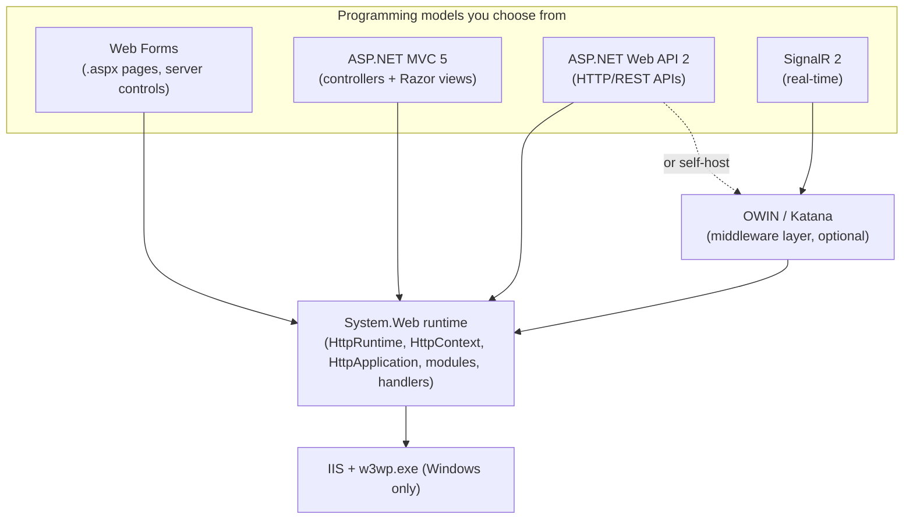
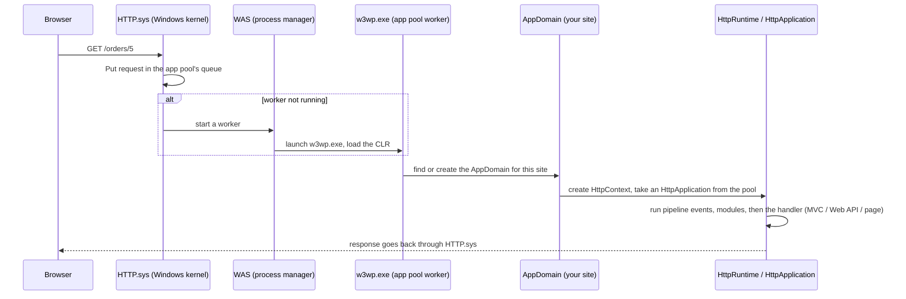
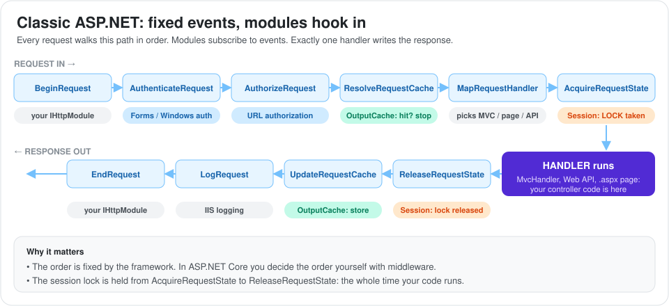
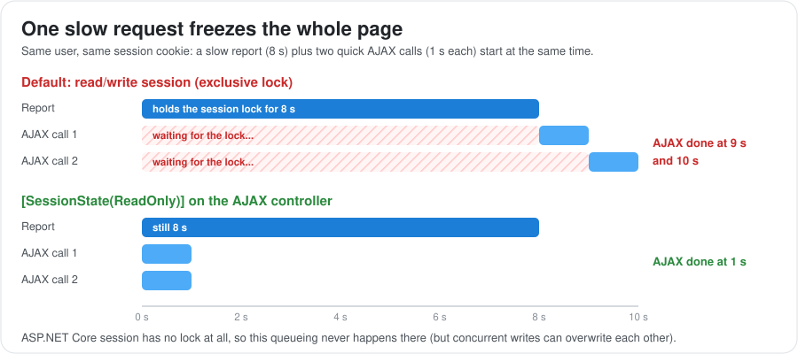

# Classic ASP.NET on .NET Framework (4.5 to 4.8)

This guide explains "classic" ASP.NET: the web stack built on `System.Web` that runs inside IIS on Windows with .NET Framework. It covers ASP.NET 4.5 and the frameworks around it: Web Forms, MVC 5, Web API 2, OWIN/Katana, session state, `web.config` and the IIS request pipeline.

Many companies still run large systems on this stack, and most ASP.NET Core design decisions are reactions to its pain points. If you understand how classic ASP.NET works, you can maintain legacy apps, plan migrations, and answer "why did ASP.NET Core change this?" questions.

Related guides:

- [ASP.NET: From 4.5 to Modern ASP.NET Core](../index.md): the big-picture comparison and the migration plan.
- [Modern ASP.NET Core](../aspnet-core/index.md): the successor of everything in this guide.
- [C# Language Deep Dive](../../csharp/index.md): async/await and the SynchronizationContext deadlock in detail.
- [Data Access in .NET](../../data-access/index.md): Entity Framework 6, which most classic ASP.NET apps use.

---

## 1. The Classic ASP.NET Family

Classic ASP.NET is not one framework. It is a group of frameworks that all run on the same foundation: the `System.Web.dll` runtime hosted by IIS.

### A. The Building Blocks



| Framework | What it is for | Style |
| :--- | :--- | :--- |
| **Web Forms** | Pages built from drag-and-drop server controls, like desktop apps | Event-driven (`Button_Click`), stateful (ViewState) |
| **MVC 5** | Server-rendered HTML with full control over markup | Controllers, actions, Razor views |
| **Web API 2** | JSON/XML APIs for SPAs, mobile apps and other services | Controllers returning data, content negotiation |
| **SignalR 2** | Real-time push (chat, notifications, dashboards) | Hubs over WebSockets with fallbacks |

### B. What Arrived With .NET Framework 4.5 and Shortly After

| Release | Year | Web highlights |
| :--- | :--- | :--- |
| .NET 4.5 / Visual Studio 2012 | 2012 | `async`/`await` in controllers and pages, MVC 4, **Web API 1**, Web Forms model binding, bundling and minification, WebSockets on IIS 8 |
| .NET 4.5.1 / Visual Studio 2013 | 2013 | **MVC 5, Web API 2, SignalR 2, ASP.NET Identity**, attribute routing, "One ASP.NET" project template, OWIN/Katana 2 |
| .NET 4.5.2 | 2014 | `HostingEnvironment.QueueBackgroundWorkItem` for safer background work |
| .NET 4.6 | 2015 | HTTP/2 on IIS 10 (Windows 10 / Server 2016), RyuJIT, Roslyn compiler |
| .NET 4.7 to 4.8.1 | 2017 to 2022 | Security, TLS and accessibility updates. The final line. |

**Interview note:** MVC 5 and Web API 2 are separate NuGet packages, not part of the .NET Framework itself. They run on .NET 4.5 and later.

---

## 2. Hosting: IIS, Application Pools and the Worker Process

Classic ASP.NET can't run on its own. IIS (Internet Information Services) receives the HTTP request and hands it to a worker process that loads your app. Knowing this journey explains many classic production issues: slow first requests, lost sessions and "random" restarts.

### A. The Journey of a Request



1. **HTTP.sys** is a Windows kernel driver. It listens on port 80/443 and puts requests into the queue of the right application pool.
2. **WAS** (Windows Process Activation Service) starts the worker process when it's needed.
3. **w3wp.exe** is the worker process of an **application pool**. It loads the .NET Framework CLR.
4. Each web application runs in its own **AppDomain** inside w3wp.exe.
5. **HttpRuntime** creates an `HttpContext` for the request and runs it through the pipeline (section 3).

### B. Application Pools

An application pool is a group of sites that share one or more worker processes.

| Setting | Default | Why you care |
| :--- | :--- | :--- |
| .NET CLR version | v4.0 (covers 4.5 to 4.8) | Use "No Managed Code" for ASP.NET Core sites |
| Pipeline mode | Integrated | See section 2D |
| Identity | `ApplicationPoolIdentity` | The Windows account your code runs as (file and database permissions) |
| Idle timeout | 20 minutes | The worker shuts down when idle, so the next request is slow ("cold start") |
| Regular recycle | Every 1,740 minutes (29 hours) | The worker restarts, and in-memory data (InProc session, cache) is lost |
| Queue length | 1,000 | When the queue is full, HTTP.sys returns **503 Service Unavailable** |

**Common fix for slow first requests:** set "Start Mode = AlwaysRunning", enable "Preload" on the site, and use the IIS Application Initialization module to warm up the app.

### C. AppDomain Restarts: Why Your App Restarts "By Itself"

Besides app pool recycling, ASP.NET restarts the **AppDomain** of a site when:
- `web.config` is changed (even by a deployment tool).
- Files in `/bin` change (for example during an xcopy deployment).
- Files in `App_Code` or `Global.asax` change.
- Too many dynamic recompilations happen (15 by default).

Every restart clears in-process session, `HttpRuntime.Cache`, static variables and the JIT-compiled code. Deploying during business hours therefore logs users out if you use InProc session.

### D. Integrated vs Classic Pipeline Mode

| | Classic mode (IIS 6 style) | Integrated mode (IIS 7+, default) |
| :--- | :--- | :--- |
| How ASP.NET plugs in | As an ISAPI extension (`aspnet_isapi.dll`), only for mapped extensions like `.aspx` | ASP.NET modules are part of the IIS pipeline itself |
| Can managed modules see static files or PHP requests? | No | Yes (for example, Forms auth can protect `.jpg` files) |
| Configuration | `<system.web>` | `<system.webServer>` for modules and handlers |
| Use today | Only for very old apps | Always |

### E. Scaling Out: Web Gardens and Web Farms

- **Web garden:** several worker processes in one app pool on one server. Each has its own memory, so InProc session and caches are not shared.
- **Web farm:** several servers behind a load balancer. You need shared session (StateServer, SQL Server or Redis), the **same `machineKey`** on every server (so auth cookies and ViewState work everywhere), or sticky sessions.

---

## 3. The Request Pipeline: Events, Modules and Handlers

Every request runs through a fixed sequence of events on an `HttpApplication` object. **Modules** subscribe to these events to add features such as authentication, session and caching. One **handler** produces the actual response.

### A. The Pipeline Events



Each event also has a `Post...` version (for example `PostAuthenticateRequest`). `PreSendRequestHeaders` fires just before headers are sent.

**Why this matters:** in classic ASP.NET the order is fixed by the framework. In ASP.NET Core you build the order yourself with middleware, which is more flexible but also means you can put things in the wrong order.

### B. HTTP Modules: Code That Runs for Every Request

A module implements `IHttpModule` and subscribes to pipeline events. Typical uses: logging, custom authentication, adding headers, URL rewriting.

```csharp
public class TimingModule : IHttpModule
{
    public void Init(HttpApplication app)
    {
        app.BeginRequest += (s, e) =>
            app.Context.Items["timer"] = Stopwatch.StartNew();

        app.EndRequest += (s, e) =>
        {
            var timer = (Stopwatch)app.Context.Items["timer"];
            app.Context.Response.AppendHeader("X-Elapsed-Ms", timer.ElapsedMilliseconds.ToString());
        };
    }

    public void Dispose() { }
}
```

```xml
<!-- web.config (integrated mode) -->
<system.webServer>
  <modules>
    <add name="TimingModule" type="MyApp.Infrastructure.TimingModule" />
  </modules>
</system.webServer>
```

### C. HTTP Handlers: Code That Produces the Response

A handler implements `IHttpHandler` (or `IHttpAsyncHandler`, or `HttpTaskAsyncHandler` since 4.5) and writes the response. Web Forms pages, MVC (`MvcHandler`) and Web API are all handlers under the hood. Custom handlers (`.ashx`) are handy for files, images or simple endpoints.

```csharp
public class ThumbnailHandler : HttpTaskAsyncHandler   // async handler, new in .NET 4.5
{
    public override async Task ProcessRequestAsync(HttpContext context)
    {
        var id = context.Request.QueryString["id"];
        var bytes = await ImageStore.GetThumbnailAsync(id);
        context.Response.ContentType = "image/jpeg";
        await context.Response.OutputStream.WriteAsync(bytes, 0, bytes.Length);
    }
}
```

| | Module | Handler |
| :--- | :--- | :--- |
| Runs for | Every request (for the events it subscribes to) | Only requests mapped to it |
| How many per request | Many | Exactly one |
| Job | Cross-cutting concerns | Produce the response |
| ASP.NET Core equivalent | Middleware | Endpoint (controller action, Minimal API, terminal middleware) |

### D. Global.asax: The Application Class

`Global.asax` is your subclass of `HttpApplication`. It's where an MVC 5 app starts up and where application-wide events are handled.

```csharp
public class MvcApplication : HttpApplication
{
    protected void Application_Start()
    {
        AreaRegistration.RegisterAllAreas();
        GlobalConfiguration.Configure(WebApiConfig.Register);   // Web API routes
        FilterConfig.RegisterGlobalFilters(GlobalFilters.Filters);
        RouteConfig.RegisterRoutes(RouteTable.Routes);          // MVC routes
        BundleConfig.RegisterBundles(BundleTable.Bundles);
    }

    protected void Application_Error()
    {
        var ex = Server.GetLastError();
        Log.Error(ex, "Unhandled exception");
    }

    protected void Session_Start() { /* runs when a new session is created */ }
}
```

**Watch out:** ASP.NET keeps a **pool** of `HttpApplication` instances, one per concurrent request. Don't store per-request data in fields of `Global.asax`. Use `HttpContext.Items` instead.

---

## 4. HttpContext, Session State and Application State

### A. `HttpContext.Current`

`HttpContext.Current` is a static property that returns the current request's context from anywhere in your code. It is convenient, but it causes problems:

- It hides dependencies. Any class can secretly depend on the web request, which makes unit testing hard.
- It returns **null** on threads that ASP.NET doesn't know about, for example inside `Task.Run`, timers or background work.
- With the .NET 4.5 task-friendly synchronization context, it **does** flow across `await` in request code. With the old (pre-4.5) behavior it can get lost.

ASP.NET Core removed it. You get `HttpContext` through the controller, through parameters, or through `IHttpContextAccessor` when you really need it.

### B. Session State Modes

| Mode | Where data lives | Survives app restart? | Works in a web farm? | Notes |
| :--- | :--- | :--- | :--- | :--- |
| `InProc` (default) | Worker process memory | **No** | **No** (needs sticky sessions) | Fastest. Stores live objects. |
| `StateServer` | The `aspnet_state` Windows service | Yes | Yes | Objects must be serializable |
| `SQLServer` | SQL Server database | Yes | Yes | Slowest, most durable |
| `Custom` | Any provider, for example Redis | Yes | Yes | Common modern choice |
| `Off` | Nowhere | n/a | n/a | Best for APIs |

### C. The Session Lock: A Classic Performance Trap

When a request needs **read/write** session access, ASP.NET takes an **exclusive lock on that user's session** for the whole request. Other requests from the **same user** must wait.



Symptoms: parallel AJAX calls from one page run one after another, and one slow request makes the whole UI feel frozen for that user.

Fixes:
```csharp
// MVC: this controller only reads session, so it doesn't take the exclusive lock
[SessionState(SessionStateBehavior.ReadOnly)]
public class DashboardController : Controller { }

// Or disable session for the controller completely
[SessionState(SessionStateBehavior.Disabled)]
public class HealthController : Controller { }
```
```aspx
<%@ Page EnableSessionState="ReadOnly" %>
```

ASP.NET Core session has **no lock**, which removes this problem but also means concurrent requests can overwrite each other's session changes.

### D. Application State and Cache

- `HttpApplicationState` (`Application["key"]`): global, in-memory, per AppDomain. Old and rarely used.
- `HttpRuntime.Cache` / `MemoryCache`: in-memory cache with expiration and dependencies. Lost on every recycle or restart, and not shared across servers.
- Output caching: `[OutputCache(Duration = 60, VaryByParam = "id")]` caches the whole rendered response.

---

## 5. Configuration: `web.config`

All configuration in classic ASP.NET lives in XML files. Settings are inherited: `machine.config` → root `web.config` → your site's `web.config` → `web.config` files in subfolders.

### A. A Typical `web.config`

```xml
<configuration>
  <connectionStrings>
    <add name="Shop" connectionString="Server=.;Database=Shop;User Id=app;Password=***;" providerName="System.Data.SqlClient" />
  </connectionStrings>

  <appSettings>
    <add key="PaymentApiUrl" value="https://payments.example.com" />
  </appSettings>

  <system.web>
    <compilation debug="false" targetFramework="4.8" />
    <!-- targetFramework="4.5"+ turns on the task-friendly async behavior -->
    <httpRuntime targetFramework="4.8" maxRequestLength="10240" /> <!-- in KB -->
    <authentication mode="Forms">
      <forms loginUrl="~/Account/Login" timeout="30" />
    </authentication>
    <sessionState mode="InProc" timeout="20" />
    <customErrors mode="RemoteOnly" defaultRedirect="~/Error" />
    <machineKey validationKey="***" decryptionKey="***" validation="HMACSHA256" />
  </system.web>

  <system.webServer>
    <security>
      <requestFiltering>
        <requestLimits maxAllowedContentLength="10485760" /> <!-- in bytes -->
      </requestFiltering>
    </security>
  </system.webServer>
</configuration>
```

```csharp
var url = ConfigurationManager.AppSettings["PaymentApiUrl"];
var cs = ConfigurationManager.ConnectionStrings["Shop"].ConnectionString;
```

### B. Things That Confuse Everyone

| Topic | Explanation |
| :--- | :--- |
| **Two upload limits** | `maxRequestLength` (ASP.NET, in **KB**, default 4 MB) and `maxAllowedContentLength` (IIS, in **bytes**, default about 28.6 MB). The smaller one wins, so you must raise both. |
| **`debug="true"` in production** | Disables batch compilation and some optimizations, and turns off bundling. Always use `false`. |
| **`targetFramework` on `httpRuntime`** | Without `4.5` or higher, the app runs with old "quirks" behavior, including the legacy synchronization context that breaks `async` code. |
| **Config transforms** | `Web.Release.config` uses XDT transforms to change values per build configuration. |
| **Secrets in `web.config`** | Often committed by mistake. Use encrypted sections (`aspnet_regiis -pe`), environment-specific transforms, or a secret store. |
| **Editing `web.config`** | Restarts the AppDomain (see section 2C). |

ASP.NET Core replaced all of this with `appsettings.json`, environment variables and the options pattern.

---

## 6. ASP.NET Web Forms

Web Forms (2002) tried to make web development feel like building Windows desktop apps: drag a button onto a page, double-click it, write a `Click` handler. It hid HTTP behind events and automatic state.

### A. How It Works

```aspx
<%@ Page Language="C#" CodeBehind="Orders.aspx.cs" Inherits="Shop.Orders" Async="true" %>
<form runat="server">
    <asp:TextBox ID="SearchBox" runat="server" />
    <asp:Button ID="SearchButton" runat="server" Text="Search" OnClick="SearchButton_Click" />
    <asp:GridView ID="OrdersGrid" runat="server" ItemType="Shop.Order" SelectMethod="GetOrders" />
</form>
```

```csharp
public partial class Orders : Page
{
    protected void SearchButton_Click(object sender, EventArgs e)
    {
        OrdersGrid.DataBind();   // the page posts back to itself and re-renders
    }

    // Model binding (new in ASP.NET 4.5): the grid calls this method itself
    public IQueryable<Order> GetOrders() =>
        _db.Orders.Where(o => o.Code.Contains(SearchBox.Text));
}
```

### B. The Page Lifecycle

Every postback rebuilds the whole page object and runs these steps:


Classic bug: putting data-loading code in `Page_Load` without checking `if (!IsPostBack)`. The data then reloads on every button click and overwrites what the user just typed.

### C. ViewState and Postback

- **ViewState** is a hidden form field (`__VIEWSTATE`) that stores the state of controls, base64-encoded and signed with the `machineKey`.
- **Postback** means every button click submits the whole form back to the same page.
- **Problems:** ViewState can grow to hundreds of KB (slow pages, big uploads on every click), HTML and IDs are generated by the framework (hard to style and test), and the page lifecycle is hard to reason about.

### D. Web Forms: Pros, Cons and Future

| Pros | Cons |
| :--- | :--- |
| Very fast to build internal CRUD screens | Heavy pages (ViewState), little control over HTML |
| Rich third-party control suites (Telerik, DevExpress) | Hard to unit test (logic lives in code-behind) |
| Familiar to WinForms developers | Not SEO or SPA friendly, unusual HTTP model |

**Future:** Web Forms is **not** available in ASP.NET Core. Migration paths are Razor Pages (closest page-based model) or Blazor (closest component and event model). Both are rewrites of the UI layer.

---

## 7. ASP.NET MVC 5

ASP.NET MVC (first released in 2009, version 5 in 2013) brought the Model-View-Controller pattern, clean URLs, full HTML control and testability. It became the standard for server-rendered sites on .NET Framework.

### A. Routing

```csharp
public class RouteConfig
{
    public static void RegisterRoutes(RouteCollection routes)
    {
        routes.IgnoreRoute("{resource}.axd/{*pathInfo}");
        routes.MapMvcAttributeRoutes();   // enables [Route] attributes (new in MVC 5)
        routes.MapRoute(
            name: "Default",
            url: "{controller}/{action}/{id}",
            defaults: new { controller = "Home", action = "Index", id = UrlParameter.Optional });
    }
}
```

Routes are checked **in order**, and the first match wins. A common bug is a general route registered before a specific one.

### B. Controllers and Action Results

```csharp
[RoutePrefix("orders")]
public class OrdersController : Controller
{
    private readonly IOrderService _orders;
    public OrdersController(IOrderService orders) { _orders = orders; } // needs a DI container (section 12)

    [Route("{id:int}")]
    public async Task<ActionResult> Details(int id)       // async action, .NET 4.5+
    {
        var order = await _orders.GetAsync(id);
        if (order == null) return HttpNotFound();
        return View(order);                               // renders Views/Orders/Details.cshtml
    }

    [HttpPost, ValidateAntiForgeryToken]
    public async Task<ActionResult> Create(CreateOrderModel model)
    {
        if (!ModelState.IsValid) return View(model);      // redisplay the form with errors
        var id = await _orders.CreateAsync(model);
        return RedirectToAction("Details", new { id });   // Post/Redirect/Get pattern
    }
}
```

Common action results: `ViewResult`, `PartialViewResult`, `JsonResult`, `RedirectToRouteResult`, `FileResult`, `HttpStatusCodeResult`, `ContentResult`.

### C. Model Binding and Validation

MVC fills action parameters from route values, the query string and form fields. Data annotations add validation:

```csharp
public class CreateOrderModel
{
    [Required, StringLength(50)]
    public string CustomerName { get; set; }

    [Range(1, 1000)]
    public int Quantity { get; set; }
}
```

**Over-posting (mass assignment) trap:** binding directly to an EF entity lets attackers post extra fields such as `IsAdmin=true`. Bind to view models, or use `[Bind(Include = "...")]`.

### D. Filters

Filters run code before and after an action. They are MVC's tool for cross-cutting concerns that need to know about controllers and actions.

| Filter type | Interface | Runs | Example |
| :--- | :--- | :--- | :--- |
| Authentication (new in MVC 5) | `IAuthenticationFilter` | First | Custom token authentication |
| Authorization | `IAuthorizationFilter` | Before model binding | `[Authorize(Roles = "Admin")]` |
| Action | `IActionFilter` | Before and after the action method | Logging, auditing |
| Result | `IResultFilter` | Before and after the view renders | Adding headers |
| Exception | `IExceptionFilter` | When something throws | `[HandleError]` |

```csharp
public class AuditAttribute : ActionFilterAttribute
{
    public override void OnActionExecuting(ActionExecutingContext ctx) =>
        Audit.Log(ctx.HttpContext.User.Identity.Name, ctx.ActionDescriptor.ActionName);
}

// Register globally in FilterConfig
filters.Add(new HandleErrorAttribute());
filters.Add(new AuthorizeAttribute());   // secure by default; use [AllowAnonymous] for exceptions
```

### E. Views, Layouts and Reuse

- **Razor** (`.cshtml`): HTML with `@` C# expressions. Output is HTML-encoded by default, which protects against XSS.
- **Layouts** (`_Layout.cshtml`), **sections** (`@RenderSection("scripts")`) and **partial views** (`@Html.Partial`).
- **Child actions** (`@Html.Action("Cart", "Shop")`): run a whole action for a widget. Replaced by **View Components** in ASP.NET Core.
- **HTML helpers**: `@Html.TextBoxFor(m => m.Name)`. Replaced mostly by **Tag Helpers** in ASP.NET Core.
- **Areas**: split large apps into sections (`/Admin/...`).
- **Bundling and minification** (`System.Web.Optimization`): combines and minifies CSS/JS at run time.

```csharp
bundles.Add(new ScriptBundle("~/bundles/app").Include("~/Scripts/app/*.js"));
// In the layout: @Scripts.Render("~/bundles/app")
// Active only when <compilation debug="false">
```

---

## 8. ASP.NET Web API 2

Web API (version 1 in 2012, version 2 in 2013) was built for HTTP services: REST APIs returning JSON or XML. It looks like MVC, but it was a **separate framework** with its own pipeline, which caused a lot of duplication.

### A. A Web API Controller

```csharp
[RoutePrefix("api/products")]
public class ProductsController : ApiController
{
    [HttpGet, Route("{id:int}")]
    public async Task<IHttpActionResult> Get(int id)
    {
        var product = await _repo.FindAsync(id);
        if (product == null) return NotFound();
        return Ok(product);                        // serialized by content negotiation
    }

    [HttpPost, Route("")]
    public async Task<IHttpActionResult> Post([FromBody] CreateProductDto dto)
    {
        if (!ModelState.IsValid) return BadRequest(ModelState);
        var created = await _repo.AddAsync(dto);
        return CreatedAtRoute("DefaultApi", new { id = created.Id }, created);
    }
}

// WebApiConfig.Register
config.MapHttpAttributeRoutes();
config.Routes.MapHttpRoute("DefaultApi", "api/{controller}/{id}", new { id = RouteParameter.Optional });
```

### B. Content Negotiation and Formatters

Web API reads the request's `Accept` header and picks a **media type formatter** to serialize the response. The JSON formatter used **Json.NET** (Newtonsoft.Json), and there was also an XML formatter. ASP.NET Core changed the default to `System.Text.Json`.

### C. Parameter Binding Rules (a Popular Question)

| Parameter type | Default source | Override |
| :--- | :--- | :--- |
| Simple types (`int`, `string`, `DateTime`, `Guid`) | URI (route or query string) | `[FromBody]` |
| Complex types (classes) | Request body | `[FromUri]` |
| Body | Only **one** parameter can be read from the body, because the body is a stream that can be read only once | |

### D. Message Handlers: Web API's Pipeline

`DelegatingHandler`s wrap the request before it reaches routing and controllers, like a "Russian doll". This is very close to ASP.NET Core middleware.

```csharp
public class ApiKeyHandler : DelegatingHandler
{
    protected override async Task<HttpResponseMessage> SendAsync(HttpRequestMessage request, CancellationToken ct)
    {
        if (!request.Headers.TryGetValues("X-Api-Key", out var keys) || !IsValid(keys.First()))
            return request.CreateResponse(HttpStatusCode.Unauthorized);

        return await base.SendAsync(request, ct);   // call the next handler
    }
}

config.MessageHandlers.Add(new ApiKeyHandler());
```

### E. MVC 5 vs Web API 2: The Duplication Problem

| Concern | MVC 5 | Web API 2 |
| :--- | :--- | :--- |
| Namespace | `System.Web.Mvc` | `System.Web.Http` |
| Base class | `Controller` | `ApiController` |
| Filters | `System.Web.Mvc.ActionFilterAttribute` | `System.Web.Http.Filters.ActionFilterAttribute` (a different type with the same name!) |
| DI hook | `DependencyResolver.SetResolver` | `config.DependencyResolver` |
| Routing table | `RouteTable.Routes` | `HttpConfiguration.Routes` |
| Depends on `System.Web` | Yes | No. It can be self-hosted with OWIN. |

A filter written for MVC silently does nothing on an `ApiController`, and the other way round. ASP.NET Core merged both into **one** framework with one `ControllerBase`, one filter system and one DI container.

---

## 9. OWIN and Katana: The Bridge to ASP.NET Core

`System.Web` tied ASP.NET to IIS. **OWIN** (Open Web Interface for .NET) is a small specification that separates the web server from the application. **Katana** is Microsoft's implementation of it. Together they introduced the **middleware pipeline** idea that ASP.NET Core is built on.

### A. The Core Idea

In OWIN, every component is a function that receives an environment dictionary (the request and response data) and calls the next component:

```csharp
// The OWIN "AppFunc" signature
using AppFunc = Func<IDictionary<string, object>, Task>;
```

```csharp
[assembly: OwinStartup(typeof(MyApp.Startup))]
namespace MyApp
{
    public class Startup
    {
        public void Configuration(IAppBuilder app)
        {
            app.Use(async (context, next) =>          // inline middleware
            {
                var sw = Stopwatch.StartNew();
                await next();
                Trace.WriteLine($"{context.Request.Path} took {sw.ElapsedMilliseconds} ms");
            });

            app.UseCookieAuthentication(new CookieAuthenticationOptions
            {
                AuthenticationType = DefaultAuthenticationTypes.ApplicationCookie,
                LoginPath = new PathString("/Account/Login")
            });

            app.MapSignalR();                         // SignalR 2 runs on OWIN

            var config = new HttpConfiguration();
            config.MapHttpAttributeRoutes();
            app.UseWebApi(config);                    // Web API as OWIN middleware
        }
    }
}
```

### B. Hosting Options

| Host | How | Use case |
| :--- | :--- | :--- |
| `Microsoft.Owin.Host.SystemWeb` | Runs the OWIN pipeline inside IIS / `System.Web` | Adding OWIN middleware (Identity, SignalR) to an MVC 5 app |
| `Microsoft.Owin.Host.HttpListener` (self-host) | Runs inside a console app or Windows service | Web API without IIS |
| `OwinHost.exe` | A standalone host | Rare |

### C. Why OWIN Matters Historically

| OWIN / Katana idea | Became in ASP.NET Core |
| :--- | :--- |
| `Startup.Configuration(IAppBuilder app)` | `Startup.Configure(IApplicationBuilder app)`, now `Program.cs` |
| `app.Use(...)` middleware | `app.Use(...)` middleware |
| Server-independent apps | Kestrel, IIS and HTTP.sys as interchangeable servers |
| OWIN cookie and OAuth middleware | ASP.NET Core authentication handlers |

**Limitation:** Katana running inside IIS was still sitting on top of `System.Web`, so it couldn't escape its overhead. ASP.NET Core finished the job by removing `System.Web` completely. Katana is now in maintenance mode.

---

## 10. Security in Classic ASP.NET

### A. Authentication Options Over the Years

| Mechanism | Era | How it works |
| :--- | :--- | :--- |
| **Windows authentication** | Since 1.0 | IIS uses Kerberos/NTLM with Active Directory. Great for intranets. |
| **Forms authentication** | Since 1.0 | An encrypted ticket in a cookie, protected by `machineKey`. `FormsAuthentication.SetAuthCookie(user, false)` |
| **Membership / Role providers** | .NET 2.0 | `SqlMembershipProvider` with a fixed database schema (`aspnet_regsql`) |
| **SimpleMembership** | MVC 4 (2012) | Simpler schema, still provider-based |
| **ASP.NET Identity 1/2** | VS 2013 / 2014 | Built on OWIN cookie middleware and EF. Claims-based, extensible, supports external logins. |
| **OAuth bearer tokens** | Katana | `app.UseOAuthBearerTokens` for Web API + SPA setups |

### B. Built-in Protections

- **Request validation:** blocks input that looks like HTML or script (`<script>`) with an `HttpRequestValidationException`. Turn it off per field with `[AllowHtml]` or per action with `[ValidateInput(false)]`. Since 4.5 it is lazy (it only checks fields you actually read). It is a safety net, **not** a replacement for output encoding.
- **Anti-forgery tokens (CSRF):** `@Html.AntiForgeryToken()` in the form plus `[ValidateAntiForgeryToken]` on the POST action.
- **Output encoding:** Razor `@value` encodes automatically. `@Html.Raw` does not.
- **ViewState MAC:** ViewState is signed so it can't be tampered with. Never turn this off.
- **`machineKey`:** encrypts and signs auth tickets, ViewState and anti-forgery tokens. Leaked or weak keys allow forged cookies, and some attacks have used leaked keys for remote code execution through ViewState. Keep it secret and unique per environment. (See also [CSRF](../../../../backend/security/CSRF/index.md) and [XSS](../../../../backend/security/XSS/index.md).)

### C. Authorization

```csharp
[Authorize]                                   // signed-in users only
public class AccountController : Controller
{
    [AllowAnonymous] public ActionResult Login() => View();

    [Authorize(Roles = "Admin")]              // role-based
    public ActionResult Users() => View();
}
```

`web.config` `<authorization>` rules (`<deny users="?" />`) protect folders and files. Avoid relying on them for MVC routes, because routes don't match physical folders.

---

## 11. Async in ASP.NET 4.5: Power and Pitfalls

.NET 4.5 brought `async`/`await` to ASP.NET. A request thread can return to the pool while waiting for the database or a web service, so the same server handles many more concurrent requests.

### A. Writing Async Code in Each Framework

```csharp
// MVC 5
public async Task<ActionResult> Index() => View(await _service.GetAsync());

// Web API 2
public async Task<IHttpActionResult> Get() => Ok(await _service.GetAsync());
```

```csharp
// Web Forms: the page needs Async="true", then register the work
protected void Page_Load(object sender, EventArgs e)
{
    RegisterAsyncTask(new PageAsyncTask(async () =>
    {
        OrdersGrid.DataSource = await _service.GetOrdersAsync();
        OrdersGrid.DataBind();
    }));
}
```

### B. `AspNetSynchronizationContext` and the Deadlock

Classic ASP.NET has a synchronization context that makes sure only one thread at a time runs code for a request, and that `HttpContext.Current` and culture flow with it. This is useful, but it causes the famous deadlock:

```csharp
public ActionResult Index()
{
    var data = _service.GetAsync().Result;   // DEADLOCK: blocks the request context
    return View(data);
}
```

`GetAsync()` wants to resume on the request context after its `await`, but `.Result` is blocking that context. Neither side can continue. The fixes are async all the way, or `ConfigureAwait(false)` inside library code. See the [C# guide](../../csharp/index.md) for the detailed walkthrough.

### C. The `targetFramework` Switch

Async behavior depends on this line in `web.config`:

```xml
<httpRuntime targetFramework="4.5" />
```

It turns on `UseTaskFriendlySynchronizationContext`. Projects upgraded from .NET 4.0 without this line run in "quirks mode" with the old context. Their `async` code can then fail in strange ways, for example with exceptions about asynchronous operations at an unexpected time, or a lost `HttpContext.Current`.

### D. Background Work in IIS

IIS can recycle or shut down the worker at any time. Work started with `Task.Run` or `new Thread` and not tied to a request may be killed halfway.

| Approach | Safe? |
| :--- | :--- |
| `Task.Run(() => SendEmails())` without awaiting | **No.** Killed silently on recycle. Exceptions are lost. |
| `HostingEnvironment.QueueBackgroundWorkItem` (4.5.2+) | Better. ASP.NET waits up to 30 seconds for the work during shutdown. Fine for short tasks. |
| Hangfire, Quartz.NET, a Windows service, or a queue + worker | **Yes.** Durable and retryable. The right choice for important work. |

ASP.NET Core solves this properly with `IHostedService` / `BackgroundService` and graceful shutdown.

---

## 12. Dependency Injection in Classic ASP.NET

Classic ASP.NET had **no built-in DI container**. Teams added a third-party container and wired it into each framework separately.

### A. Typical Setup With Autofac

```csharp
var builder = new ContainerBuilder();
builder.RegisterControllers(typeof(MvcApplication).Assembly);      // MVC controllers
builder.RegisterApiControllers(typeof(MvcApplication).Assembly);   // Web API controllers
builder.RegisterType<OrderService>().As<IOrderService>().InstancePerRequest();
builder.RegisterType<ShopContext>().AsSelf().InstancePerRequest();
var container = builder.Build();

DependencyResolver.SetResolver(new AutofacDependencyResolver(container));            // MVC
GlobalConfiguration.Configuration.DependencyResolver =
    new AutofacWebApiDependencyResolver(container);                                    // Web API (separate!)
```

### B. Problems This Caused

- Two (or three, with SignalR) integration points with slightly different behavior.
- Web Forms pages could not use constructor injection until .NET 4.7.2 added limited support.
- Many codebases fell back to service location (`DependencyResolver.Current.GetService<T>()`) or `new` everywhere, making testing hard.

Popular containers: **Unity, Autofac, Ninject, Simple Injector, StructureMap, Castle Windsor**. In ASP.NET Core, DI is built in and used by the framework itself (see the ASP.NET Core guide).

---

## 13. Neighbors: WCF and ASMX

You will often find these next to classic ASP.NET apps:

| Technology | What it is | Status in modern .NET |
| :--- | :--- | :--- |
| **ASMX** web services | The oldest SOAP services (`.asmx`) | Not supported |
| **WCF** (Windows Communication Foundation) | Configurable SOAP/TCP/named-pipe services with WS-* security and transactions | Server side not in modern .NET. Options: **CoreWCF** (community port), **gRPC**, or REST APIs. WCF client libraries are available. |
| **WCF Data Services / OData** | Queryable REST endpoints | Use `Microsoft.AspNetCore.OData` |
| **.NET Remoting** | Old cross-AppDomain or cross-process calls | Removed. Use gRPC or messaging. |

---

## 14. Common Production Problems and Fixes

| Problem | Cause | Fix |
| :--- | :--- | :--- |
| Users logged out after a deployment | InProc session and auth lost when the AppDomain restarts, or `machineKey` auto-generated per server | Out-of-process session, a fixed `machineKey` shared across servers |
| First request after idle is very slow | App pool idle timeout + JIT + EF model building | AlwaysRunning + preload + Application Initialization, warm-up URLs |
| Parallel AJAX calls run one by one | Session lock | `SessionStateBehavior.ReadOnly` or `Disabled` |
| 503 errors under load | App pool queue full because threads are blocked | Async I/O, find blocking calls, tune thread settings, scale out |
| Hangs under load | Sync-over-async deadlock or thread pool starvation | Async all the way, `ConfigureAwait(false)` in libraries |
| Huge pages, slow postbacks | ViewState bloat | Turn ViewState off for controls that don't need it, or page through data |
| "Could not load file or assembly" | Version conflicts (DLL hell) | Binding redirects in `web.config` |
| Upload fails above 4 MB | `maxRequestLength` limit | Raise both `maxRequestLength` and `maxAllowedContentLength` |
| Memory grows until recycle | Static caches, event handlers, large ViewState or session objects | Profile with a memory dump, add cache limits |

---

## 15. Summary: Working With Classic ASP.NET Today

1. **Know the hosting model.** IIS app pools, recycling and AppDomain restarts explain most "random" production behavior.
2. **Mind the session lock.** Use read-only or disabled session where you can, and keep session data small.
3. **Make `web.config` correct**: `httpRuntime targetFramework="4.5"` or higher, `debug="false"`, both upload limits, a fixed `machineKey` in farms.
4. **Async all the way** and never block on tasks. The classic synchronization context deadlocks easily.
5. **Don't run important background work inside IIS.** Use a job framework or a separate service.
6. **Remember MVC and Web API are separate stacks** with separate filters, DI and routing.
7. **Use OWIN middleware** (Identity, SignalR, custom middleware) as a first step toward ASP.NET Core patterns.
8. **Plan the migration.** .NET Framework 4.8 is stable but frozen. See the [ASP.NET overview](../index.md) for the step-by-step plan.

---

## 16. Interview Masterclass: High-Impact Q&As

### Q1: Walk through what happens when a request reaches a classic ASP.NET app on IIS.
* **Answer:** HTTP.sys in the Windows kernel receives the request and puts it into the queue of the site's application pool. If no worker process is running, WAS starts `w3wp.exe`, which loads the CLR. The request is routed to the site's AppDomain, where `HttpRuntime` creates an `HttpContext` and takes an `HttpApplication` instance from a pool. The request then goes through the fixed pipeline events (BeginRequest, AuthenticateRequest, AuthorizeRequest, ResolveRequestCache, MapRequestHandler, AcquireRequestState, the handler, ReleaseRequestState, UpdateRequestCache, LogRequest, EndRequest). Modules hook into these events, and one handler (MVC, Web API, a Web Forms page) produces the response.

### Q2: What is the difference between an HttpModule and an HttpHandler?
* **Answer:** A module subscribes to pipeline events and runs for every request, so it is used for cross-cutting concerns such as authentication, logging, compression and URL rewriting. Many modules run per request. A handler is the endpoint that actually produces the response for requests mapped to it, and exactly one handler runs per request. In ASP.NET Core, modules became middleware and handlers became endpoints.

### Q3: Why can parallel requests from the same user be slow in classic ASP.NET?
* **Answer:** Because of the session state lock. A request that needs read/write session access takes an exclusive lock on that user's session for the whole request. Other requests with the same session ID wait in line, so parallel AJAX calls run one after another. You fix it by marking controllers or pages that only read session as `ReadOnly`, disabling session where it isn't needed, and keeping session-heavy requests short.

### Q4: What are the session state modes, and which would you use in a web farm?
* **Answer:** InProc (in worker memory, fastest, but lost on recycle and not shared between servers), StateServer (a separate Windows service), SQLServer (a database, durable but slower), Custom (for example Redis) and Off. In a web farm you need an out-of-process mode such as SQL Server or Redis, or sticky sessions on the load balancer. Every server also needs the same `machineKey`, so cookies and ViewState are valid everywhere.

### Q5: Why does my ASP.NET app restart even when nobody touched IIS?
* **Answer:** There are several triggers. The app pool recycles on a schedule (every 29 hours by default) and shuts down after 20 idle minutes. The AppDomain restarts when `web.config`, `/bin`, `App_Code` or `Global.asax` change, or after too many recompilations. IIS can also recycle on memory limits or health check failures. Each restart clears in-process session, caches, static state and JIT code.

### Q6: Explain the ASP.NET 4.5 async deadlock and how to fix it.
* **Answer:** Classic ASP.NET runs request code under `AspNetSynchronizationContext`, which lets only one thread at a time execute in a request. If an action calls `.Result` or `.Wait()` on a task, it blocks while holding that context. The awaited method later tries to resume on the same context to continue after its `await`. It can't, because the context is blocked, so both wait forever. Fix it by making the call chain async end to end (`async Task<ActionResult>` with `await`), and use `ConfigureAwait(false)` in library code that doesn't need the request context.

### Q7: What does `<httpRuntime targetFramework="4.5" />` do?
* **Answer:** It tells ASP.NET to use .NET 4.5 behavior instead of legacy compatibility "quirks". Most importantly, it turns on the task-friendly synchronization context (`UseTaskFriendlySynchronizationContext`), which `async`/`await` needs to work correctly. It also turns on newer defaults such as lazy request validation and encoding changes. Projects upgraded from 4.0 without this setting often have strange async bugs.

### Q8: What are the main differences between MVC 5 and Web API 2?
* **Answer:** They look alike but are separate frameworks. MVC (`System.Web.Mvc`) is built on `System.Web` and focuses on HTML views. Web API (`System.Web.Http`) is built around `HttpRequestMessage`/`HttpResponseMessage`, does content negotiation, and can be self-hosted through OWIN. They have different base controllers, filter types, DI resolvers and routing tables, so a filter written for one doesn't work in the other. Web API binds simple types from the URI and complex types from the body. ASP.NET Core merged both into one framework.

### Q9: What is OWIN, and why is it important for understanding ASP.NET Core?
* **Answer:** OWIN is a specification that separates .NET web apps from the web server, using a simple delegate that takes an environment dictionary and returns a `Task`. Katana is Microsoft's implementation, and it brought the middleware pipeline (`app.Use`), the `Startup` class, self-hosting, and the cookie/OAuth authentication middleware used by ASP.NET Identity 2 and SignalR 2. ASP.NET Core took these ideas, removed the dependency on `System.Web`, and made them the core of the framework.

### Q10: How did dependency injection work in MVC 5 and Web API 2?
* **Answer:** There was no built-in container. You added Autofac, Unity, Ninject or another container and plugged it in through `DependencyResolver.SetResolver` for MVC, and separately through `HttpConfiguration.DependencyResolver` for Web API. Lifetimes like "per request" were features of each container. This duplication, plus poor support in Web Forms, often pushed code toward service location. ASP.NET Core has DI built in, and the framework itself uses it.

### Q11: Why shouldn't you use `Task.Run` for background work in an ASP.NET 4.x app?
* **Answer:** IIS can recycle or shut down the worker process at any time, and ASP.NET doesn't know about work that isn't tied to a request. That work can be killed halfway with no error logged. `HostingEnvironment.QueueBackgroundWorkItem` (4.5.2+) tells ASP.NET about the work and delays shutdown by up to 30 seconds, which is fine for short tasks. Important or long-running work belongs in a durable job system (Hangfire, Quartz.NET) or in a separate service fed by a queue.

### Q12: What is ViewState, and what problems does it cause?
* **Answer:** ViewState is a hidden form field in Web Forms that stores the state of controls between postbacks. It is serialized, base64-encoded and signed with the `machineKey`. It made Web Forms feel stateful, but it often grows very large, which slows down every page load and postback. It also ties correctness to `machineKey` handling (servers in a farm must share the key, and a leaked key is a serious security risk). Turn it off for controls that don't need it, and never turn off its MAC protection.

### Q13: Why are there two upload size limits in classic ASP.NET?
* **Answer:** Two layers check the request size. ASP.NET checks `httpRuntime maxRequestLength` (in kilobytes, default 4 MB) and IIS request filtering checks `maxAllowedContentLength` (in bytes, default about 28.6 MB). The smaller limit wins, so to accept large uploads you must raise both. In ASP.NET Core the equivalents are Kestrel's `MaxRequestBodySize` and, behind IIS, the same IIS request filtering setting.

### Q14: How would you protect a classic ASP.NET MVC app against CSRF and XSS?
* **Answer:** For CSRF, add `@Html.AntiForgeryToken()` to forms and `[ValidateAntiForgeryToken]` to state-changing POST actions, and use cookies with `SameSite` and `Secure`. For XSS, rely on Razor's automatic HTML encoding, avoid `@Html.Raw` with user data, keep request validation on as an extra safety net, and add a Content Security Policy header. Also keep the `machineKey` secret, because it protects auth cookies, ViewState and anti-forgery tokens.
