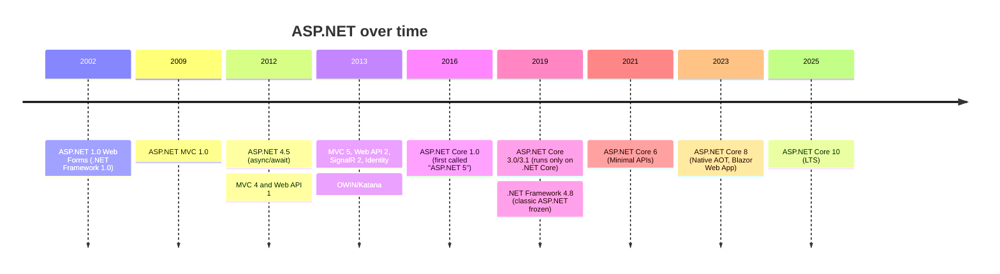
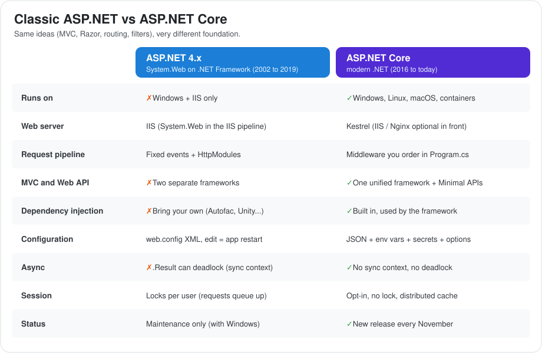
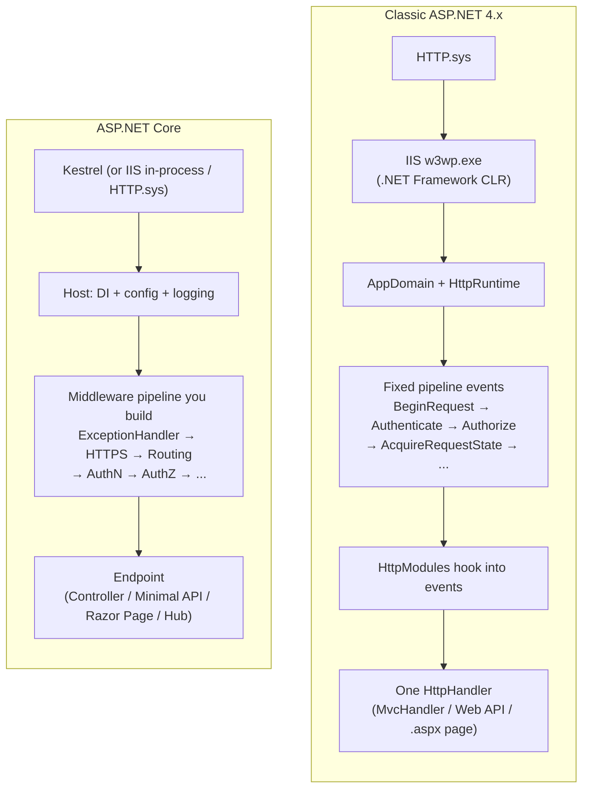
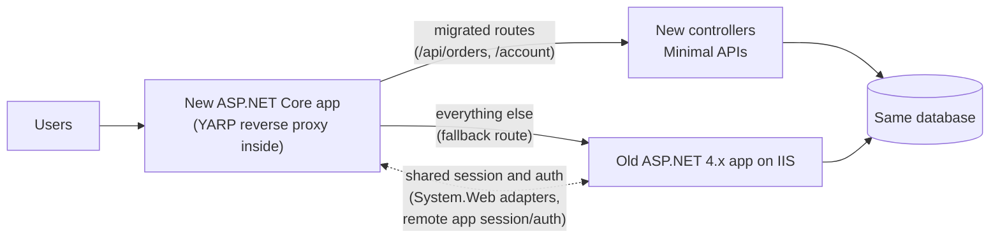
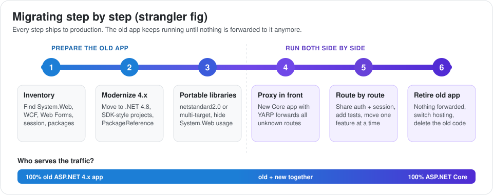
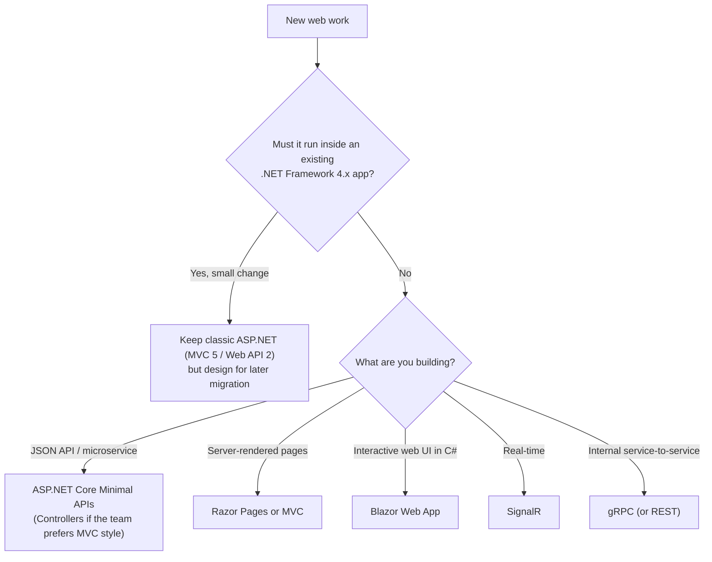

# ASP.NET: From 4.5 to Modern ASP.NET Core

This guide is the overview of the ASP.NET section. It explains how ASP.NET evolved from the `System.Web`-based stack of .NET Framework 4.5 to today's ASP.NET Core, compares the two side by side, maps every classic concept to its modern equivalent, and lays out a practical migration plan.

If you only read one ASP.NET file before an interview, read this one. Then go deeper with the two companion guides:

- [Classic ASP.NET on .NET Framework (4.5 to 4.8)](./aspnet-framework/index.md): IIS pipeline, modules and handlers, session state, `web.config`, Web Forms, MVC 5, Web API 2, OWIN/Katana.
- [Modern ASP.NET Core (.NET Core 1.0 to .NET 10)](./aspnet-core/index.md): hosting, Kestrel, middleware, DI, configuration, Controllers and Minimal APIs, security, performance, testing.

Other related guides:

- [.NET Platform](../index.md): .NET Framework vs .NET Core vs .NET 5+, the runtime and the thread pool.
- [C# Language Deep Dive](../csharp/index.md): async/await and the SynchronizationContext.
- [Data Access in .NET](../data-access/index.md): EF6 vs EF Core.

---

## 1. The ASP.NET Family Tree

The name "ASP.NET" covers more than 20 years of web frameworks. The names changed several times, which confuses many people, so it is worth getting the timeline straight.

### A. The Timeline



### B. Clearing Up the Names

| Name you hear | What it really is |
| :--- | :--- |
| "ASP.NET", "classic ASP.NET", "ASP.NET 4.x" | The `System.Web` stack on .NET Framework: Web Forms, MVC 5, Web API 2 |
| "ASP.NET MVC 5", "Web API 2" | NuGet frameworks running on classic ASP.NET (.NET Framework 4.5+) |
| "ASP.NET 5" | The **original working name** of ASP.NET Core (renamed in early 2016). Not related to MVC 5. |
| "ASP.NET Core 1.x / 2.x" | The new framework. It could run on .NET Core **or** .NET Framework 4.6.1+. |
| "ASP.NET Core 3.0+" | Runs only on .NET Core / modern .NET |
| "ASP.NET Core in .NET 8" | Since .NET 5, ASP.NET Core versions match the .NET version |
| "Classic ASP" | The VBScript technology from the 1990s (`.asp` files). Not .NET at all. |

**Interview tip:** saying "ASP.NET 5" when you mean MVC 5 is a classic mix-up. MVC 5 is classic ASP.NET. ASP.NET 5 became ASP.NET Core.

---

## 2. Why Microsoft Rewrote ASP.NET

Classic ASP.NET was successful, but by around 2014 its design was holding it back. Cloud, Linux, containers and microservices had arrived, and `System.Web` couldn't follow.

### A. The Main Problems of Classic ASP.NET

1. **Locked to Windows and IIS.** `System.Web` was tightly connected to IIS. No Linux, no containers, no lightweight self-hosting for MVC.
2. **One huge assembly.** `System.Web.dll` loaded everything for every app (Web Forms, session, caching, membership), whether you used it or not. Every request carried that weight.
3. **Machine-wide framework.** .NET Framework updates were installed for the whole server. Upgrading one app meant risking every other app on that machine.
4. **Duplicated frameworks.** MVC and Web API had separate controllers, filters, routing, model binding and DI hooks.
5. **No built-in DI, hard to test.** Static `HttpContext.Current` and `ConfigurationManager` made code hard to unit test.
6. **Slow release cycle.** New web features waited for the next Windows/.NET Framework release.
7. **Performance ceiling.** Old abstractions made it hard to compete with Node.js, Go and Java frameworks on throughput.

### B. The Goals of ASP.NET Core

| Goal | How it was achieved |
| :--- | :--- |
| Cross-platform | New runtime (.NET Core), Kestrel web server |
| Modular, pay for what you use | Small core + middleware you add explicitly |
| Fast | Rewritten HTTP stack, `Span<T>`, pooling, System.Text.Json |
| Testable | Built-in DI, no static request state, in-memory test server |
| Unified | One framework for MVC, APIs, Razor Pages, SignalR, gRPC |
| Cloud-ready | Environment-based config, health checks, structured logging, containers |
| Open and fast-moving | Open source on GitHub, yearly releases |

---

## 3. Architecture Side by Side

The biggest change is **who owns the pipeline**. In classic ASP.NET, IIS and `System.Web` defined a fixed set of events, and you hooked into them. In ASP.NET Core, you build the pipeline yourself, in code, from middleware.

### A. Request Flow Compared





### B. The Big Comparison Table

| Topic | Classic ASP.NET (4.5 to 4.8) | ASP.NET Core (modern .NET) |
| :--- | :--- | :--- |
| **Runtime** | .NET Framework, machine-wide | .NET (Core), per app, side by side |
| **OS** | Windows only | Windows, Linux, macOS |
| **Web server** | IIS (`System.Web`), or OWIN self-host for Web API | Kestrel, IIS (via ANCM), HTTP.sys |
| **Entry point** | `Global.asax` `Application_Start`, OWIN `Startup` | `Program.cs` (`WebApplication.CreateBuilder`) |
| **Pipeline** | Fixed `HttpApplication` events + modules + handlers | Ordered middleware + endpoints |
| **Frameworks** | Web Forms, MVC 5, Web API 2 (separate) | Unified MVC/Web API, Razor Pages, Minimal APIs, Blazor |
| **Routing** | `RouteTable.Routes` (MVC) and `HttpConfiguration.Routes` (Web API) | One endpoint routing system for everything |
| **Dependency injection** | None built in (Autofac, Unity, Ninject...) | Built in and used by the framework |
| **Configuration** | `web.config` XML, `ConfigurationManager`, transforms | `appsettings.json`, env vars, secrets, options pattern |
| **Config change** | Editing `web.config` restarts the app | Can reload without restart |
| **HttpContext access** | Static `HttpContext.Current` | Passed in, or `IHttpContextAccessor` |
| **Async context** | `AspNetSynchronizationContext` (deadlock risk with `.Result`) | No SynchronizationContext |
| **Session** | InProc/StateServer/SQL, **locks per user** | `IDistributedCache`-based, **no lock**, opt-in |
| **Auth** | Forms auth, Membership, Identity 2 on OWIN, Windows auth | Authentication schemes (Cookie, JWT, OIDC), policies, Identity Core |
| **Crypto keys** | `machineKey` in `web.config` | Data Protection key ring |
| **JSON** | Newtonsoft.Json (Web API), `JavaScriptSerializer` (MVC) | System.Text.Json (Newtonsoft optional) |
| **Background work** | `QueueBackgroundWorkItem`, or outside IIS | `IHostedService` / `BackgroundService` |
| **Static files / bundling** | IIS static file handler, `System.Web.Optimization` | `UseStaticFiles` / `MapStaticAssets`, front-end build tools |
| **Real-time** | SignalR 2 (OWIN) | ASP.NET Core SignalR (not wire-compatible with SignalR 2) |
| **Service-to-service** | WCF, ASMX | gRPC, REST, CoreWCF (community) |
| **Testing** | Hard (static context, IIS) | `WebApplicationFactory`, in-memory test server |
| **Performance** | Moderate | Among the fastest mainstream frameworks |
| **Deployment** | Copy to IIS, Web Deploy | Containers, any host, self-contained, Native AOT |
| **Status** | Supported as part of Windows, no new features | Active development, yearly releases |

---

## 4. Concept Mapping: Classic → Core

Use this table when you read old code and need to know "what is this called now?", or when you plan a migration.

| Classic ASP.NET | ASP.NET Core equivalent | Notes |
| :--- | :--- | :--- |
| `Global.asax` `Application_Start` | `Program.cs` before `app.Run()` | |
| `Application_Error` | `UseExceptionHandler` + `IExceptionHandler` | |
| `Application_BeginRequest` / `EndRequest` | Custom middleware | Code before/after `await next()` |
| `IHttpModule` | Middleware | Order is explicit in code |
| `IHttpHandler` / `.ashx` | Endpoint (`MapGet`), controller action, or terminal middleware | |
| `web.config` `<appSettings>` | `appsettings.json` + `IOptions<T>` | |
| `ConfigurationManager` | `IConfiguration` | |
| `Web.Release.config` transforms | `appsettings.Production.json` + environment variables | |
| `HttpContext.Current` | `HttpContext` property, handler parameter, `IHttpContextAccessor` | |
| `Server.MapPath("~/App_Data")` | `IWebHostEnvironment.ContentRootPath` / `WebRootPath` | |
| `System.Web.Mvc.Controller` | `Microsoft.AspNetCore.Mvc.Controller` | |
| `ApiController` (Web API) | `ControllerBase` + `[ApiController]` | One base class now |
| `IHttpActionResult` | `IActionResult` / `ActionResult<T>` / `TypedResults` | |
| `HttpResponseMessage` returned from actions | `IActionResult` (still possible with a compat shim, not recommended) | |
| Web API `DelegatingHandler` (server side) | Middleware | `DelegatingHandler` lives on for **outgoing** `HttpClient` calls |
| MVC and Web API filters (two types) | One filter system (+ endpoint filters for Minimal APIs) | |
| `[RoutePrefix]` | `[Route]` on the controller | |
| Child actions (`Html.Action`) | View Components | |
| HTML helpers | Tag Helpers (HTML helpers still work) | |
| `System.Web.Optimization` bundling | Front-end tooling (Vite, esbuild), WebOptimizer, or `MapStaticAssets` | |
| Web Forms (`.aspx`) | Razor Pages or Blazor | A rewrite of the UI |
| User controls (`.ascx`) | Partial views, View Components, Razor/Blazor components | |
| `Session` (InProc, locking) | `AddSession` + `IDistributedCache` (no lock) | Prefer stateless design |
| `HttpRuntime.Cache` / `MemoryCache.Default` | `IMemoryCache`, `HybridCache` | |
| `[OutputCache]` | Output caching middleware (`[OutputCache]` / `.CacheOutput()`) | |
| Forms authentication | Cookie authentication | |
| Membership / SimpleMembership | ASP.NET Core Identity | Password hashes can be migrated |
| ASP.NET Identity 2 (OWIN) | ASP.NET Core Identity | Similar concepts, new packages |
| OWIN cookie / OAuth middleware | Authentication handlers | |
| `machineKey` | Data Protection API (shared key ring) | |
| `[ValidateInput(false)]`, request validation | Not present. Rely on output encoding. | |
| `HostingEnvironment.QueueBackgroundWorkItem` | `BackgroundService`, `Channel<T>`, job frameworks | |
| Unity / Autofac / Ninject wiring | Built-in DI (Autofac can still be plugged in) | |
| WCF services | gRPC, REST, or CoreWCF | |
| SignalR 2 | ASP.NET Core SignalR | Clients must be updated too |
| EF6 | EF Core (EF 6.3+ also runs on modern .NET) | See the data access guide |
| ELMAH / `Trace` | `ILogger`, Serilog, OpenTelemetry | |
| `aspnet_regiis -pe` encrypted config | Secret stores (Key Vault, etc.), user secrets | |

---

## 5. What Carries Over (and What Doesn't)

Moving from classic ASP.NET to ASP.NET Core is not starting from zero. Much of the knowledge transfers directly.

### A. Concepts That Transfer Directly

- **The MVC pattern:** controllers, actions, models, views, areas, routing templates.
- **Razor syntax:** `@model`, `@foreach`, layouts, sections, partials.
- **Attribute routing** (`[Route]`, `[HttpGet("...")]`), model binding and data annotation validation.
- **Filters** (with a unified, richer pipeline).
- **async/await** in controllers, now without the deadlock risk.
- **Claims-based identity** (`User.Claims`, `[Authorize(Roles = ...)]`).
- **Entity Framework** concepts: `DbContext`, `DbSet`, LINQ, migrations.
- **SignalR hubs**, with an updated API.

### B. Things You Have to Rethink

| Area | Why it's different |
| :--- | :--- |
| Application startup | Code-first `Program.cs` instead of `Global.asax` + config files |
| Cross-cutting concerns | Middleware order is now **your** responsibility |
| Statics and service location | Constructor injection everywhere. No `HttpContext.Current`. |
| Session and in-memory state | Designed for scale-out and stateless containers |
| Configuration | Layered providers and options instead of one XML file |
| Hosting | Containers, Linux, reverse proxies, forwarded headers |
| JSON | System.Text.Json is stricter (case sensitivity options, no `$ref` loops by default, different date handling) |

### C. Things That Have No Direct Equivalent

| Classic feature | What to do instead |
| :--- | :--- |
| **Web Forms**, ViewState, postbacks, server controls | Rewrite the UI in Razor Pages, MVC or Blazor |
| **WCF server** | gRPC (new contracts), REST, or CoreWCF to keep SOAP clients working |
| **AppDomain** isolation and recycling | Processes, containers, orchestrator restarts |
| **`System.Web` APIs** used deep in business code | Refactor behind interfaces, or use the System.Web adapters (section 6) during migration |
| **Session locking** behavior | Make concurrent requests safe yourself (optimistic concurrency) |
| **`web.config` authorization rules** for folders | Authorization policies on endpoints, static file authorization via middleware |

---

## 6. Code Side by Side

Seeing the same feature written both ways is the fastest way to learn the differences.

### A. Startup

```csharp
// Classic: Global.asax.cs
public class MvcApplication : HttpApplication
{
    protected void Application_Start()
    {
        GlobalConfiguration.Configure(WebApiConfig.Register);
        FilterConfig.RegisterGlobalFilters(GlobalFilters.Filters);
        RouteConfig.RegisterRoutes(RouteTable.Routes);
        BundleConfig.RegisterBundles(BundleTable.Bundles);
    }
}
```
```csharp
// Core: Program.cs
var builder = WebApplication.CreateBuilder(args);
builder.Services.AddControllersWithViews(o => o.Filters.Add<AuditFilter>());
var app = builder.Build();
app.UseStaticFiles();
app.MapDefaultControllerRoute();
app.Run();
```

### B. Reading Configuration

```csharp
// Classic
var timeout = int.Parse(ConfigurationManager.AppSettings["Payments.TimeoutSeconds"]);
```
```csharp
// Core
builder.Services.AddOptions<PaymentOptions>().BindConfiguration("Payments").ValidateOnStart();
public class PaymentClient(IOptions<PaymentOptions> options) { /* options.Value.TimeoutSeconds */ }
```

### C. Module vs Middleware

```csharp
// Classic: IHttpModule registered in web.config
public class SecurityHeadersModule : IHttpModule
{
    public void Init(HttpApplication app) =>
        app.PreSendRequestHeaders += (s, e) =>
            app.Context.Response.Headers["X-Content-Type-Options"] = "nosniff";
    public void Dispose() { }
}
```
```csharp
// Core: middleware registered in Program.cs
app.Use(async (context, next) =>
{
    context.Response.OnStarting(() =>
    {
        context.Response.Headers.XContentTypeOptions = "nosniff";
        return Task.CompletedTask;
    });
    await next(context);
});
```

### D. Web API Controller

```csharp
// Classic: Web API 2
public class ProductsController : ApiController
{
    public IHttpActionResult Get(int id)
    {
        var p = _repo.Find(id);
        return p == null ? (IHttpActionResult)NotFound() : Ok(p);
    }
}
```
```csharp
// Core: controller
[ApiController, Route("api/products")]
public class ProductsController(IProductRepo repo) : ControllerBase
{
    [HttpGet("{id:int}")]
    public async Task<ActionResult<Product>> Get(int id) =>
        await repo.FindAsync(id) is { } p ? p : NotFound();
}

// Core: Minimal API
app.MapGet("/api/products/{id:int}", async (int id, IProductRepo repo) =>
    await repo.FindAsync(id) is { } p ? Results.Ok(p) : Results.NotFound());
```

### E. Getting the Current User Outside a Controller

```csharp
// Classic: hidden static dependency
var userName = HttpContext.Current.User.Identity.Name;
```
```csharp
// Core: explicit dependency (prefer passing the user in as a parameter when you can)
public class CurrentUser(IHttpContextAccessor accessor)
{
    public string? Name => accessor.HttpContext?.User.Identity?.Name;
}
builder.Services.AddHttpContextAccessor();
```

---

## 7. Migration Strategies

Most teams with a large ASP.NET 4.x app eventually ask "should we move to ASP.NET Core, and how?". There is no one-click upgrade for web apps, so the strategy matters more than the tooling.

### A. Should You Migrate at All?

| Reasons to migrate | Reasons to wait |
| :--- | :--- |
| Need Linux, containers or cheaper hosting | App is stable, rarely changed and near end of life |
| Performance or scalability problems | Heavy Web Forms or WCF server usage with no budget for a UI rewrite |
| Hard to hire for or test the old stack | Critical third-party components exist only for .NET Framework |
| Want modern C#, libraries and security features | |
| Dependencies are dropping .NET Framework support | |

.NET Framework 4.8 is still supported with Windows, so there is no hard deadline. But the ecosystem is moving on, and the longer you wait, the more the gap grows.

### B. Big Bang Rewrite vs Incremental Migration

| | Big bang rewrite | Incremental (strangler fig) |
| :--- | :--- | :--- |
| How | Build the new app next to the old one, switch over at the end | Put a proxy in front, move routes one by one to the new app |
| Risk | High: long time with no value delivered, feature freeze, risky cutover | Low: small steps, each one goes to production |
| Good for | Small apps, or apps whose UI must be rewritten anyway | Large, business-critical apps |

### C. The Incremental Approach With YARP and System.Web Adapters

Microsoft supports an incremental path: a new ASP.NET Core app sits **in front of** the old app and forwards everything it doesn't handle yet.



How it works:
1. **YARP** (a reverse proxy library) runs inside the new app and sends unmigrated routes to the old app.
2. **`Microsoft.AspNetCore.SystemWebAdapters`** offers a familiar subset of `System.Web` APIs (`HttpContext`, `HttpRequest`) on ASP.NET Core, so shared libraries need fewer changes.
3. **Remote app session and authentication** let both apps share the same session values and the same signed-in user during the transition.
4. Move one feature or route at a time. When nothing is forwarded anymore, retire the old app.

### D. A Step-by-Step Plan



1. **Inventory.** List projects, NuGet packages, `System.Web` usages, Web Forms pages, WCF services, session usage and third-party controls. Check which packages support modern .NET.
2. **Upgrade the platform first.** Move the old app to .NET Framework 4.8 and SDK-style projects with `PackageReference`.
3. **Make class libraries portable.** Retarget business and data libraries to `netstandard2.0`, or multi-target (`net48;net10.0`). Move `System.Web` dependencies out of them, behind interfaces.
4. **Handle data access.** Keep EF6 at first (EF 6.3+ runs on modern .NET), and move to EF Core later as a separate step.
5. **Create the new ASP.NET Core app** with YARP forwarding to the old app (or start a side-by-side rewrite for small apps).
6. **Share auth and session** between both apps (System.Web adapters, shared cookies, or a shared identity provider such as Entra ID or Keycloak).
7. **Migrate route by route**, starting with simple, low-risk, high-value endpoints (APIs before complex pages). Write integration tests for each route before moving it.
8. **Replace infrastructure:** `web.config` → `appsettings.json`, modules → middleware, filters → Core filters, Unity/Ninject → built-in DI, bundling → front-end build tools.
9. **Rewrite UI-heavy parts:** Web Forms → Razor Pages or Blazor. WCF → gRPC or CoreWCF.
10. **Switch hosting** when ready (IIS → containers or Linux), then retire the old app.

### E. Tooling That Helps

| Tool | What it does |
| :--- | :--- |
| .NET Upgrade Assistant | Converts project files, updates packages and does some code fixes. Microsoft now points people to GitHub Copilot app modernization tooling for this job. |
| `try-convert` / SDK-style conversion | Converts old `.csproj` files to SDK style |
| API Port / platform compatibility analyzers | Find APIs that don't exist on modern .NET |
| YARP | Reverse proxy for the incremental approach |
| System.Web adapters | `System.Web`-like APIs plus shared session/auth during migration |
| CoreWCF | Hosts existing WCF service contracts on modern .NET |

Tools convert **projects**, not **architecture**. Expect manual work for pipelines, auth, DI and anything that touches `System.Web`.

### F. Common Migration Pitfalls

| Pitfall | What happens | Avoid it by |
| :--- | :--- | :--- |
| Converting everything at once | Months without a release | Incremental migration, small releases |
| JSON differences | Clients break: casing, dates, enums, nulls, reference loops | Configure System.Text.Json to match, or use Newtonsoft temporarily (`AddNewtonsoftJson`). Add contract tests. |
| Relying on session locking | Race conditions once session has no lock | Review concurrent writes, use optimistic concurrency |
| Middleware order mistakes | Auth or CORS silently not applied | Follow the recommended order, test with integration tests |
| Lost `machineKey` compatibility | Users logged out, old cookies invalid | Plan an auth cutover, or share auth through the adapters / identity provider |
| Hidden `HttpContext.Current` usages deep in libraries | Null references or compile errors | Search and abstract early (step 3) |
| Different defaults (model binding, routing, case sensitivity) | Subtle behavior changes | Integration tests that run against both apps |
| Forgetting forwarded headers behind a proxy | Wrong scheme, broken redirects, wrong client IPs | `UseForwardedHeaders` with known proxies |
| Running both apps without shared Data Protection | Random logouts on multi-instance Core | Persist the key ring |

---

## 8. Choosing the Right ASP.NET Option for New Work

### A. Decision Guide



### B. Rules of Thumb

- **Never start a new project on .NET Framework 4.x** unless you are extending an existing app and have no choice.
- Target the **latest LTS** (.NET 10 at the time of writing).
- For SPAs (React, Angular), use ASP.NET Core as the API backend, often with a Backend-for-Frontend (BFF) for auth. (See [Backend for Frontend](../../../design/lv2-architectural-design-(software-architecture)/data-flow-n-communication-patterns/backend-for-frontend/index.md).)

---

## 9. Summary: The Story in Ten Lines

1. Classic ASP.NET (`System.Web`) runs on the Windows-only, machine-wide .NET Framework inside IIS.
2. It includes Web Forms, MVC 5 and Web API 2. MVC and Web API are separate stacks with duplicated concepts.
3. .NET Framework 4.5 brought `async`/`await`, but also the SynchronizationContext deadlock trap.
4. OWIN/Katana introduced middleware and self-hosting, and became the blueprint for ASP.NET Core.
5. ASP.NET Core (2016) is a cross-platform rewrite: Kestrel, middleware, built-in DI, JSON configuration, one unified framework.
6. Since 3.0 it runs only on modern .NET, and since .NET 5 its version matches the .NET version.
7. .NET 6 added Minimal APIs, .NET 7 rate limiting and output caching, .NET 8 Native AOT and Blazor Web App, .NET 9 HybridCache and built-in OpenAPI, .NET 10 built-in validation.
8. Most MVC and Razor knowledge carries over. Web Forms, WCF server and `System.Web` APIs do not.
9. Migrate incrementally with YARP and System.Web adapters, and libraries first.
10. Start every new project on the latest LTS of ASP.NET Core.

---

## 10. Interview Masterclass: High-Impact Q&As

### Q1: What are the main differences between ASP.NET (4.x) and ASP.NET Core?
* **Answer:** Classic ASP.NET runs on .NET Framework, only on Windows, inside IIS through `System.Web`, with a fixed event-based pipeline, separate MVC and Web API frameworks, no built-in DI and XML configuration. ASP.NET Core runs on modern .NET on any OS, hosts itself with Kestrel (optionally behind IIS or a proxy), uses an explicit middleware pipeline, unifies MVC and Web API, has DI built in, uses layered configuration with the options pattern, has no SynchronizationContext, and is much faster. Web Forms and the WCF server were not carried over.

### Q2: Is "ASP.NET 5" the same as "MVC 5"?
* **Answer:** No. MVC 5 (2013) is a framework on classic ASP.NET and .NET Framework 4.5+. "ASP.NET 5" was the working name of the rewrite that was released as ASP.NET Core 1.0 in 2016. The rename was done to make it clear that it is a new framework and not the next version of ASP.NET 4.x.

### Q3: How do HttpModules and HttpHandlers map to ASP.NET Core?
* **Answer:** Modules, which hook into fixed pipeline events for every request, become middleware. Each middleware runs code before and after `await next()`, and the order is defined by registration in `Program.cs`, not by event names. Handlers, which produce the response, become endpoints: controller actions, Minimal API handlers, Razor Pages, or terminal middleware. Code that used `PreSendRequestHeaders` uses `Response.OnStarting` instead.

### Q4: Why did the async deadlock disappear in ASP.NET Core?
* **Answer:** Classic ASP.NET uses `AspNetSynchronizationContext`, which runs only one thread at a time per request. Blocking with `.Result` while an awaited method needs to resume on that context causes a deadlock. ASP.NET Core has no SynchronizationContext, so continuations run on any thread pool thread and there is no context to fight over. Blocking still causes thread pool starvation, so async all the way remains the rule.

### Q5: How would you migrate a large ASP.NET MVC 5 + Web API 2 application to ASP.NET Core?
* **Answer:** Incrementally. First update to .NET Framework 4.8 and SDK-style projects, then move business and data libraries to `netstandard2.0` or multi-target them, removing `System.Web` dependencies behind interfaces. Create a new ASP.NET Core app that uses YARP to forward unmigrated routes to the old app, and use the System.Web adapters' remote session and authentication (or a shared identity provider) so users don't notice the split. Move routes one by one with integration tests, starting with APIs. Replace `web.config`, modules, filters and the DI container along the way. Keep EF6 at first and move to EF Core later. Retire the old app when nothing is forwarded anymore.

### Q6: What happens to Web Forms and WCF when you move to ASP.NET Core?
* **Answer:** Neither is supported on ASP.NET Core. Web Forms pages must be rewritten, usually as Razor Pages (page-based, closest in structure) or Blazor (component and event-based, closest in programming model). For WCF, you can expose new gRPC or REST APIs, or use the community CoreWCF project to host existing service contracts on modern .NET so existing SOAP clients keep working. WCF client libraries are available on modern .NET.

### Q7: What replaced `web.config` and `ConfigurationManager`?
* **Answer:** A layered configuration system: `appsettings.json`, `appsettings.{Environment}.json`, user secrets in development, environment variables and command-line arguments, where later sources override earlier ones. Code reads strongly typed settings through the options pattern (`IOptions<T>`, `IOptionsSnapshot<T>`, `IOptionsMonitor<T>`) with validation at startup. Unlike editing `web.config`, a configuration change doesn't restart the app, and secrets can come from stores like Key Vault.

### Q8: What replaced `machineKey`, and why does it matter during migration?
* **Answer:** The Data Protection API replaced it. It manages a rotating key ring that encrypts cookies, antiforgery tokens and TempData. In multi-instance deployments, the key ring must be persisted to shared storage, or users are logged out randomly. During a migration, old ASP.NET cookies (protected with `machineKey`) and new ASP.NET Core cookies (protected with Data Protection) are not compatible by default. So you plan shared authentication, for example with the System.Web adapters' remote authentication, a shared cookie configuration, or a central identity provider.

### Q9: How is session different between the two, and what can break when migrating?
* **Answer:** Classic ASP.NET session can store live objects (InProc) and takes an exclusive lock per user for read/write requests, so concurrent requests from one user run one after another. ASP.NET Core session is opt-in, stores serialized bytes in `IDistributedCache`, and has no locking. Code that quietly relied on the lock can get race conditions, and code that stored complex objects must serialize them. The best migration is often to remove server-side session in favor of stateless design, claims or a database.

### Q10: Why was dependency injection built into ASP.NET Core, and how did it work before?
* **Answer:** In classic ASP.NET there was no built-in container. Teams plugged Autofac, Unity or Ninject separately into MVC (`DependencyResolver`), Web API (`HttpConfiguration.DependencyResolver`) and SignalR, and Web Forms barely supported it. That caused duplication and pushed code toward static access and service location. ASP.NET Core builds DI into the host, and the framework itself resolves controllers, middleware, filters, options, logging and `HttpClient`s through it. Constructor injection is therefore the normal way to write code, and testing becomes much easier.

### Q11: Can ASP.NET Core run on .NET Framework?
* **Answer:** Only versions 1.x and 2.x, which could target .NET Framework 4.6.1+. Teams sometimes used this as a stepping stone, moving to the ASP.NET Core programming model before the runtime. Since ASP.NET Core 3.0, it runs only on .NET Core / modern .NET. Today the recommended path is straight to the latest LTS of modern .NET.

### Q12: What would you check first when an app migrated to ASP.NET Core behaves differently from the old one?
* **Answer:** Middleware order (authentication, authorization, CORS, exception handling). JSON serialization differences between Newtonsoft and System.Text.Json (casing, dates, enums, nulls, reference loops). Model binding source inference under `[ApiController]`. Forwarded headers behind the proxy (scheme and client IP). Route matching differences. Session that no longer locks. Data Protection keys shared across instances. Configuration values that came from `web.config` transforms and are now missing from environment-specific settings.
