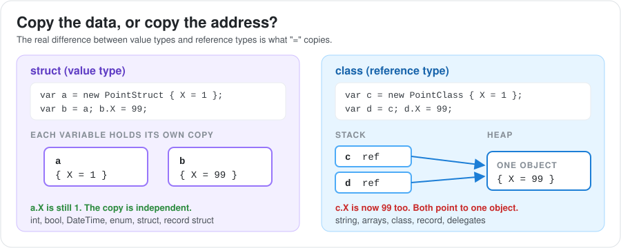
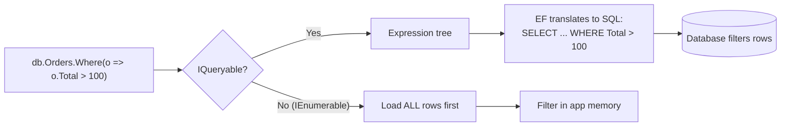
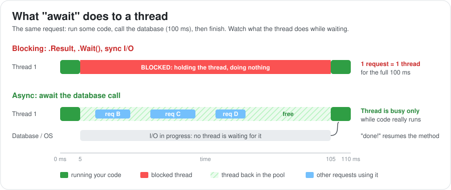
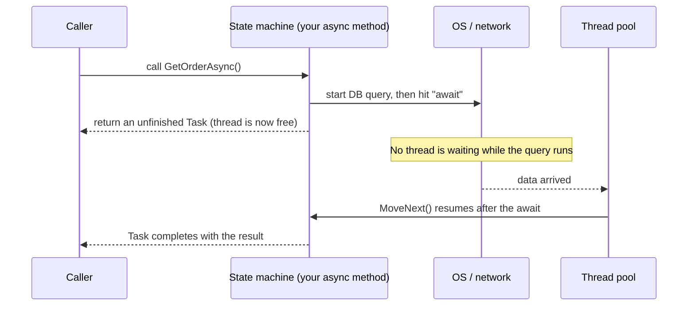

# C# Language Deep Dive: From C# 5 to C# 14

This guide covers the C# language itself: how types behave, how generics, delegates and LINQ work, what `async`/`await` really does under the hood, and which modern features you should know. It starts from C# 5 (the version that shipped with .NET Framework 4.5 and introduced `async`/`await`) and goes up to C# 14 (shipped with .NET 10).

Each topic explains the idea in plain words first, then shows a small example, then lists the traps that interviewers like to ask about.

Related guides:

- [.NET Platform](../index.md): the runtime, JIT, garbage collector and thread pool that C# code runs on.
- [ASP.NET: From 4.5 to Modern ASP.NET Core](../aspnet/index.md): where most of these language features are used in real web apps.
- [Data Access in .NET](../data-access/index.md): LINQ and `IQueryable` in action with Entity Framework.

---

## 1. C# Versions and Which .NET Ships Them

The C# language is versioned separately from the runtime. Each new .NET version comes with a new default C# version. Knowing this helps you understand why some features "don't work" in an old .NET Framework project.

### A. The Version Map

| C# | Year | Shipped with | Headline features |
| :--- | :--- | :--- | :--- |
| **5** | 2012 | .NET Framework 4.5 | `async` / `await`, caller info attributes |
| **6** | 2015 | .NET Framework 4.6 (Roslyn) | String interpolation `$"..."`, `nameof`, `?.`, expression-bodied members, exception filters |
| **7.0 to 7.3** | 2017 to 2018 | .NET Framework 4.7 / .NET Core 2.x | Tuples, pattern matching (`is`), `out var`, local functions, `ref` returns, `Span<T>` support |
| **8** | 2019 | .NET Core 3.0 | Nullable reference types, `switch` expressions, `async` streams, ranges `[1..^1]`, default interface methods, `using` declarations |
| **9** | 2020 | .NET 5 | Records, `init` setters, top-level statements, target-typed `new()` |
| **10** | 2021 | .NET 6 | `global using`, file-scoped namespaces, `record struct` |
| **11** | 2022 | .NET 7 | Raw string literals `"""..."""`, `required` members, list patterns, generic math |
| **12** | 2023 | .NET 8 | Primary constructors for classes, collection expressions `[1, 2, 3]`, alias any type |
| **13** | 2024 | .NET 9 | `params` collections, new `System.Threading.Lock` type, partial properties |
| **14** | 2025 | .NET 10 | Extension members (extension properties), `field` keyword, null-conditional assignment `a?.B = c` |

### B. Why Old Projects Feel "Stuck"

- A .NET Framework 4.x project uses **C# 7.3 by default**.
- You can raise `<LangVersion>` in the project file. Pure compiler features like `switch` expressions or records then work.
- Some features need **runtime support** and do not work on .NET Framework at all, for example default interface methods. Others need helper types that you must add yourself (for example `Index`/`Range`, or `IsExternalInit` for records).
- This is one more practical reason teams migrate to modern .NET.

---

## 2. The Type System: Classes, Structs and Records

C# gives you four ways to define your own data type. Choosing the right one affects copying, equality and performance.

### A. The Four Kinds of Types



| Kind | Value or reference? | Equality by default | Typical use |
| :--- | :--- | :--- | :--- |
| `class` | Reference | Same object? (reference equality) | Services, entities, anything with identity and behavior |
| `struct` | Value | Same field values? (slow reflection-based unless you override) | Small values: `Point`, `Money`, `DateTime` |
| `record` (`record class`) | Reference | Same property values (compiler-generated) | DTOs, messages, immutable data |
| `record struct` | Value | Same property values (compiler-generated) | Small immutable values with nice equality |

```csharp
public class CustomerEntity { public int Id { get; set; } public string Name { get; set; } = ""; }
public struct Point { public int X; public int Y; }
public record OrderDto(int Id, decimal Total);            // positional record
public readonly record struct Money(decimal Amount, string Currency);
```

**Rules of thumb:**
- Use a **struct** only when the value is small (roughly 16 bytes or less), immutable, and short-lived. Large structs are expensive to copy.
- Use a **record** when the object is "just data" and two objects with the same values should be equal.
- Use a **class** when the object has identity (two customers with the same name are still different customers) or behavior.

### B. What a Record Gives You for Free

A `record` is a class where the compiler writes the boring code for you:

```csharp
public record Person(string FirstName, string LastName);

var a = new Person("Ana", "Lee");
var b = new Person("Ana", "Lee");

Console.WriteLine(a == b);          // True: compares values, not references
Console.WriteLine(a);               // Person { FirstName = Ana, LastName = Lee }
var c = a with { LastName = "Kim" }; // copy with one change (non-destructive mutation)
var (first, last) = a;              // deconstruction
```

The compiler generates: properties with `init` setters, `Equals`, `GetHashCode`, `==` / `!=`, `ToString`, a copy constructor for `with`, and `Deconstruct`.

**Watch out:** records are only *shallowly* immutable. If a record holds a `List<string>`, the list itself can still be changed.

### C. Equality: `==` vs `Equals`

| Type | `==` compares | `Equals` compares |
| :--- | :--- | :--- |
| `class` (default) | References | References (unless overridden) |
| `string` | Characters (operator is overloaded) | Characters |
| `record` | Values | Values |
| `struct` | Not defined unless you write it | Field values (slow by default) |

If you override `Equals`, **always override `GetHashCode` too**. Otherwise `Dictionary` and `HashSet` will lose your objects, because they look objects up by hash code first.

```csharp
public sealed class Sku : IEquatable<Sku>
{
    public string Code { get; }
    public Sku(string code) => Code = code;
    public bool Equals(Sku? other) => other is not null && Code == other.Code;
    public override bool Equals(object? obj) => Equals(obj as Sku);
    public override int GetHashCode() => Code.GetHashCode();
}
```

### D. Strings Are Immutable

Every change to a string creates a **new** string. That makes strings safe to share between threads, but building strings in a loop is slow.

```csharp
// Slow: creates 10,000 temporary strings
string s = "";
for (int i = 0; i < 10_000; i++) s += i;

// Fast: one growing buffer
var sb = new StringBuilder();
for (int i = 0; i < 10_000; i++) sb.Append(i);
string result = sb.ToString();
```

Other string facts worth knowing:
- **Interning:** string literals with the same text share one object in memory.
- **Comparisons:** use `string.Equals(a, b, StringComparison.OrdinalIgnoreCase)` instead of `a.ToLower() == b.ToLower()`. It allocates nothing and avoids culture bugs (the famous Turkish "I" problem).

### E. Nullable Value Types and Nullable Reference Types

There are two different "nullable" features, and they work in very different ways.

| | Nullable value types | Nullable reference types (NRT) |
| :--- | :--- | :--- |
| Syntax | `int?`, `DateTime?` | `string?`, `Customer?` |
| Since | C# 2 | C# 8 |
| What it is | A real type: `Nullable<int>` with `HasValue` / `Value` | Compiler **warnings only**. No change at run time. |
| Goal | Let a value type hold "no value" | Catch `NullReferenceException` at compile time |

```csharp
#nullable enable
string name = null;      // warning: assigning null to non-nullable
string? nickname = null; // fine, explicitly nullable

int len = nickname.Length;        // warning: possible null dereference
int safeLen = nickname?.Length ?? 0; // ?. returns null, ?? gives a default
```

**Watch out:** NRT does not stop nulls at run time. Data coming from JSON, databases or old libraries can still be null, so validate input at the edges of your system.

---

## 3. Members, Access Modifiers and Class Design

This section covers the building blocks inside a type: properties, constructors, access levels, and the choice between abstract classes and interfaces.

### A. Properties, `init` and `required`

```csharp
public class Product
{
    public int Id { get; init; }                  // can be set only during creation
    public required string Name { get; set; }     // must be set by the caller (C# 11)
    public decimal Price { get; private set; }    // read from outside, changed only inside

    public decimal PriceWithTax => Price * 1.1m;  // computed, read-only

    // C# 14: 'field' refers to the hidden backing field, no need to declare one
    public string Sku { get; set => field = value.Trim().ToUpperInvariant(); } = "";
}

var p = new Product { Id = 1, Name = "Keyboard" }; // must set Name or it won't compile
// p.Id = 2;  // error: init-only
```

### B. Access Modifiers

| Modifier | Who can see it |
| :--- | :--- |
| `public` | Everyone |
| `private` | Only the same type (the default for members) |
| `protected` | The same type and derived types |
| `internal` | Code in the same assembly (project). The default for top-level types. |
| `protected internal` | Same assembly **or** derived types |
| `private protected` | Derived types **within** the same assembly |
| `file` (C# 11) | Only code in the same source file |

### C. Abstract Class vs Interface

| | Abstract class | Interface |
| :--- | :--- | :--- |
| Multiple inheritance | No, one base class only | Yes, implement many |
| Fields / state | Yes | No instance fields |
| Constructors | Yes | No |
| Method bodies | Yes | Yes, since C# 8 (default interface methods, modern .NET only) |
| Static abstract members | No | Yes, since C# 11 (used for generic math) |
| Best for | Sharing code between closely related types | Defining a contract ("can do") for unrelated types |

**Rule of thumb:** start with an interface for dependencies you want to swap or mock. Use an abstract base class when several types share real implementation and state.

### D. `static`, `sealed`, `virtual`, `override`, `new`

- `static` members belong to the type, not to an object. A `static class` cannot be instantiated (it is used for helpers and extension methods).
- `sealed` stops further inheritance. It also lets the JIT skip virtual calls, so sealing classes you don't plan to extend is a small free speed-up.
- `virtual` + `override` replace behavior in a derived class (polymorphism).
- `new` on a method *hides* the base method instead of overriding it. The method that runs then depends on the variable's declared type, which surprises people. Avoid it.

```csharp
class Animal { public virtual string Speak() => "..."; public string Name() => "Animal"; }
class Dog : Animal { public override string Speak() => "Woof"; public new string Name() => "Dog"; }

Animal a = new Dog();
Console.WriteLine(a.Speak()); // Woof   (override: uses the real object type)
Console.WriteLine(a.Name());  // Animal (new: uses the variable type)
```

### E. Primary Constructors (C# 12)

```csharp
// Before
public class OrderService
{
    private readonly IOrderRepository _repo;
    public OrderService(IOrderRepository repo) => _repo = repo;
}

// C# 12
public class OrderService(IOrderRepository repo)
{
    public Task<Order?> Get(int id) => repo.GetAsync(id);
}
```

**Watch out:** primary constructor parameters are **not** `readonly` fields. Code inside the class can reassign `repo`. If that matters, assign it to a `private readonly` field explicitly.

---

## 4. Generics

Generics let you write one piece of code that works with many types while staying type-safe. `List<T>` is the classic example: one implementation, but `List<int>` only accepts ints.

### A. Why Generics Matter

Before generics (.NET 1.x), collections stored `object`. That meant casting everywhere, runtime type errors, and boxing for every number. Generics fix all three:

```csharp
ArrayList old = new ArrayList();
old.Add(1);
old.Add("oops");             // compiles fine, breaks later
int x = (int)old[1];         // InvalidCastException at run time

List<int> modern = new List<int>();
modern.Add(1);
// modern.Add("oops");       // compile error, caught early
```

In .NET, generics are **reified**: the runtime knows the real type. `List<int>` stores raw ints with no boxing, and you can use `typeof(T)` inside generic code.

### B. Constraints

Constraints tell the compiler what `T` is allowed to be, so you can use its members.

```csharp
public T Max<T>(T a, T b) where T : IComparable<T> => a.CompareTo(b) >= 0 ? a : b;

public class Repository<TEntity> where TEntity : class, IEntity, new() { }
```

| Constraint | Meaning |
| :--- | :--- |
| `where T : class` / `class?` | Must be a reference type |
| `where T : struct` | Must be a non-nullable value type |
| `where T : notnull` | Must not be nullable |
| `where T : new()` | Must have a public parameterless constructor |
| `where T : SomeBase` / `ISomething` | Must inherit / implement it |
| `where T : unmanaged` | Must be a struct with no references (safe for raw memory) |
| `where T : allows ref struct` (C# 13) | `T` may be a `ref struct` such as `Span<T>` |

### C. Covariance and Contravariance (`out` and `in`)

These words describe when you can pass a "more specific" or "more general" generic type.

- **Covariance (`out T`)**: the type only *gives out* `T`. So a list of `Dog` can be used where a list of `Animal` is expected.
- **Contravariance (`in T`)**: the type only *takes in* `T`. So a handler for any `Animal` can be used where a handler for `Dog` is expected.

```csharp
IEnumerable<Dog> dogs = new List<Dog>();
IEnumerable<Animal> animals = dogs;        // OK: IEnumerable<out T> is covariant

Action<Animal> feedAnimal = a => a.Feed();
Action<Dog> feedDog = feedAnimal;          // OK: Action<in T> is contravariant

List<Animal> list = new List<Dog>();       // ERROR: List<T> is invariant (it both reads and writes T)
```

**Trap:** arrays are covariant for historical reasons, which is unsafe:
```csharp
object[] items = new string[1];
items[0] = 42;  // compiles, but throws ArrayTypeMismatchException at run time
```

### D. Generic Math (C# 11)

Interfaces can now have `static abstract` members, so you can write math code that works for any number type:

```csharp
T Sum<T>(IEnumerable<T> values) where T : INumber<T>
{
    T total = T.Zero;
    foreach (var v in values) total += v;
    return total;
}

Sum(new[] { 1, 2, 3 });        // int
Sum(new[] { 1.5m, 2.5m });     // decimal
```

---

## 5. Delegates, Events, Lambdas and Closures

A **delegate** is a type-safe reference to a method. It lets you pass behavior around like data. Lambdas, events, LINQ and callbacks are all built on delegates.

### A. Delegates and the Built-in Types

```csharp
// Custom delegate type (old style)
public delegate decimal DiscountRule(decimal price);

// Built-in generic delegates (use these instead)
Func<decimal, decimal> tenPercentOff = price => price * 0.9m; // takes input, returns a value
Action<string> log = message => Console.WriteLine(message);  // returns nothing
Predicate<int> isEven = n => n % 2 == 0;                     // returns bool

decimal final = tenPercentOff(100m); // 90
```

### B. Events

An event is a delegate with restrictions: outside code can only subscribe (`+=`) or unsubscribe (`-=`). Only the owner can raise it. This protects the publisher from outsiders who might reset or invoke the event.

```csharp
public class OrderService
{
    public event EventHandler<OrderPlacedEventArgs>? OrderPlaced;

    public void Place(Order order)
    {
        // ... save order
        OrderPlaced?.Invoke(this, new OrderPlacedEventArgs(order.Id));
    }
}

service.OrderPlaced += (sender, e) => emailSender.SendConfirmation(e.OrderId);
```

**Memory leak trap:** if a long-lived publisher (for example a singleton) holds an event, every subscriber stays in memory until it unsubscribes.

### C. Closures

A lambda can use variables from the method around it. The compiler moves those variables into a hidden class on the heap so they stay alive as long as the lambda does. This is called a **closure**.

```csharp
int counter = 0;
Action increment = () => counter++;  // 'counter' is captured, not copied
increment();
increment();
Console.WriteLine(counter); // 2
```

### D. The Famous Loop Capture Bug

```csharp
var actions = new List<Action>();
for (int i = 0; i < 3; i++)
    actions.Add(() => Console.Write(i));
actions.ForEach(a => a());   // prints 333: all lambdas share the same 'i'

var actions2 = new List<Action>();
foreach (var n in new[] { 0, 1, 2 })
    actions2.Add(() => Console.Write(n));
actions2.ForEach(a => a());  // prints 012 since C# 5
```

- In C# 5, `foreach` was changed so each iteration gets a **new** variable. This was a breaking change that fixed a very common bug.
- A `for` loop still shares one variable. Fix it by copying: `int copy = i; actions.Add(() => Console.Write(copy));`.

**Performance note:** capturing variables allocates objects. In hot code, use `static` lambdas (C# 9) to make sure nothing is captured by accident: `list.Where(static x => x > 0)`.

---

## 6. LINQ: Querying Collections and Databases

LINQ (Language Integrated Query) lets you filter, sort and transform data with the same syntax, whether the data is a `List<T>` in memory or a SQL table through Entity Framework.

### A. Two Ways to Write It

```csharp
var orders = GetOrders();

// Method syntax (most common)
var bigOrders = orders
    .Where(o => o.Total > 100)
    .OrderByDescending(o => o.Total)
    .Select(o => new { o.Id, o.Total });

// Query syntax (reads like SQL, compiles to the same calls)
var bigOrders2 = from o in orders
                 where o.Total > 100
                 orderby o.Total descending
                 select new { o.Id, o.Total };
```

### B. Deferred Execution: The Most Asked LINQ Topic

Most LINQ operators **do not run when you write them**. They build a recipe. The work happens only when you enumerate the result (with `foreach`, `ToList()`, `Count()`, `First()` and so on).

```csharp
var numbers = new List<int> { 1, 2, 3 };
var query = numbers.Where(n => n > 1);  // nothing happens yet

numbers.Add(4);
Console.WriteLine(string.Join(",", query)); // 2,3,4: the query ran now, and saw the new item
```

| Deferred (lazy) | Immediate (runs right away) |
| :--- | :--- |
| `Where`, `Select`, `OrderBy`, `Skip`, `Take`, `GroupBy`, `Join` | `ToList`, `ToArray`, `ToDictionary`, `Count`, `Sum`, `First`, `Any`, `Max` |

### C. The Multiple Enumeration Trap

Because a query runs every time you enumerate it, using it twice does all the work twice. With a database query, that means **two SQL calls**.

```csharp
IEnumerable<Order> pending = db.Orders.Where(o => o.Status == "Pending");

if (pending.Any())                 // query #1
    foreach (var o in pending) { } // query #2

// Fix: materialize once
var pendingList = pending.ToList();
```

### D. `IEnumerable<T>` vs `IQueryable<T>`

This is the key to using LINQ with databases efficiently.

| | `IEnumerable<T>` | `IQueryable<T>` |
| :--- | :--- | :--- |
| Where the work happens | In your app's memory | In the data source (for example SQL Server) |
| Lambdas become | Compiled code (delegates) | **Expression trees** (data describing the code) |
| Used by | Lists, arrays, LINQ to Objects | Entity Framework, other query providers |



```csharp
// GOOD: filter runs in SQL, only matching rows come back
var big = db.Orders.Where(o => o.Total > 100).ToList();

// BAD: AsEnumerable() switches to in-memory LINQ, so ALL orders are loaded first
var bigSlow = db.Orders.AsEnumerable().Where(o => o.Total > 100).ToList();
```

### E. Handy Operators to Know

```csharp
var byCustomer = orders.GroupBy(o => o.CustomerId)
                       .Select(g => new { CustomerId = g.Key, Total = g.Sum(o => o.Total) });

var lookup  = orders.ToDictionary(o => o.Id);          // fast lookup by key
var chunks  = orders.Chunk(100);                       // batches of 100 (.NET 6)
var newest  = orders.MaxBy(o => o.CreatedAt);          // .NET 6
var counted = orders.CountBy(o => o.Status);           // .NET 9
var any     = orders.Any(o => o.Total > 1000);          // stops at the first match, better than Count() > 0
```

---

## 7. Iterators and `yield return`

`yield return` lets a method produce items one at a time, only when someone asks for the next one. The compiler turns the method into a state machine behind the scenes. LINQ itself is built this way.

### A. How It Works

```csharp
IEnumerable<int> Evens(int max)
{
    for (int i = 0; i <= max; i += 2)
    {
        Console.WriteLine($"producing {i}");
        yield return i;   // pause here, hand out i, resume on the next MoveNext()
    }
}

foreach (var n in Evens(1_000_000).Take(3))
    Console.WriteLine(n);
// Only 0, 2, 4 are ever produced. The other million are never computed.
```

Good uses: reading a huge file line by line, paging through an API, generating infinite sequences.

### B. Trap: Validation Runs Late

Because nothing in an iterator runs until enumeration starts, argument checks are delayed too:

```csharp
IEnumerable<string> ReadLines(string path)
{
    if (path is null) throw new ArgumentNullException(nameof(path)); // runs only on first MoveNext!
    foreach (var line in File.ReadLines(path)) yield return line;
}

var lines = ReadLines(null);  // no exception here
lines.First();                // exception here, far from the bug
```

**Fix:** validate in a normal method, then call a private iterator (a local function works well).

---

## 8. Async/Await Deep Dive

`async`/`await` (C# 5, .NET Framework 4.5) lets you write asynchronous code that reads like normal top-to-bottom code. It is the most important C# feature for web developers, and also the source of the most famous ASP.NET bugs.

### A. Why It Exists

Before C# 5, asynchronous code used callbacks (`BeginXxx`/`EndXxx` or `ContinueWith`). It was hard to read and hard to handle errors in. `await` keeps the same efficiency but makes the code look synchronous:

```csharp
// .NET 4.0 style: callback chains
client.GetStringAsync(url).ContinueWith(t =>
{
    if (t.IsFaulted) Log(t.Exception);
    else Process(t.Result);
});

// C# 5 style
try
{
    var html = await client.GetStringAsync(url);
    Process(html);
}
catch (HttpRequestException ex) { Log(ex); }
```

### B. What the Compiler Actually Does



The compiler rewrites an `async` method into a **state machine**: a hidden struct with a `MoveNext()` method and a `state` number that remembers where to resume.



Key points:
1. The method runs **synchronously** until the first `await` on something that is not finished yet.
2. At that point, it returns an unfinished `Task` to the caller and frees the thread.
3. When the awaited work completes, the rest of the method (the **continuation**) is scheduled to run.
4. Local variables that are used after the `await` are stored as fields of the state machine. That is why they "survive" while no thread is running the method.
5. If every awaited task is already complete, the method finishes synchronously and nothing is allocated on the heap.

### C. SynchronizationContext and the Classic Deadlock

A **SynchronizationContext** decides *where* the continuation runs after an `await`.

| Environment | SynchronizationContext | Where code resumes after `await` |
| :--- | :--- | :--- |
| WinForms / WPF | UI context | Back on the UI thread |
| **ASP.NET (.NET Framework)** | `AspNetSynchronizationContext` | Back "inside" the request, one thread at a time |
| **ASP.NET Core** | **None** | Any thread pool thread |
| Console app | None | Any thread pool thread |

This is why the following code **deadlocks on ASP.NET 4.x (and in UI apps)** but not in ASP.NET Core:

```csharp
// ASP.NET MVC 5 controller
public ActionResult Index()
{
    var data = GetDataAsync().Result;   // 1. blocks the request thread, waiting
    return View(data);
}

private async Task<string> GetDataAsync()
{
    var s = await _http.GetStringAsync(url);  // 2. when done, wants to resume on the request context...
    return s;                                 // 3. ...but that context is blocked by .Result. Deadlock.
}
```

How to fix it:
1. **Best:** async all the way. Make `Index` `async Task<ActionResult>` and `await` the call.
2. **In library code:** use `ConfigureAwait(false)` so the continuation doesn't need the original context.

```csharp
var s = await _http.GetStringAsync(url).ConfigureAwait(false);
```

**Do you still need `ConfigureAwait(false)` in ASP.NET Core?** In application code, no, because there is no context to capture. In **libraries** that might be used from WPF, WinForms or old ASP.NET, yes, keep it.

### D. Rules for Writing Good Async Code

| Rule | Why |
| :--- | :--- |
| Async all the way, never `.Result` / `.Wait()` | Blocking causes deadlocks (old ASP.NET, UI) and thread pool starvation (everywhere). |
| Never use `async void` except for event handlers | Exceptions from `async void` can't be caught by the caller and can crash the process. You also can't await it. |
| Accept and pass a `CancellationToken` | Lets you stop work when a request is aborted or times out. |
| Don't wrap I/O in `Task.Run` on the server | It just moves the work to another pool thread. Use real async APIs instead. |
| Use `Task.WhenAll` for independent work | Runs things concurrently instead of one by one. |
| Name async methods with an `Async` suffix | A convention everyone expects. |

```csharp
// Sequential: about 3 seconds if each call takes 1 second
var a = await GetUserAsync(id, ct);
var b = await GetOrdersAsync(id, ct);
var c = await GetInvoicesAsync(id, ct);

// Concurrent: about 1 second
var userTask = GetUserAsync(id, ct);
var ordersTask = GetOrdersAsync(id, ct);
var invoicesTask = GetInvoicesAsync(id, ct);
await Task.WhenAll(userTask, ordersTask, invoicesTask);
var user = userTask.Result; // safe here: the task is already complete
```

**Watch out:** Entity Framework's `DbContext` is not thread-safe. Don't run several queries **on the same context** with `Task.WhenAll`.

### E. `Task` vs `ValueTask`

- `Task<T>` is a class, so every unfinished call allocates an object.
- `ValueTask<T>` is a struct. It avoids the allocation when the result is often ready right away (for example, a cache hit).

```csharp
public ValueTask<Product> GetAsync(int id)
{
    if (_cache.TryGetValue(id, out var p)) return ValueTask.FromResult(p); // no allocation
    return new ValueTask<Product>(LoadFromDbAsync(id));
}
```

**Rules for `ValueTask`:** await it **only once**, and never call `.Result` before it completes. If you are not sure, use `Task`.

### F. Cancellation

```csharp
public async Task<IActionResult> Search(string q, CancellationToken ct) // ASP.NET Core passes the "request aborted" token
{
    using var timeout = CancellationTokenSource.CreateLinkedTokenSource(ct);
    timeout.CancelAfter(TimeSpan.FromSeconds(5));

    var results = await _db.Products
        .Where(p => p.Name.Contains(q))
        .ToListAsync(timeout.Token);   // the SQL query is cancelled too
    return Ok(results);
}
```

### G. Async Streams: `IAsyncEnumerable<T>` (C# 8)

Combines `yield return` with `await`. Useful for streaming data without loading everything into memory.

```csharp
public async IAsyncEnumerable<Order> StreamOrdersAsync([EnumeratorCancellation] CancellationToken ct = default)
{
    int page = 0;
    while (true)
    {
        var batch = await _api.GetPageAsync(page++, ct);
        if (batch.Count == 0) yield break;
        foreach (var o in batch) yield return o;
    }
}

await foreach (var order in StreamOrdersAsync(ct))
    Console.WriteLine(order.Id);
```

---

## 9. Exceptions

Exceptions are .NET's way of reporting errors. Throwing is fairly expensive (the runtime captures a stack trace), so exceptions should be for unexpected situations, not for normal control flow.

### A. `throw;` vs `throw ex;`

```csharp
try { DoWork(); }
catch (Exception ex)
{
    _logger.LogError(ex, "Work failed");
    throw;       // GOOD: keeps the original stack trace
    // throw ex; // BAD: resets the stack trace to this line, hiding where the error started
}
```

### B. Exception Filters (`when`, C# 6)

The filter runs **before** the stack is unwound, so if it returns `false`, the original stack is untouched for debuggers and crash dumps.

```csharp
try { await _http.GetAsync(url); }
catch (HttpRequestException ex) when (ex.StatusCode == HttpStatusCode.NotFound)
{
    return null;  // handle only 404s, let everything else bubble up
}
```

### C. Good Practices

- Catch **specific** exceptions you can actually handle. Let the rest go to a global handler (in ASP.NET Core, the exception handling middleware).
- Use `finally` or `using` for cleanup. Don't rely on `catch` for cleanup.
- For expected outcomes ("user not found", "validation failed"), return a result value instead of throwing. Prefer `TryParse` over `Parse` + `catch`.
- When you wrap an exception, pass the original one as `innerException`.

### D. Exceptions and Async

- An exception in an `async Task` method is **stored in the Task** and re-thrown when you `await` it.
- With `Task.WhenAll`, `await` re-throws only the **first** exception. To see all of them, inspect `task.Exception.InnerExceptions` (an `AggregateException`).
- `.Result` and `.Wait()` wrap errors in an `AggregateException`. `await` and `.GetAwaiter().GetResult()` give you the original exception.

---

## 10. Resource Cleanup: `IDisposable`, `using` and `IAsyncDisposable`

The garbage collector frees memory, but it does not know when to close a file, a socket or a database connection. Types that hold such resources implement `IDisposable`, and you call `Dispose()` when you are done.

### A. The `using` Forms

```csharp
// Classic using statement
using (var conn = new SqlConnection(cs))
{
    await conn.OpenAsync();
}   // Dispose() here, even if an exception is thrown

// using declaration (C# 8): disposed at the end of the enclosing block
using var stream = File.OpenRead(path);

// Async disposal (C# 8): for resources that need async cleanup
await using var writer = new AsyncLogWriter();
```

### B. What `using` Compiles To

```csharp
var conn = new SqlConnection(cs);
try
{
    // your code
}
finally
{
    conn?.Dispose();
}
```

### C. Things You Should and Shouldn't Dispose

| Type | Dispose it? | Note |
| :--- | :--- | :--- |
| `SqlConnection`, `FileStream`, `StreamReader` | Yes | Use `using` |
| `DbContext` | Yes, but usually DI does it for you | DI disposes scoped services at the end of the request |
| `HttpClient` | **Not per request** | Creating and disposing one per call causes socket exhaustion. Use `IHttpClientFactory` or one shared instance. |
| `CancellationTokenSource` | Yes | Especially linked or timed ones |
| Services resolved from DI | **No** | The container owns them and disposes them |

---

## 11. Pattern Matching and `switch` Expressions

Pattern matching lets you check the shape or type of a value and pull data out of it in one step. It grew in almost every version from C# 7 to C# 11.

### A. Type, Property and Relational Patterns

```csharp
decimal Shipping(object order) => order switch
{
    null                                      => throw new ArgumentNullException(nameof(order)),
    DigitalOrder                              => 0m,
    PhysicalOrder { Weight: < 1 }             => 5m,
    PhysicalOrder { Weight: >= 1 and < 10 }   => 10m,
    PhysicalOrder { Country: not "VN" } p     => 30m + p.Weight,
    PhysicalOrder                             => 20m,
    _                                         => throw new NotSupportedException()
};
```

### B. Pattern Cheat Sheet

| Pattern | Example | Since |
| :--- | :--- | :--- |
| Type pattern | `if (shape is Circle c)` | C# 7 |
| `switch` expression | `x switch { 1 => "one", _ => "other" }` | C# 8 |
| Property pattern | `order is { Status: "Paid", Total: > 0 }` | C# 8 |
| Tuple pattern | `(a, b) switch { (0, 0) => "origin", ... }` | C# 8 |
| Relational / logical | `age is >= 18 and < 65`, `x is not null` | C# 9 |
| List pattern | `items is [var first, .., var last]` | C# 11 |

**Tip:** `x is null` / `x is not null` is safer than `x == null`, because `==` can be overloaded by the type.

---

## 12. High-Performance Features: `Span<T>`, `Memory<T>` and `ref`

These features let you work with slices of memory **without copying or allocating**. ASP.NET Core and System.Text.Json use them heavily to be fast.

### A. `Span<T>`: a Window Over Memory

```csharp
string line = "2026-10-08,ORDER-123,49.90";

// Old way: Split allocates an array plus 3 new strings
var parts = line.Split(',');

// Span way: no allocations, just views into the original string
ReadOnlySpan<char> span = line;
int firstComma = span.IndexOf(',');
ReadOnlySpan<char> datePart = span[..firstComma];
var date = DateOnly.Parse(datePart);
```

`Span<T>` can point to an array, a slice of a string, stack memory (`stackalloc`) or native memory, all through the same API.

### B. The Rules of `ref struct`

`Span<T>` is a `ref struct`. It may point into the stack, so the compiler makes sure it can **never escape to the heap**:
- It can't be a field of a class or a normal struct.
- It can't be boxed or captured by a lambda.
- It can't be kept alive across an `await` (since C# 13 it can be used *inside* async methods, as long as it's not used across an `await`).

When you need to store a slice or use it across an `await`, use **`Memory<T>`**, then call `.Span` when you need to process it.

### C. `ref`, `out`, `in` Parameters

| Keyword | Meaning |
| :--- | :--- |
| `ref` | Pass by reference. The method can read and change the caller's variable. |
| `out` | The method **must** assign it. Used for "Try" patterns: `int.TryParse(s, out var n)`. |
| `in` / `ref readonly` | Pass a large struct by reference **without** allowing changes. Avoids copying. |

### D. Other Performance Tools

- `stackalloc`: allocate a small buffer on the stack: `Span<byte> buf = stackalloc byte[256];`
- `ArrayPool<T>.Shared`: rent and return large arrays instead of allocating new ones.
- `readonly struct`: tells the compiler the struct never changes, which avoids hidden defensive copies.
- `string.Create`, `StringBuilder` pooling, `SearchValues<T>` (.NET 8) for fast searches.

---

## 13. Thread Safety and Synchronization

When several threads share data, you need to protect it. Otherwise you get race conditions: bugs that appear only under load and are hard to reproduce. (See also [Backend Concurrency and Race Conditions](../../../backend/concurrency-race-conditions/index.md).)

### A. The Toolbox

| Tool | Use when | Async friendly? |
| :--- | :--- | :--- |
| `lock` (or the `Lock` type, C# 13) | Protect a short critical section inside one process | **No**, you can't `await` inside a `lock` |
| `Interlocked` | Atomic counters and swaps (`Interlocked.Increment(ref count)`) | Yes (no waiting at all) |
| `SemaphoreSlim` | Limit concurrency, or an async-friendly lock | **Yes**, `await sem.WaitAsync()` |
| `ConcurrentDictionary`, `ConcurrentQueue` | Thread-safe collections | Yes |
| `Channel<T>` | Producer/consumer queues | Yes |
| `ReaderWriterLockSlim` | Many readers, few writers | No |
| Immutable collections / records | Share data without locks by never changing it | Yes |

### B. Examples

```csharp
// lock: simple and fast, for synchronous code only
private readonly Lock _gate = new();   // C# 13; use 'private readonly object _gate = new();' on older versions
private int _balance;
public void Deposit(int amount) { lock (_gate) { _balance += amount; } }

// SemaphoreSlim: an async-friendly lock
private readonly SemaphoreSlim _mutex = new(1, 1);
public async Task RefreshTokenAsync()
{
    await _mutex.WaitAsync();
    try { _token = await _auth.GetNewTokenAsync(); }
    finally { _mutex.Release(); }
}

// Interlocked: lock-free counter
Interlocked.Increment(ref _requestCount);
```

### C. Common Traps

- `lock(this)` or `lock(typeof(MyClass))`: outside code can lock the same object and cause deadlocks. Lock on a private object.
- `ConcurrentDictionary.GetOrAdd(key, factory)` may run the factory **more than once** under contention. Use `Lazy<T>` values if the factory must run exactly once.
- A `lock` only works inside **one process**. With several servers or pods, you need a database constraint, optimistic concurrency, or a distributed lock.

---

## 14. Reflection, Attributes and Source Generators

**Reflection** lets code inspect types at run time. **Attributes** attach metadata to code. **Source generators** create code at compile time. Frameworks like ASP.NET Core and EF Core use all three.

### A. Attributes and Reflection

```csharp
[AttributeUsage(AttributeTargets.Property)]
public class SensitiveAttribute : Attribute { }

public class User
{
    public string Email { get; set; } = "";
    [Sensitive] public string Password { get; set; } = "";
}

// Reflection: find properties marked [Sensitive] and mask them in logs
foreach (var prop in typeof(User).GetProperties())
{
    var isSensitive = prop.GetCustomAttribute<SensitiveAttribute>() is not null;
    Console.WriteLine($"{prop.Name}: {(isSensitive ? "***" : prop.GetValue(user))}");
}
```

**Downsides of reflection:** it is slow compared with direct calls, it skips compile-time checks, and it breaks with trimming and Native AOT because the compiler can't see what will be used.

### B. Source Generators: Reflection Moved to Build Time

A source generator reads your code during compilation and writes extra C# code. You get the convenience of reflection with the speed of hand-written code, and it works with Native AOT.

Examples you will meet:
- `System.Text.Json` source generation (`[JsonSerializable(typeof(Order))]`)
- `[LoggerMessage]` for fast, allocation-free logging
- `[GeneratedRegex]` for compiled regular expressions
- The Minimal API request delegate generator in ASP.NET Core

```csharp
public static partial class Log
{
    [LoggerMessage(Level = LogLevel.Warning, Message = "Order {OrderId} is late by {Minutes} minutes")]
    public static partial void OrderLate(ILogger logger, int orderId, int minutes);
}
```

---

## 15. Extension Methods and Extension Members

Extension methods let you "add" methods to a type you don't own, without inheritance. LINQ is entirely made of extension methods on `IEnumerable<T>`.

### A. Classic Extension Methods (C# 3)

```csharp
public static class StringExtensions
{
    public static bool IsBlank(this string? s) => string.IsNullOrWhiteSpace(s);
}

"   ".IsBlank(); // true; the compiler turns this into StringExtensions.IsBlank("   ")
```

### B. Extension Members (C# 14)

C# 14 adds an `extension` block, which also allows extension **properties** and **static** extension members:

```csharp
public static class StringExtensions
{
    extension(string? s)
    {
        public bool IsBlank => string.IsNullOrWhiteSpace(s);   // extension property
    }

    extension(string)
    {
        public static string ToCsv(params string[] parts) => string.Join(",", parts); // static extension member
    }
}

if (input.IsBlank) { /* ... */ }        // used like a property
var csv = string.ToCsv("a", "b", "c");  // used like a static method on string
```

**Watch out:** extensions can't access private members, and having too many of them on common types (like `string` or `object`) clutters IntelliSense for the whole team.

---

## 16. Modern C# Cheat Sheet (C# 9 to C# 14)

Small features that make everyday code shorter. Interviewers often ask "what's new in C# X?", so this table is worth skimming.

| Feature | Example | Version |
| :--- | :--- | :--- |
| Top-level statements | A `Program.cs` with no `class Program` / `Main` | 9 |
| Target-typed `new` | `List<int> ids = new();` | 9 |
| `init` setters / records | `public string Name { get; init; }` | 9 |
| Global usings | `global using System.Text.Json;` | 10 |
| File-scoped namespace | `namespace Shop.Orders;` | 10 |
| Raw string literals | `var json = """{ "id": 1 }""";` | 11 |
| `required` members | `public required string Name { get; init; }` | 11 |
| List patterns | `if (args is [var cmd, ..])` | 11 |
| Collection expressions | `int[] a = [1, 2, ..others];` | 12 |
| Primary constructors | `class Svc(IRepo repo) { }` | 12 |
| Default lambda parameters | `var add = (int x, int y = 1) => x + y;` | 12 |
| `params` collections | `void Log(params ReadOnlySpan<string> parts)` | 13 |
| `Lock` type | `private readonly Lock _gate = new();` | 13 |
| `field` keyword | `public string Name { get; set => field = value.Trim(); }` | 14 |
| Null-conditional assignment | `customer?.LastSeen = DateTime.UtcNow;` | 14 |
| Extension members | `extension(string s) { public bool IsBlank => ... }` | 14 |

---

## 17. Summary: Habits of a Strong C# Developer

1. **Choose types on purpose:** `class` for identity, `record` for data, small `readonly struct` for values.
2. **Turn on nullable reference types** and treat the warnings seriously.
3. **Understand deferred execution** in LINQ, and keep database queries as `IQueryable` until the last step.
4. **Go async all the way.** No `.Result`, no `.Wait()`, no `async void`. Pass `CancellationToken`s.
5. **Dispose resources with `using`**, but let DI dispose what DI creates, and never create `HttpClient` per request.
6. **Use `throw;`**, not `throw ex;`, and catch only what you can handle.
7. **Reach for `Span<T>` and pooling** only in measured hot paths. Readable code first.
8. **Protect shared state** with the simplest correct tool, and remember that `lock` does not work across servers.

---

## 18. Interview Masterclass: High-Impact Q&As

### Q1: What is the difference between a `class`, a `struct` and a `record`?
* **Answer:** A `class` is a reference type: variables share one object, and equality compares references by default. A `struct` is a value type: it is copied on assignment and cannot be null, so it suits small, immutable values. A `record` is a class (or a `record struct`) where the compiler generates value-based equality, `ToString`, `with` copies and deconstruction. Records suit DTOs and messages where "same data" should mean "equal".

### Q2: Explain deferred execution in LINQ and the problem it can cause.
* **Answer:** Operators such as `Where` and `Select` only build a query. The query runs each time you enumerate it, for example with `foreach`, `ToList()` or `Count()`. This gives you laziness and lets queries compose, but enumerating the same query twice does the work twice. With Entity Framework that means two database round trips, and the results can differ if the data changed in between. Materialize with `ToList()` once when you need the results more than once.

### Q3: What is the difference between `IEnumerable<T>` and `IQueryable<T>`?
* **Answer:** `IEnumerable<T>` runs LINQ in memory, using compiled delegates. `IQueryable<T>` builds expression trees that a provider such as EF Core translates into another language like SQL, so filtering, sorting and paging happen in the database. If you switch to `IEnumerable` too early (for example with `AsEnumerable()` or by returning `IEnumerable` from a repository), every row is loaded into memory before filtering.

### Q4: What does the compiler do with an `async` method?
* **Answer:** It turns the method into a state machine with a `MoveNext()` method and a state field. The method runs synchronously until it awaits something that isn't finished yet. Then it registers a continuation and returns an unfinished `Task` to the caller, which frees the thread. When the awaited operation completes, `MoveNext()` is called again to resume from the saved state. Local variables used after the `await` are stored as fields of the state machine. If everything completes synchronously, no heap allocation happens.

### Q5: Why does `.Result` deadlock in ASP.NET MVC 5 but usually not in ASP.NET Core?
* **Answer:** Classic ASP.NET has an `AspNetSynchronizationContext` that lets only one thread at a time run inside a request. `.Result` blocks the request thread, and the awaited method's continuation then waits to get back into that same context. Each side waits for the other, so it deadlocks. ASP.NET Core has no SynchronizationContext, so continuations run on any pool thread and this deadlock doesn't happen. Blocking is still bad there, though, because it causes thread pool starvation. The fix in both cases is async all the way. In libraries, add `ConfigureAwait(false)` as well.

### Q6: When should you use `ConfigureAwait(false)`?
* **Answer:** In general-purpose library code that might run under a SynchronizationContext (WPF, WinForms, classic ASP.NET). It tells the continuation not to go back to the captured context, which avoids deadlocks and is a little faster. In ASP.NET Core application code there is no context to capture, so it makes no difference and is usually left out for readability.

### Q7: Why is `async void` dangerous?
* **Answer:** The caller gets no `Task`, so it can't await the method, can't know when it finished, and can't catch its exceptions. An exception thrown in an `async void` method is raised directly on the SynchronizationContext or thread pool, which can crash the process. Use `async void` only for event handlers, where the signature is fixed.

### Q8: `Task` vs `ValueTask`: when would you use `ValueTask`?
* **Answer:** Use `ValueTask<T>` on hot paths where the result is often available synchronously, such as a cache hit or a buffered read. It is a struct, so it avoids allocating a `Task`. It has rules: await it only once, and don't block on it or read its result before it completes. In normal application code, `Task` is simpler and safer.

### Q9: What is the difference between `throw;` and `throw ex;`?
* **Answer:** `throw;` re-throws the current exception and keeps its original stack trace. `throw ex;` throws the same exception object but resets the stack trace to the current line, so you lose the information about where the error really happened. Always use `throw;` when re-throwing, or wrap the error in a new exception and pass the original as `InnerException`.

### Q10: Explain the closure loop variable issue. Was it fixed?
* **Answer:** Lambdas capture variables, not values. If lambdas created in a loop all capture the same loop variable, they all see its final value. C# 5 changed `foreach` so each iteration gets a fresh variable, which fixed the common case. `for` loops still share one variable, so you must copy it into a local inside the loop body before capturing it.

### Q11: What are covariance and contravariance?
* **Answer:** They decide when a generic type can be swapped for a related one. Covariance (`out T`) applies to types that only return `T`: `IEnumerable<Dog>` can be used as an `IEnumerable<Animal>`. Contravariance (`in T`) applies to types that only accept `T`: an `Action<Animal>` can be used as an `Action<Dog>`. Types that both read and write `T`, like `List<T>`, are invariant. Arrays are covariant for historical reasons, which can cause an `ArrayTypeMismatchException` at run time.

### Q12: Do nullable reference types prevent `NullReferenceException`?
* **Answer:** Not at run time. They are a compile-time analysis that gives warnings when code might dereference null or assign null to a non-nullable reference. The compiled code is the same as before. Nulls can still arrive from deserialization, reflection, old libraries or code with the warnings suppressed, so validate input at system boundaries.

### Q13: What is `Span<T>`, and why can't you store it in a field of a class?
* **Answer:** `Span<T>` is a lightweight view over a block of memory: part of an array, a string, stack memory or native memory. You can slice and parse data with no copying or allocation. It is a `ref struct` because it might point to stack memory, so the compiler stops it from ever reaching the heap. That means no class fields, no boxing, no lambda captures and no use across an `await`. Use `Memory<T>` when you need to store a slice or keep it across an `await`.

### Q14: How do you protect shared state in async code?
* **Answer:** `lock` can't contain an `await`, so use `SemaphoreSlim` with `await WaitAsync()` inside a `try`/`finally`, or design without shared mutable state by using immutable data, `ConcurrentDictionary`, `Channel<T>` or `Interlocked` operations. Remember that all of these only work inside one process. With multiple instances, you need database constraints, optimistic concurrency tokens or a distributed lock.

### Q15: Abstract class or interface: how do you choose?
* **Answer:** Use an interface to define a capability or a contract that unrelated types can implement, and to make dependencies easy to mock. A class can implement many interfaces. Use an abstract class when closely related types share real state and implementation, such as fields, constructors or protected helpers. Since C# 8, interfaces can have default method bodies, but they still can't hold instance state.

### Q16: What are source generators, and why are they replacing reflection in .NET?
* **Answer:** Source generators run inside the compiler and add new C# code based on your code. Work that used to be done with reflection at run time, such as JSON serialization metadata, logging templates, regex compilation and Minimal API binding, is now done at build time. The result is faster startup, fewer allocations, errors found at compile time, and compatibility with trimming and Native AOT, which don't support unbounded reflection.

### Q17: Why should you not create a new `HttpClient` for every request, even though it is `IDisposable`?
* **Answer:** Disposing an `HttpClient` closes its connection pool, but the operating system keeps the closed sockets in a `TIME_WAIT` state for a while. Under load, creating a client per request uses up all available ports (socket exhaustion). On the other hand, a single static client never picks up DNS changes. `IHttpClientFactory` solves both problems by pooling and recycling the underlying handlers. A long-lived client with `SocketsHttpHandler.PooledConnectionLifetime` set also works.
