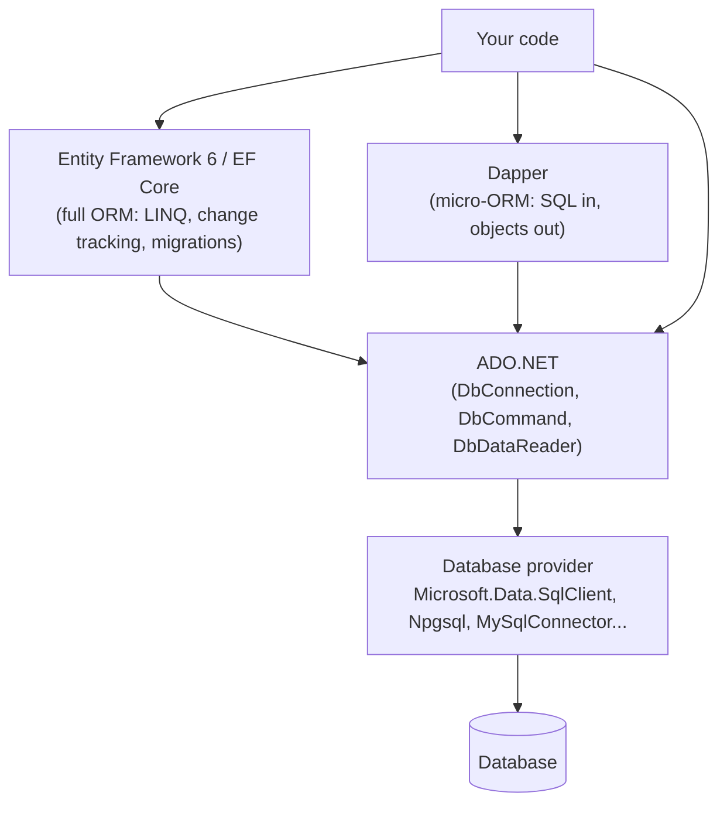
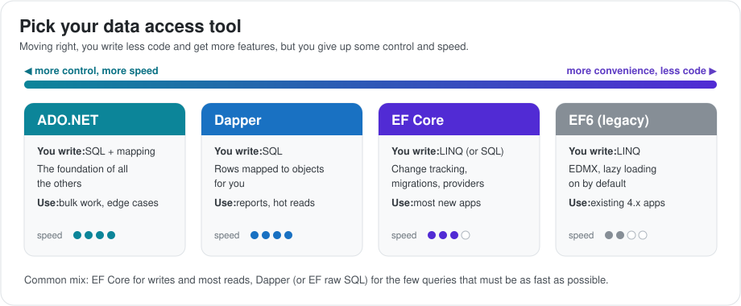
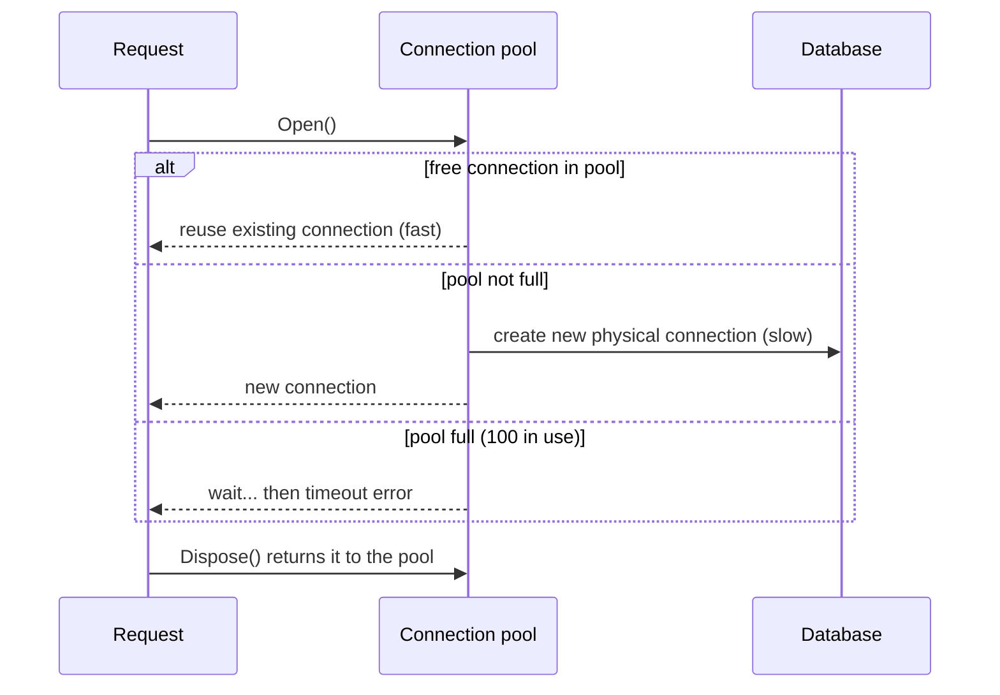
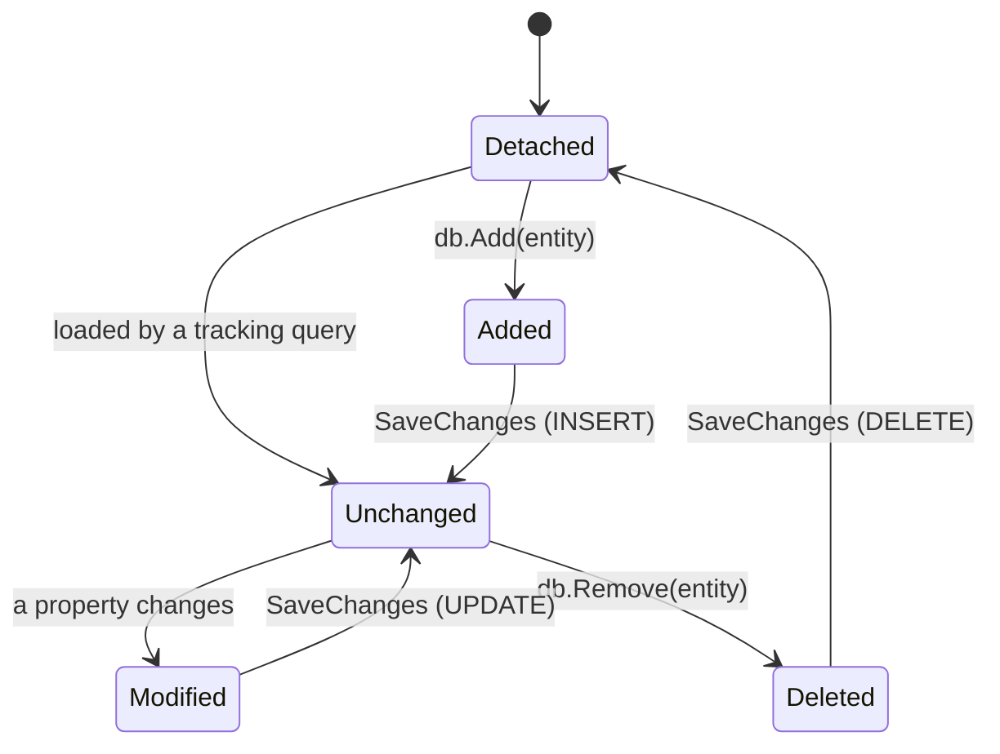
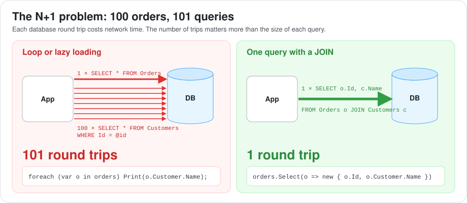
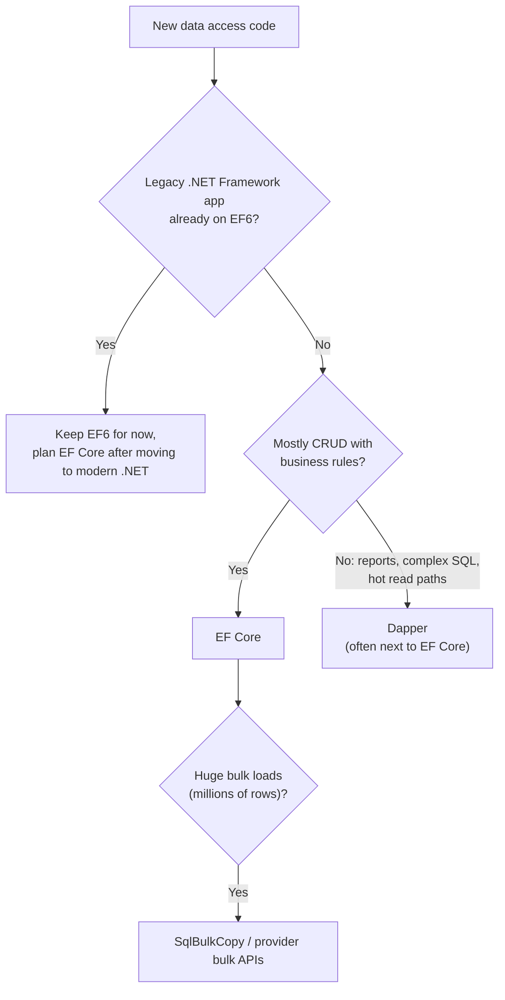

# Data Access in .NET: ADO.NET, Dapper, Entity Framework 6 & EF Core

This guide explains how .NET applications talk to relational databases. It covers the low-level foundation (ADO.NET), the lightweight micro-ORM (Dapper), the classic ORM of the .NET Framework era (Entity Framework 6), and the modern ORM (Entity Framework Core). For each one you will see how it works, when to use it, and the performance traps that show up in production and in interviews.

Related guides:

- [.NET Platform](../index.md): memory, the thread pool and why async database calls matter.
- [C# Language Deep Dive](../csharp/index.md): LINQ, `IQueryable`, expression trees and async/await.
- [ASP.NET: From 4.5 to Modern ASP.NET Core](../aspnet/index.md): how `DbContext` is wired into web requests.
- [SQL Concurrency, Locking, MVCC, and Duplication Control](../../../database/sql/concurrency-race-conditions/index.md) and [SQL Transactions](../../../database/sql/transaction/index.md): the database side of the story.

---

## 1. The Data Access Stack at a Glance

Every .NET data tool ends up using the same foundation: an ADO.NET **provider** that speaks the database's wire protocol. Higher-level tools add convenience on top.

### A. The Layers



### B. Quick Comparison



| | ADO.NET | Dapper | EF6 | EF Core |
| :--- | :--- | :--- | :--- | :--- |
| **You write** | SQL + manual mapping | SQL | LINQ (or SQL) | LINQ (or SQL) |
| **Mapping rows to objects** | By hand | Automatic | Automatic | Automatic |
| **Change tracking** | No | No | Yes | Yes |
| **Migrations** | No | No | Yes | Yes |
| **Runs on** | Everything | Everything | .NET Framework, and .NET Core 3.0+ (from EF 6.3) | Modern .NET (EF Core 3.1 was the last version that ran on .NET Framework) |
| **Speed** | Fastest | Almost as fast as ADO.NET | Slowest | Fast, close to Dapper for simple queries |
| **Best for** | Special cases, bulk work | Read-heavy, SQL-savvy teams | Legacy apps | Most new business apps |

---

## 2. ADO.NET: The Foundation

ADO.NET is the low-level API that ships with .NET. It gives you a connection, a command and a reader. Everything else is built on it, so knowing it helps you understand connection pools, parameters and transactions in every other tool.

### A. The Core Objects

| Object | Job |
| :--- | :--- |
| `DbConnection` (`SqlConnection`) | An open connection to the database |
| `DbCommand` (`SqlCommand`) | A SQL statement or stored procedure plus its parameters |
| `DbDataReader` (`SqlDataReader`) | Reads results forward-only, one row at a time (fast, low memory) |
| `DataSet` / `DataTable` | In-memory copy of tables (old, heavy, mostly legacy) |
| `DbTransaction` | Groups several commands into one atomic unit |

```csharp
await using var conn = new SqlConnection(connectionString);
await conn.OpenAsync(ct);

await using var cmd = new SqlCommand(
    "SELECT Id, Name, Price FROM Products WHERE CategoryId = @categoryId", conn);
cmd.Parameters.Add("@categoryId", SqlDbType.Int).Value = categoryId;

await using var reader = await cmd.ExecuteReaderAsync(ct);
var products = new List<Product>();
while (await reader.ReadAsync(ct))
{
    products.Add(new Product
    {
        Id = reader.GetInt32(0),
        Name = reader.GetString(1),
        Price = reader.GetDecimal(2)
    });
}
```

**Package note:** new code should use `Microsoft.Data.SqlClient`. The older `System.Data.SqlClient` is the .NET Framework-era package and only gets critical fixes.

### B. Connection Pooling

Opening a real database connection is slow (network handshake, login, TLS). ADO.NET keeps a **pool** of open connections and reuses them.

- `conn.Open()` borrows a connection from the pool. `conn.Dispose()` (or `Close()`) **returns it to the pool**. It does not really close it.
- Each unique connection string has its own pool. The default maximum is **100 connections** per pool for SQL Server.
- **Classic incident:** code forgets to dispose connections, so the pool runs dry and requests fail with *"Timeout expired. The timeout period elapsed prior to obtaining a connection from the pool."*
- **Fix:** always use `using`, keep connections open for as short a time as possible, and use async calls so requests don't hold connections while blocked.



### C. Parameters and SQL Injection

Never build SQL by joining strings with user input. Use parameters. The database then treats the input as data, never as SQL code.

```csharp
// DANGEROUS: name = "x'; DROP TABLE Users; --"
var bad = new SqlCommand($"SELECT * FROM Users WHERE Name = '{name}'", conn);

// SAFE: the value is sent separately from the SQL text
var good = new SqlCommand("SELECT * FROM Users WHERE Name = @name", conn);
good.Parameters.Add("@name", SqlDbType.NVarChar, 100).Value = name;
```

Parameters also help performance: the database can reuse the same execution plan for every value. (See also [SQL Injection at the Backend Level](../../../backend/security/SQL-injection-backend-level/index.md).)

### D. Transactions

```csharp
await using var conn = new SqlConnection(cs);
await conn.OpenAsync();
await using var tx = await conn.BeginTransactionAsync();
try
{
    await new SqlCommand("UPDATE Accounts SET Balance -= 100 WHERE Id = 1", conn, (SqlTransaction)tx).ExecuteNonQueryAsync();
    await new SqlCommand("UPDATE Accounts SET Balance += 100 WHERE Id = 2", conn, (SqlTransaction)tx).ExecuteNonQueryAsync();
    await tx.CommitAsync();
}
catch
{
    await tx.RollbackAsync();
    throw;
}
```

**`TransactionScope` trap:** `TransactionScope` stores the ambient transaction per thread by default. With `async` code, it must be created with `TransactionScopeAsyncFlowOption.Enabled` (available since .NET Framework 4.5.1), or the transaction is lost after the first `await`.

```csharp
using var scope = new TransactionScope(TransactionScopeAsyncFlowOption.Enabled);
// ... async work
scope.Complete();
```

### E. `DataSet` vs `DataReader`

| | `DataReader` | `DataSet` / `DataTable` |
| :--- | :--- | :--- |
| Model | Connected, streaming, forward-only | Disconnected, everything in memory |
| Memory | Low | High |
| Typical era | Still used everywhere (ORMs use it inside) | .NET Framework 2.0 / Web Forms data binding |
| Use today | Yes, for custom fast reads | Rarely, mostly in legacy code |

---

## 3. Dapper: The Micro-ORM

Dapper (made by Stack Overflow) is a small library that adds extension methods to `IDbConnection`. You still write SQL, but Dapper maps parameters and result rows to objects for you. It's popular because it's almost as fast as raw ADO.NET with much less code.

### A. Basic Usage

```csharp
await using var conn = new SqlConnection(cs);

// Query: rows -> objects
var products = await conn.QueryAsync<Product>(
    "SELECT Id, Name, Price FROM Products WHERE CategoryId = @CategoryId",
    new { CategoryId = categoryId });

// Single row
var product = await conn.QuerySingleOrDefaultAsync<Product>(
    "SELECT * FROM Products WHERE Id = @Id", new { Id = id });

// Insert / update
int rows = await conn.ExecuteAsync(
    "UPDATE Products SET Price = @Price WHERE Id = @Id", new { Id = id, Price = newPrice });
```

### B. Multi-Mapping (Joins)

```csharp
var sql = """
    SELECT o.Id, o.Total, c.Id, c.Name
    FROM Orders o JOIN Customers c ON c.Id = o.CustomerId
    """;
var orders = await conn.QueryAsync<Order, Customer, Order>(
    sql, (order, customer) => { order.Customer = customer; return order; }, splitOn: "Id");
```

### C. When to Use Dapper

| Use Dapper when | Avoid Dapper when |
| :--- | :--- |
| The team is strong in SQL and wants full control | You want LINQ, change tracking and migrations |
| Read-heavy endpoints, reports, dashboards | Complex object graphs that are loaded, changed and saved together |
| Performance-critical queries next to an EF Core app (a common hybrid) | You need to support several database engines with the same queries |
| Stored procedure-heavy legacy databases | |

---

## 4. Entity Framework 6: The .NET Framework-Era ORM

Entity Framework 6 (EF6) was the standard ORM for ASP.NET MVC 5 and Web API 2 apps on .NET Framework 4.5+. You will meet it in almost every legacy .NET codebase, so you need to know how it differs from EF Core.

### A. The Three Workflows

| Workflow | How it works | Status |
| :--- | :--- | :--- |
| **Database First** | Generate classes from an existing database into an `.edmx` designer file | Common in old enterprise apps. Not supported in EF Core (EF Core uses scaffolding instead). |
| **Model First** | Draw the model in the EDMX designer, generate the database | Rare. Removed in EF Core. |
| **Code First** | Write C# classes, EF builds the database (with migrations) | The standard approach. Carried over to EF Core. |

### B. EF6 Characteristics You Should Know

- **Lazy loading is ON by default.** Navigation properties marked `virtual` are loaded automatically the first time you touch them, through runtime-generated proxy classes. This is the main source of N+1 query problems in legacy apps.
- **`ObjectContext` vs `DbContext`:** EF 4 used `ObjectContext`. EF 4.1+ added the simpler `DbContext` API, which most EF6 code uses.
- **Configuration** lives in `web.config` / `app.config` (connection strings, `<entityFramework>` section).
- **Migrations** via Package Manager Console: `Enable-Migrations`, `Add-Migration`, `Update-Database`.
- **Async** support (`ToListAsync`, `SaveChangesAsync`) arrived in EF6 together with .NET 4.5.

```csharp
public class ShopContext : DbContext   // System.Data.Entity.DbContext
{
    public ShopContext() : base("name=ShopConnection") { }   // connection string from web.config
    public DbSet<Order> Orders { get; set; }
}

public class Order
{
    public int Id { get; set; }
    public virtual Customer Customer { get; set; }            // 'virtual' enables lazy loading proxies
    public virtual ICollection<OrderLine> Lines { get; set; }
}
```

### C. EF6 Today

- EF 6.3+ runs on .NET Core 3.0+ and modern .NET, which helps step-by-step migrations: move the app to modern .NET first, then switch EF6 to EF Core later.
- EF6 gets only stability and security fixes. All new features go into EF Core.

---

## 5. Entity Framework Core: Core Concepts

EF Core is a rewrite of Entity Framework for modern .NET. It is lighter, faster, cross-platform, supports many databases (SQL Server, PostgreSQL, MySQL, SQLite, Cosmos DB and more), and gets new features every year with each .NET release.

### A. DbContext and DbSet

The `DbContext` represents **one unit of work** with the database. It tracks the entities you load and turns your changes into SQL when you call `SaveChanges`.

```csharp
public class ShopDbContext(DbContextOptions<ShopDbContext> options) : DbContext(options)
{
    public DbSet<Order> Orders => Set<Order>();
    public DbSet<Customer> Customers => Set<Customer>();

    protected override void OnModelCreating(ModelBuilder b)
    {
        b.Entity<Order>(e =>
        {
            e.Property(o => o.Total).HasPrecision(18, 2);
            e.HasIndex(o => o.CreatedAt);
            e.HasOne(o => o.Customer).WithMany(c => c.Orders).HasForeignKey(o => o.CustomerId);
        });
    }
}

// Program.cs (ASP.NET Core): registered as a scoped service, one per request
builder.Services.AddDbContext<ShopDbContext>(o =>
    o.UseSqlServer(builder.Configuration.GetConnectionString("Shop")));
```

### B. Three Ways to Configure the Model

| Way | Example | Use for |
| :--- | :--- | :--- |
| **Conventions** | A property named `Id` becomes the primary key | The defaults. Less code. |
| **Data annotations** | `[MaxLength(100)]`, `[Required]` on properties | Simple rules, also reused by validation |
| **Fluent API** | `modelBuilder.Entity<Order>().HasIndex(...)` | Everything else. Keeps entities clean. Wins if both are used. |

### C. Migrations

Migrations are versioned C# files that describe schema changes. They let the database evolve with the code.

```bash
dotnet ef migrations add AddOrderStatus   # create a migration from model changes
dotnet ef database update                 # apply to the local database
dotnet ef migrations script --idempotent  # generate a SQL script for production
dotnet ef migrations bundle               # build a self-contained executable that applies migrations
```

**Production tip:** don't call `Database.Migrate()` at app startup when you run several instances. They can race each other. Apply migrations as a separate deployment step (SQL script or migration bundle).

### D. Change Tracking: How `SaveChanges` Knows What to Do

Every entity loaded through a tracking query gets a **state**:



```csharp
var order = await db.Orders.FirstAsync(o => o.Id == id); // state: Unchanged (a snapshot is kept)
order.Status = OrderStatus.Shipped;                      // detected as Modified at SaveChanges
db.Orders.Add(new Order { CustomerId = 5 });             // Added
await db.SaveChangesAsync();                             // one transaction: UPDATE + INSERT
```

`SaveChanges` runs all pending changes in **one transaction** and sends them in batches. That's why `DbContext` already acts as a "unit of work".

---

## 6. Querying With EF Core

EF Core translates your LINQ into SQL. Most performance problems come from writing LINQ without thinking about the SQL it produces.

### A. Tracking vs No-Tracking

| | Tracking (default) | `AsNoTracking()` |
| :--- | :--- | :--- |
| Keeps a snapshot for change detection | Yes | No |
| Memory and CPU | Higher | Lower |
| Use for | Data you will modify and save | Read-only endpoints (lists, reports, GET APIs) |

```csharp
var list = await db.Products.AsNoTracking().Where(p => p.IsActive).ToListAsync(ct);
```

You can also make no-tracking the default for a context: `optionsBuilder.UseQueryTrackingBehavior(QueryTrackingBehavior.NoTracking)`.

### B. Loading Related Data

| Strategy | How | When |
| :--- | :--- | :--- |
| **Eager loading** | `.Include(o => o.Lines).ThenInclude(l => l.Product)` | You know you need the related data |
| **Projection** | `.Select(o => new OrderDto(o.Id, o.Customer.Name))` | Usually the best for reads: only the needed columns |
| **Explicit loading** | `await db.Entry(order).Collection(o => o.Lines).LoadAsync()` | Load later, only on some code paths |
| **Lazy loading** | Off by default. Needs the Proxies package and `UseLazyLoadingProxies()`. | Rarely. Easy to cause N+1. |

```csharp
// Projection: EF generates a SELECT with only these columns and the join
var dtos = await db.Orders
    .Where(o => o.CreatedAt >= from)
    .Select(o => new OrderSummary(o.Id, o.Customer.Name, o.Lines.Count, o.Total))
    .ToListAsync(ct);
```

### C. Split Queries vs Single Query

Including several collections in one query creates a big JOIN where rows multiply (the **cartesian explosion**). One order with 10 lines and 10 payments returns 100 rows.

```csharp
var orders = await db.Orders
    .Include(o => o.Lines)
    .Include(o => o.Payments)
    .AsSplitQuery()        // EF Core 5+: one SQL query per collection, no row multiplication
    .ToListAsync();
```

**Trade-off:** split queries mean more round trips, and the data can change between them unless you use a transaction with a suitable isolation level.

### D. Raw SQL When LINQ Is Not Enough

```csharp
// Interpolated values become parameters automatically, so this is safe from SQL injection
var top = await db.Products
    .FromSql($"SELECT * FROM Products WHERE CategoryId = {categoryId}")
    .OrderBy(p => p.Price)          // you can still compose LINQ on top
    .ToListAsync();

// EF Core 8+: query unmapped types
var stats = await db.Database
    .SqlQuery<SalesStat>($"SELECT Region, SUM(Total) AS Total FROM Orders GROUP BY Region")
    .ToListAsync();
```

**Danger:** `FromSqlRaw` with string concatenation is **not** safe. Use `FromSql` / `FromSqlInterpolated`, or pass parameters explicitly.

### E. Pagination

```csharp
// Offset paging: simple, but slow on deep pages (the database still scans the skipped rows)
var page = await db.Orders.OrderBy(o => o.Id).Skip((pageNo - 1) * size).Take(size).ToListAsync();

// Keyset (seek) paging: fast on any page, uses the index
var next = await db.Orders.Where(o => o.Id > lastSeenId).OrderBy(o => o.Id).Take(size).ToListAsync();
```

Always use `OrderBy` with `Skip`/`Take`. Without it, the order of rows is not guaranteed. (See also [Pagination, Filtering and Sorting](../../../backend/api/pagination-filtering-sorting/index.md).)

### F. Global Query Filters

Apply a filter to every query of an entity automatically, for example soft delete or multi-tenancy:

```csharp
modelBuilder.Entity<Order>().HasQueryFilter(o => !o.IsDeleted && o.TenantId == _tenantId);

// Bypass when needed (for example, in an admin screen)
var all = await db.Orders.IgnoreQueryFilters().ToListAsync();
```

EF Core 10 adds **named** query filters, so you can switch off one filter (for example soft delete) while keeping another (tenant).

### G. Client Evaluation

If EF Core can't translate part of a query to SQL:
- **EF Core 1.x and 2.x** quietly ran that part in memory, sometimes after loading the whole table. This caused hidden performance disasters.
- **EF Core 3.0+** throws an exception instead. Only the final `Select` projection may contain code that runs on the client.

```csharp
// Throws in EF Core 3.0+: MyCustomFormat can't be translated to SQL
db.Orders.Where(o => MyCustomFormat(o.Code) == "X").ToList();
```

---

## 7. Saving Data

### A. Bulk Updates and Deletes Without Loading Entities (EF Core 7+)

Before EF Core 7, updating 10,000 rows meant loading 10,000 entities into memory. Now one SQL statement does it:

```csharp
await db.Orders
    .Where(o => o.Status == OrderStatus.Pending && o.CreatedAt < cutoff)
    .ExecuteUpdateAsync(s => s.SetProperty(o => o.Status, OrderStatus.Expired), ct);

await db.Logs.Where(l => l.CreatedAt < cutoff).ExecuteDeleteAsync(ct);
```

**Watch out:** these statements run directly in the database. They skip change tracking, so entities already loaded in the context are not updated.

### B. Optimistic Concurrency

Two users edit the same record at the same time. Without protection, the last save silently overwrites the first ("lost update"). A **concurrency token** makes EF Core check that the row has not changed since it was read.

```csharp
public class Product
{
    public int Id { get; set; }
    public int Stock { get; set; }
    [Timestamp] public byte[] RowVersion { get; set; } = []; // SQL Server rowversion, changes on every update
}

try
{
    product.Stock -= quantity;
    await db.SaveChangesAsync();   // UPDATE ... WHERE Id = @id AND RowVersion = @originalVersion
}
catch (DbUpdateConcurrencyException)
{
    // someone else changed the row: reload, retry, or tell the user
}
```

### C. Explicit Transactions

`SaveChanges` is already transactional. Use an explicit transaction only when you need several `SaveChanges` calls, or raw SQL plus `SaveChanges`, to succeed or fail together.

```csharp
await using var tx = await db.Database.BeginTransactionAsync(ct);
await db.SaveChangesAsync(ct);
await db.Database.ExecuteSqlAsync($"EXEC RecalculateTotals {orderId}", ct);
await tx.CommitAsync(ct);
```

### D. Connection Resiliency

Cloud databases have short network blips. EF Core can retry automatically:

```csharp
o.UseSqlServer(cs, sql => sql.EnableRetryOnFailure(maxRetryCount: 5));
```

If you use a retrying strategy together with your own transaction, wrap the whole block in `db.Database.CreateExecutionStrategy().ExecuteAsync(...)`, so the transaction is retried as one unit.

---

## 8. Common Performance Problems and How to Fix Them

### A. The Problem List

| Problem | What it looks like | Fix |
| :--- | :--- | :--- |
| **N+1 queries** | 1 query for orders, then 1 query per order for its customer | `Include`, or better, a projection with `Select` |
| **Cartesian explosion** | Several `Include`s of collections return millions of rows | `AsSplitQuery()` or separate queries |
| **Over-fetching** | Loading whole entities to show 2 columns | Project into a DTO with `Select` |
| **Tracking read-only data** | High memory and CPU on GET endpoints | `AsNoTracking()` |
| **Filtering in memory** | `ToList()` or `AsEnumerable()` before `Where` | Keep the query `IQueryable` until the end |
| **Missing indexes** | Slow `WHERE` / `ORDER BY` columns | `HasIndex` + check the execution plan |
| **Huge contexts** | One `DbContext` that lives for minutes and tracks thousands of entities | Short-lived contexts, one per unit of work |
| **Sync calls** | `ToList()` instead of `ToListAsync()` in web apps | Async APIs to keep threads free |

### B. N+1 in Action



```csharp
// N+1: one query for the orders, then one query per order (lazy loading or a loop)
var orders = await db.Orders.ToListAsync();
foreach (var o in orders)
    Console.WriteLine(o.Customer.Name);   // a query per iteration if lazy loading is on

// One query with a JOIN
var rows = await db.Orders
    .Select(o => new { o.Id, CustomerName = o.Customer.Name })
    .ToListAsync();
```

### C. Always Look at the SQL

```csharp
// Log generated SQL during development
builder.Services.AddDbContext<ShopDbContext>(o => o
    .UseSqlServer(cs)
    .LogTo(Console.WriteLine, LogLevel.Information)
    .EnableSensitiveDataLogging());   // shows parameter values, development only!

// Or inspect one query
var sql = db.Orders.Where(o => o.Total > 100).ToQueryString();
```

### D. Extra Speed-Ups

- **DbContext pooling:** `AddDbContextPool<T>()` reuses context instances instead of creating new ones for every request.
- **Compiled queries:** `EF.CompileAsyncQuery(...)` skips the LINQ-to-SQL translation step for very hot queries.
- **Compiled models** (EF Core 6+): speed up startup for apps with very large models.
- **Dapper for the hottest read paths:** many teams use EF Core for writes and Dapper for heavy reports.

---

## 9. EF Core Modeling Features

| Feature | What it solves | Example |
| :--- | :--- | :--- |
| **Owned types** | A value object stored in the owner's table, for example `Address` inside `Customer` | `b.OwnsOne(c => c.Address)` |
| **Complex types** (EF Core 8+) | Value objects with no identity, a better fit for DDD value objects | `b.ComplexProperty(c => c.Address)` |
| **Value converters** | Store a type differently, for example an enum as a string or a strongly typed ID as an int | `.HasConversion<string>()` |
| **Shadow properties** | Columns that exist in the database but not on the C# class, for example `LastUpdated` | `b.Property<DateTime>("LastUpdated")` |
| **JSON columns** (EF Core 7+) | Store a nested object as JSON and still query inside it with LINQ | `b.OwnsOne(o => o.Metadata, m => m.ToJson())` |
| **Primitive collections** (EF Core 8+) | Store a `List<string>` or `int[]` without a join table | `public List<string> Tags { get; set; }` |
| **Interceptors** | Hook into commands and `SaveChanges`, for example audit columns or soft delete | `AddInterceptors(new AuditInterceptor())` |
| **Inheritance mapping** | Map class hierarchies to tables | See below |

### A. Inheritance Strategies

| Strategy | Tables | Pros | Cons |
| :--- | :--- | :--- | :--- |
| **TPH** (Table per Hierarchy, default) | One table with a discriminator column | Fastest queries, no joins | Many nullable columns |
| **TPT** (Table per Type, EF Core 5+) | One table per class, joined by key | Clean, normalized schema | Joins on every query, slow |
| **TPC** (Table per Concrete type, EF Core 7+) | One table per concrete class, no base table | No joins for concrete queries | Querying the base type needs `UNION`. IDs must be unique across tables. |

---

## 10. DbContext Lifetime, Threading and Pooling

### A. The Rules

- **`DbContext` is not thread-safe.** Never run two operations on the same context at the same time. `Task.WhenAll` over two queries on one context throws *"A second operation was started on this context instance before a previous operation completed."*
- **Short-lived:** one context per unit of work. In ASP.NET Core that means one per request (it is registered as **scoped**).
- **Never inject a `DbContext` into a singleton.** It becomes a "captive dependency" that is shared across requests and threads.
- **In background services**, create a scope for each job, or use `IDbContextFactory<T>`:

```csharp
public class CleanupWorker(IDbContextFactory<ShopDbContext> factory) : BackgroundService
{
    protected override async Task ExecuteAsync(CancellationToken ct)
    {
        while (!ct.IsCancellationRequested)
        {
            await using var db = await factory.CreateDbContextAsync(ct);   // fresh context per run
            await db.Logs.Where(l => l.CreatedAt < DateTime.UtcNow.AddDays(-30)).ExecuteDeleteAsync(ct);
            await Task.Delay(TimeSpan.FromHours(1), ct);
        }
    }
}
```

### B. Lifetime in Classic ASP.NET vs ASP.NET Core

| | ASP.NET MVC 5 + EF6 | ASP.NET Core + EF Core |
| :--- | :--- | :--- |
| Creation | `new ShopContext()` in the controller, or "per request" with Unity/Autofac/Ninject | Built-in DI: `AddDbContext` (scoped) |
| Disposal | `Dispose()` override in the controller, or the DI container | Automatic at the end of the request |
| Config | `web.config` connection strings | `appsettings.json` + options |

---

## 11. EF6 vs EF Core: Differences and Migration

### A. Key Differences

| Topic | EF6 | EF Core |
| :--- | :--- | :--- |
| Platforms | .NET Framework (also .NET Core 3.0+ from 6.3) | Modern .NET |
| EDMX designer / Database First | Yes | No. Use `dotnet ef dbcontext scaffold` instead. |
| Lazy loading | On by default | Off by default (opt-in) |
| Unit testing | Mock `DbSet` (painful) | SQLite in-memory or Testcontainers. (The InMemory provider exists but doesn't behave like a real database.) |
| Bulk update/delete | No (third-party libraries) | `ExecuteUpdate` / `ExecuteDelete` |
| Batching of `SaveChanges` | One round trip per row | Batched statements |
| Many-to-many without a join entity | Yes | Yes since EF Core 5 |
| Global query filters, shadow properties, alternate keys | No | Yes |
| Performance | Slower | Much faster |
| New features | No | Every year |

### B. Migration Steps (EF6 to EF Core)

1. Move the app to modern .NET first, keeping EF6 (6.3+ supports it). Change one thing at a time.
2. Replace `System.Data.Entity` namespaces with `Microsoft.EntityFrameworkCore`.
3. Move EDMX or attribute configuration into the Fluent API (or scaffold from the database).
4. Find code that relied on lazy loading and add `Include` or projections.
5. Re-create the migrations baseline: generate an initial EF Core migration that matches the existing schema, and mark it as already applied.
6. Run integration tests against a real database and compare the generated SQL for important queries.

---

## 12. Repository and Unit of Work: Do You Still Need Them?

`DbContext` is already a unit of work, and `DbSet<T>` is already a repository. Wrapping them in generic `IRepository<T>` classes is a long-running debate.

| Arguments for a repository layer | Arguments against it |
| :--- | :--- |
| Hides EF from the domain layer (Clean Architecture / DDD) | Generic repositories hide useful EF features (`Include`, projections, `AsNoTracking`) |
| Gives one place for complex queries | Often returns `IEnumerable`, causing in-memory filtering |
| Easier to mock in unit tests | Tests against a real database (Testcontainers) catch more bugs than mocks |

**A practical middle ground:** no generic repository. Write **specific** query or repository classes per aggregate (`IOrderRepository.GetWithLinesAsync(id)`), or use DbContext directly in application services, and test with a real database.

---

## 13. Choosing the Right Tool



---

## 14. Summary: Data Access Best Practices

1. **Always use parameters.** Never build SQL by concatenating strings.
2. **Dispose connections and contexts quickly**, and let the connection pool do its job.
3. **Use async APIs** (`ToListAsync`, `SaveChangesAsync`) in web apps.
4. **Read with `AsNoTracking` and projections.** Write with tracked entities.
5. **Watch for N+1 and cartesian explosions.** Look at the generated SQL.
6. **Use concurrency tokens** for data that several users can edit.
7. **Keep `DbContext` scoped and single-threaded.** Use `IDbContextFactory` in background work.
8. **Run migrations as a deployment step**, not inside every app instance at startup.
9. **Mix tools on purpose:** EF Core for most work, Dapper or raw SQL for hot paths and reports.

---

## 15. Interview Masterclass: High-Impact Q&As

### Q1: What is connection pooling in ADO.NET, and what happens if you forget to dispose connections?
* **Answer:** ADO.NET keeps a pool of open physical connections for each unique connection string. `Open()` borrows one and `Dispose()`/`Close()` returns it. If connections are not disposed, they stay checked out until the GC finalizes them, the pool hits its maximum (100 by default for SQL Server), and new requests wait and then fail with "Timeout expired... prior to obtaining a connection from the pool". Always wrap connections in `using` and keep them open for as short a time as possible.

### Q2: What is the N+1 problem, and how do you fix it in EF Core?
* **Answer:** It happens when you run one query to load a list, then one extra query for each item to load related data, often hidden by lazy loading or by a loop that calls the database. 100 orders turn into 101 queries. Fix it by loading related data in the same query with `Include`, or better, by projecting only the needed fields with `Select`, which EF turns into a single JOIN. Keep lazy loading off unless you really need it.

### Q3: When should you use `AsNoTracking()`?
* **Answer:** For read-only queries, such as GET endpoints, lists and reports. Tracking keeps a snapshot of every loaded entity so `SaveChanges` can detect changes. That costs memory and CPU and isn't needed if you won't modify the data. For entities you will update and save, keep tracking on.

### Q4: What is a cartesian explosion, and how do split queries help?
* **Answer:** When one query includes several collection navigations, the SQL JOIN multiplies rows. An order with 10 lines and 10 payments returns 100 rows, and the parent columns are repeated in each one. `AsSplitQuery()` makes EF Core load each collection with a separate SQL query and stitch the results together, which avoids the row multiplication. The trade-off is more round trips, and the data may not be consistent between queries unless they run in a suitable transaction.

### Q5: How does EF Core know what to save when you call `SaveChanges`?
* **Answer:** The change tracker records each tracked entity's state (Added, Unchanged, Modified, Deleted) and keeps a snapshot of its original values. On `SaveChanges`, it calls `DetectChanges`, compares the current values with the snapshots, generates INSERT/UPDATE/DELETE statements, batches them, and runs them in one transaction. After that, the states are reset to Unchanged.

### Q6: How do you handle concurrent edits to the same row?
* **Answer:** Use optimistic concurrency. Add a concurrency token, such as a SQL Server `rowversion` column marked with `[Timestamp]`, or a property marked `[ConcurrencyCheck]`. EF Core adds the original token value to the UPDATE's `WHERE` clause. If no row is affected, someone else changed it, and EF throws `DbUpdateConcurrencyException`. You then reload the data and retry, merge, or ask the user. For hot counters, an atomic SQL update (`ExecuteUpdate` with `SET Stock = Stock - 1 WHERE Stock > 0`) is often better.

### Q7: Why is `DbContext` registered as scoped, and what goes wrong if it is a singleton?
* **Answer:** A `DbContext` is a short-lived unit of work and is not thread-safe. Scoped means one instance per HTTP request, so each request gets its own change tracker and connection usage. As a singleton, it would be shared across concurrent requests (causing "a second operation was started on this context" errors), it would track more and more entities forever (a memory leak), and it would serve stale data. Background services should create a scope or use `IDbContextFactory` for each unit of work.

### Q8: What are the main differences between EF6 and EF Core?
* **Answer:** EF Core is a lighter, faster rewrite for modern .NET. It has no EDMX designer (it uses scaffolding instead), lazy loading is off by default, and it has batching, global query filters, shadow properties, `ExecuteUpdate`/`ExecuteDelete`, JSON columns, split queries and support for many database providers. EF6 is stable but only gets fixes. EF 6.3+ can run on modern .NET, which allows a step-by-step migration: move the runtime first, then move to EF Core.

### Q9: EF Core or Dapper: how do you choose?
* **Answer:** EF Core gives you LINQ, change tracking, migrations and less code for CRUD and complex domain models. Dapper gives you full control of the SQL with very little overhead, which suits reports, complex queries and hot read paths. They work well together: many systems use EF Core for writes and most reads, and Dapper (or EF Core raw SQL) for performance-critical queries.

### Q10: What happens if EF Core can't translate a LINQ expression to SQL?
* **Answer:** Since EF Core 3.0, it throws an `InvalidOperationException` that says the expression could not be translated. The only exception is the final projection (`Select`), which may contain client-side code. EF Core 1.x and 2.x silently ran the untranslatable part in memory, sometimes after loading entire tables, which caused hidden performance problems. You fix it by rewriting the expression using translatable functions, or by explicitly filtering in SQL first and then switching to in-memory LINQ with `AsEnumerable()` on a small result.

### Q11: How do you apply EF Core migrations safely in production?
* **Answer:** Treat them as a separate deployment step. Generate an idempotent SQL script (`dotnet ef migrations script --idempotent`) for review, or build a migration bundle, and run it once in the pipeline before the new version starts. Avoid `Database.Migrate()` at startup when you have several instances, because they can race each other. Make schema changes backward-compatible (expand, then contract), so the old and new app versions can run at the same time during a rolling deployment.

### Q12: Why is `TransactionScope` tricky with async code?
* **Answer:** By default, the ambient transaction is stored per thread. After an `await`, the code can continue on a different thread, so the transaction is no longer visible, or the scope throws when it is disposed on another thread. Create it with `TransactionScopeAsyncFlowOption.Enabled` (available since .NET Framework 4.5.1) so the transaction flows with the async context. In EF Core you can often use `BeginTransactionAsync` on the context instead.

### Q13: Do you need a repository pattern on top of EF Core?
* **Answer:** Not by default. `DbContext` is already a unit of work and `DbSet<T>` is already a repository. Generic repositories often hide useful features like `Include`, projections and `AsNoTracking`, and they push people toward returning `IEnumerable`, which leads to in-memory filtering. Specific repositories per aggregate can still make sense in DDD or Clean Architecture to keep the domain free of EF. Test against a real database (for example with Testcontainers) rather than mocking `DbSet`.
