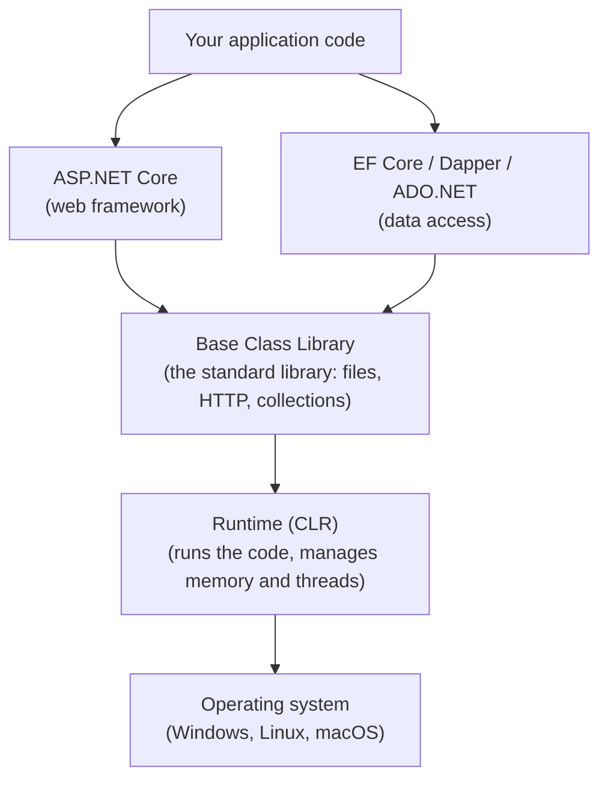
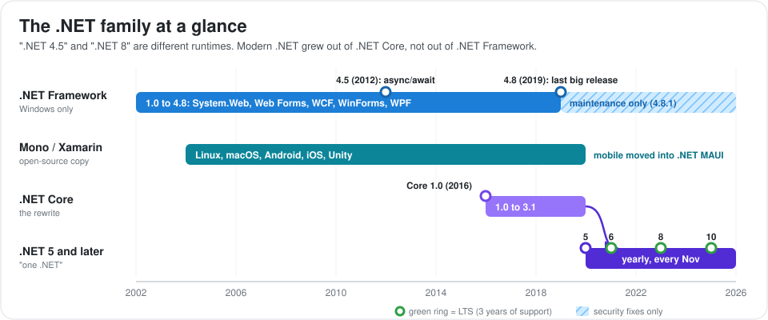
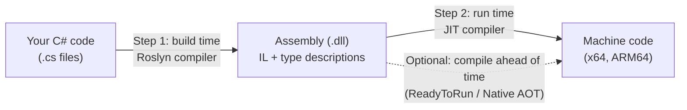
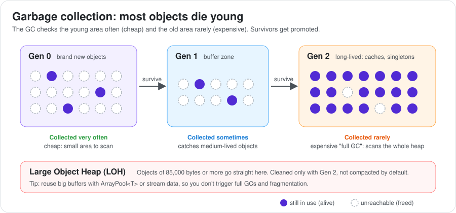
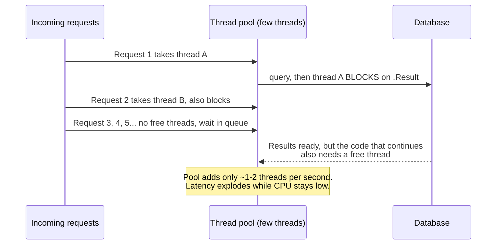

# .NET Platform: How It Runs Your Code

This guide covers the "engine room" under C# and ASP.NET. It explains how your code gets compiled and run, how memory and threads are managed, and how .NET grew from the Windows-only .NET Framework 4.5 into the cross-platform .NET we use today.

You don't need to know all of this to write a controller. But when an interviewer asks "why is this API slow?" or "why does memory keep growing?", the answer is usually at this level.

This guide is the entry point of the .NET section. It works together with these companion guides:

- [C# Language Deep Dive](./csharp/index.md): types, generics, delegates, LINQ, how async/await really works, modern C# features.
- [ASP.NET: From 4.5 to Modern ASP.NET Core](./aspnet/index.md): how ASP.NET evolved, side-by-side comparison, migration plan.
  - [ASP.NET on .NET Framework (4.5 to 4.8)](./aspnet/aspnet-framework/index.md): System.Web, the IIS pipeline, Web Forms, MVC 5, Web API 2, OWIN.
  - [Modern ASP.NET Core (.NET Core 1.0 to .NET 10)](./aspnet/aspnet-core/index.md): Kestrel, middleware, dependency injection, Minimal APIs, security, performance.
- [Data Access in .NET](./data-access/index.md): ADO.NET, Dapper, Entity Framework 6 and Entity Framework Core.

---

## 1. How the .NET Pieces Fit Together

### A. The Layers

Think of it as layers. Each layer is built on the one below it.



### B. Mapping to the Node.js World

If you know Node.js, this comparison helps:

| .NET piece | What it does | Node.js equivalent |
| :--- | :--- | :--- |
| **Runtime (CLR)** | Runs code, cleans up memory, manages threads. | V8 + libuv |
| **Base Class Library (BCL)** | Built-in standard library. | Core modules like `fs`, `http` |
| **C#** | The main programming language. | JavaScript / TypeScript |
| **ASP.NET Core** | Web framework. | Express / NestJS |
| **EF Core** | ORM (maps database tables to objects). | Prisma / TypeORM |

### C. What They Share and How They Differ

**What they all share:** automatic memory cleanup (garbage collection), the `Task` + `async/await` model, dependency injection, `IDisposable` for cleaning up resources, and NuGet packages.

**How they are versioned separately:**
- The **language** has its own versions: C# 5 up to C# 14.
- The **runtime** has its own versions: .NET Framework 4.5 to 4.8.1, then .NET Core 1.0 to 3.1, then .NET 5 to .NET 10.
- **ASP.NET** and **EF** also have their own history. Since .NET Core 3.0 they ship together with the runtime.

---

## 2. What Is ".NET"? A Short History

".NET" is not one product. It is a family of runtimes that share the same languages and ideas. ".NET 4.5" and ".NET 8" are two different runtimes, not two versions of the same one.

### A. Why It Matters
Job descriptions, legacy code and interview questions mix these names all the time. If you mix up ".NET Framework 4.8" and ".NET 8", you will give wrong answers about hosting, performance and migration.

### B. The Timeline



### C. The Four Members of the Family

**1. .NET Framework (2002 to today, maintenance only)**
- Runs only on Windows. It is installed as part of Windows, and all apps on the machine share it.
- Versions 4.5 to 4.8.1 are **in-place updates**. Installing 4.8 replaces 4.5, and old 4.5 apps then run on 4.8.
- Contains the classic web stack (`System.Web`), Web Forms, WCF, WinForms and WPF.
- **Today:** 4.8 / 4.8.1 is the last version. It still gets security fixes with Windows, but no new features. Versions 4.5 and 4.5.1 lost support in 2016, and 4.5.2 to 4.6.1 lost it in 2022.

**2. Mono / Xamarin**
- An open-source copy of .NET Framework that ran on Linux, macOS, Android and iOS.
- Powered Xamarin (mobile apps) and still powers the Unity game engine. Its mobile role now lives in .NET MAUI.

**3. .NET Core 1.0 to 3.1 (2016 to 2019)**
- A rewrite from scratch. It is open source, runs on Windows, Linux and macOS, and **each app can pick its own runtime version**. Two apps on one server can use different versions.
- It left behind the parts tied to Windows and IIS: `System.Web`, Web Forms, the WCF server and AppDomains.

**4. .NET 5 and later (2020 to today)**
- This is .NET Core continued under a simpler name. Version 4 was skipped so nobody would confuse it with .NET Framework 4.x.
- A new version ships **every November**.
  - **Even numbers are LTS** (Long Term Support): 3 years of fixes.
  - **Odd numbers are STS** (Standard Term Support): 24 months of fixes since .NET 9 (it used to be 18 months).

| Version | Year | Support | What people remember it for |
| :--- | :--- | :--- | :--- |
| .NET Core 2.1 | 2018 | LTS (ended) | `Span<T>`, SignalR, `IHttpClientFactory` |
| .NET Core 3.1 | 2019 | LTS (ended) | Generic Host, System.Text.Json, gRPC, Blazor Server |
| .NET 5 | 2020 | STS (ended) | One unified name, records (C# 9) |
| .NET 6 | 2021 | LTS (ended Nov 2024) | Minimal APIs, hot reload |
| .NET 7 | 2022 | STS (ended) | Rate limiting, output caching |
| .NET 8 | 2023 | LTS (ends Nov 2026) | Native AOT for web, Blazor Web App, keyed DI |
| .NET 9 | 2024 | STS | HybridCache, built-in OpenAPI, smarter Server GC |
| .NET 10 | 2025 | LTS (until Nov 2028) | C# 14, built-in Minimal API validation, `dotnet run app.cs` |

### D. What About ".NET Standard"?

.NET Standard is a **list of APIs**, not a runtime. It was the bridge that let one library run on both old and new .NET.

- A library built for `netstandard2.0` works on .NET Framework 4.6.1+, .NET Core 2.0+, Mono and Unity.
- **Use it today** only when a library must still support .NET Framework apps.
- **Otherwise** target a modern version directly (`net8.0`, `net10.0`). You get newer and faster APIs.

**Interview tip:** If someone says ".NET 4.5", they mean .NET **Framework** 4.5. If they say ".NET 8", they mean modern .NET (the successor of .NET Core).

---

## 3. The Runtime and Its Vocabulary

The **CLR** (Common Language Runtime) is the program that runs .NET code. It is to .NET what the JVM is to Java.

### A. Why It Matters
The CLR is the reason C# feels "safe". You don't free memory by hand, arrays check their bounds, and an exception in one method can be caught in another. Knowing what the CLR does tells you what you get for free and what you still have to handle yourself.

### B. What the CLR Does for You
1. **Loads** your compiled code (assemblies).
2. **Compiles** it into machine code just before it runs (the JIT, see section 3).
3. **Cleans up memory** you no longer use (the garbage collector, see section 5).
4. **Keeps things type-safe**: no random memory access, no array overflow.
5. **Handles exceptions** across methods and even across languages.
6. **Manages threads**, including a shared pool of worker threads (see section 6).
7. **Talks to native code** when you need it (P/Invoke for C libraries, COM on Windows).

### C. Words You Will Hear

| Term | Plain meaning |
| :--- | :--- |
| **CLR / CoreCLR** | The runtime. CoreCLR is the modern, cross-platform version. |
| **IL** (also MSIL or CIL) | Intermediate Language. A portable bytecode that compilers produce. Not yet machine code. |
| **Assembly** | A compiled `.dll` or `.exe`. Contains IL plus a description of every type inside. |
| **BCL** | Base Class Library, the built-in standard library. |
| **CTS** | Common Type System. The shared rules for types, so C#, F# and VB.NET can use each other's classes. |
| **CLS** | Common Language Specification. The subset of rules every .NET language must support. |
| **Managed code** | Code run by the CLR. "Unmanaged" code (C/C++) runs outside of it. |

---

## 4. From Source Code to Running Program

.NET compiles your code **twice**. First at build time into IL (portable bytecode). Then at run time the JIT turns IL into real machine code for the exact CPU it is running on.

### A. Why It Matters
This two-step design explains several things: why the first request to a fresh app is slow ("warm-up"), why .NET can get faster after running for a while, and why options like Native AOT exist.

### B. How It Works



**Step 1: Roslyn (build time)**
- Roslyn is the C# compiler. It turns `.cs` files into IL inside an assembly.
- It also runs **analyzers** (warnings and code fixes) and **source generators** (code that writes code during build, C# 9+).

**Step 2: the JIT (run time)**
- JIT means "Just-In-Time". The first time a method is called, the JIT compiles it into machine code. After that, calls go straight to the compiled code.
- That is why the first request to a new app is slower.

### C. How .NET Gets Faster While Running

Modern .NET compiles hot code twice. This is called **tiered compilation**:

| Tier | When | Goal |
| :--- | :--- | :--- |
| **Tier 0** | First call | Compile fast so the app starts quickly. Code is not well optimized. |
| **Tier 1** | After a method is called ~30 times | Recompile with full optimizations. |

On top of that, **Dynamic PGO** (on by default since .NET 8) watches what really happens in Tier 0. For example, "this `IShape` is almost always a `Circle`". Tier 1 then generates code optimized for that case.

**Example of what that means:**
```csharp
// You write this:
double TotalArea(IEnumerable<IShape> shapes) => shapes.Sum(s => s.Area());

// If PGO sees that 99% of shapes are Circle, the optimized code
// behaves roughly like this (conceptually):
//   if (s is Circle c) -> inline Circle.Area() directly (fast path)
//   else               -> normal interface call (slow path)
```

### D. Compiling Ahead of Time (AOT)

Sometimes you don't want to wait for the JIT, for example with serverless functions that start cold. You have three choices:

| Option | What it does | Good for | Watch out |
| :--- | :--- | :--- | :--- |
| **JIT (default)** | Compiles at run time. | Long-running servers. Best top speed thanks to PGO. | Slower startup. |
| **ReadyToRun** | Ships pre-compiled code, keeps IL as a backup so the JIT can still optimize. | Faster startup with no compatibility risk. | Bigger files. |
| **Native AOT** | Compiles everything into one native executable. No JIT at all. | Containers, serverless, CLI tools. Starts in milliseconds, uses less memory. | Code that relies on reflection (inspecting types at run time) may break. Many classic MVC and EF Core features are not fully supported. |

**Old name you may see:** .NET Framework had **NGEN** for pre-compiling. ReadyToRun replaced it.

---

## 5. Value Types vs Reference Types

A **value type** variable holds the data itself and is copied when you assign it. A **reference type** variable holds an address that points to an object somewhere else, and copying it only copies the address.

### A. Why It Matters
This decides whether a change made in one place shows up somewhere else, how much memory you allocate, and how much work the garbage collector has to do.

### B. The Two Kinds

| | Value types | Reference types |
| :--- | :--- | :--- |
| **Examples** | `int`, `bool`, `double`, `DateTime`, `enum`, any `struct` | `string`, arrays, any `class`, `record`, delegates |
| **Assignment** | Copies the whole value. | Copies the reference. Both variables point to the same object. |
| **Can be null?** | No (unless written as `int?`) | Yes |
| **Stored** | Inline, wherever it is declared | As an object on the managed heap |

```csharp
struct PointStruct { public int X; }
class  PointClass  { public int X; }

var a = new PointStruct { X = 1 };
var b = a;      // copy of the data
b.X = 99;
Console.WriteLine(a.X); // 1, a is untouched

var c = new PointClass { X = 1 };
var d = c;      // copy of the reference
d.X = 99;
Console.WriteLine(c.X); // 99, both point to the same object
```

```
Stack (method's local variables)       Managed heap
+---------------------------+          +------------------------------+
| a: PointStruct { X = 1 }  |          |  PointClass object { X = 99 }|
| b: PointStruct { X = 99 } |    +---->|                              |
| c: ref ------------------------+     +------------------------------+
| d: ref ------------------------+
+---------------------------+
```

### C. A Common Myth
"Value types live on the stack." **Not always.** A value type lives wherever its container lives:
- A local `int` in a method: usually on the stack.
- An `int` field inside a class: on the heap, inside that object.
- An `int` captured by a lambda or used after an `await`: moved to the heap by the compiler.

The real difference is **copy vs share**, not stack vs heap.

### D. Boxing: a Hidden Cost

**Boxing** happens when a value type is treated as an `object`. .NET wraps it in a new heap object. This costs memory and GC time.

```csharp
int n = 42;
object boxed = n;        // boxing: creates a heap object
int back = (int)boxed;   // unboxing: copies the value back

var oldList = new ArrayList();   // .NET 1.x style, stores object
oldList.Add(1);                  // boxes every number

var newList = new List<int>();   // generic, stores real ints
newList.Add(1);                  // no boxing
```

**Takeaway:** use generic collections (`List<T>`, `Dictionary<TKey, TValue>`) and avoid passing structs as `object` in hot code.

---

## 6. Garbage Collection: Automatic Memory Cleanup

The **garbage collector (GC)** finds objects that your program can no longer reach and frees their memory, so you never call `free()` yourself.

### A. Why It Matters
The GC removes whole classes of bugs (use-after-free, double free). But it is not free. GC pauses add latency, and some patterns make the GC work much harder than needed. Most .NET memory and latency problems come down to how the app uses the GC.

### B. How the GC Decides What is Garbage
1. It starts from **roots**: local variables on the stack, static fields, CPU registers.
2. It follows every reference to mark objects as **alive**.
3. Anything not marked is garbage. Its memory is freed.
4. It **compacts** the remaining objects (moves them together) so there are no holes.

### C. Generations: Why New Objects Are Cheap

Most objects die young. A request DTO, for example, lives for a few milliseconds. The GC uses that fact by splitting the heap into generations:



- **Gen 0 / Gen 1 collections** are fast because they only look at a small area.
- **Gen 2 collections** look at the whole heap and are expensive. You want them to be rare.

### D. The Large Object Heap (LOH)
- Objects of **85,000 bytes or more** (usually big arrays or strings) go straight to the LOH.
- The LOH is only cleaned during Gen 2 collections, and by default it is **not compacted**.
- **Classic problem:** an API that allocates a new 1 MB buffer for every request triggers frequent Gen 2 collections and fragments memory.
- **Fix:** reuse buffers with `ArrayPool<byte>.Shared`, or stream data instead of loading it all at once.

```csharp
// Instead of: var buffer = new byte[1_000_000]; (new LOH object each call)
byte[] buffer = ArrayPool<byte>.Shared.Rent(1_000_000);
try
{
    // use buffer
}
finally
{
    ArrayPool<byte>.Shared.Return(buffer);
}
```

### E. GC Modes

| Mode | Plain explanation | Default for |
| :--- | :--- | :--- |
| **Workstation GC** | One heap. Uses little memory. | Desktop and console apps |
| **Server GC** | One heap per CPU core, cleaned in parallel. Higher throughput, more memory. | ASP.NET / ASP.NET Core |
| **Background GC** | Most Gen 2 work runs while your code keeps running. | On by default |
| **DATAS** | Server GC that grows and shrinks the number of heaps with the load. | Server GC, since .NET 9 |

**Container tip:** In older versions, Server GC on a machine with many cores could use a lot of memory per heap, which surprised teams running many small containers. On .NET 9+ DATAS handles this. On older versions, set a memory limit or switch to Workstation GC.

### F. Dispose vs Finalizers

The GC only knows about memory. It does not know you need to close a file or a database connection **right now**. That is what `Dispose()` is for.

| | `Dispose()` / `using` | Finalizer `~MyClass()` |
| :--- | :--- | :--- |
| **When it runs** | Exactly when you call it, or at the end of a `using` block | Some time later, when the GC notices the object is dead |
| **Who calls it** | Your code | The GC's finalizer thread |
| **Cost** | Cheap | Expensive. The object survives one extra GC. |
| **Use for** | Every resource: files, sockets, DB connections, streams | Only as a last-resort safety net |

```csharp
// The using statement calls Dispose() even if an exception is thrown
using (var connection = new SqlConnection(connectionString))
{
    connection.Open();
    // ...
} // connection.Dispose() runs here and returns the connection to the pool

// Modern shorter form (C# 8+): disposed at the end of the enclosing scope
using var file = File.OpenRead("data.csv");
```

**Modern advice:** you almost never need to write a finalizer. If you wrap a native handle, use `SafeHandle`, which already does it correctly.

### G. "But There's a GC, How Can I Leak Memory?"

A leak in .NET means objects stay **reachable** by accident, so the GC cannot free them:

| Cause | Example | Fix |
| :--- | :--- | :--- |
| Event subscriptions | `StaticPublisher.Changed += this.OnChanged;` and never `-=` | Unsubscribe, or use weak events |
| Caches that only grow | `static Dictionary<string, Report>` | Use `MemoryCache` with size limits and expiry |
| Lambdas stored long term | A callback captures a big object | Capture only what you need |
| Not disposing | `CancellationTokenSource`, streams, `HttpResponseMessage` | `using` |
| DI lifetime mistakes | A singleton holds a scoped `DbContext` | See the ASP.NET Core guide (captive dependency) |

---

## 7. Threads, the Thread Pool and Tasks

Creating threads is expensive, so .NET keeps a **pool** of ready-to-use threads. ASP.NET runs each request on a pool thread. `async/await` lets that thread go back to the pool while waiting for I/O.

### A. Why It Matters
How well a .NET web server scales depends mostly on how well you treat the thread pool. The classic "API suddenly freezes under load while CPU is low" incident is almost always **thread pool starvation**.

### B. The Key Concepts

| Concept | Plain meaning | Use it for |
| :--- | :--- | :--- |
| `Thread` | A real OS thread (about 1 MB of stack). | Rare. Long-running dedicated work only. |
| **Thread pool** | A shared set of reusable threads managed by .NET. | Used automatically by ASP.NET, `Task.Run`, timers. |
| `Task` | A "promise" of a future result. **Not a thread.** | Any async operation. |
| `async` / `await` | Lets a method pause without blocking a thread. | All I/O: database, HTTP, files. |
| `Parallel.For`, PLINQ | Split CPU work across cores. | CPU-heavy work (image processing, math). |
| `Channel<T>` | Fast async queue between producers and consumers. | Background processing pipelines. |

### C. "There is No Thread"
While your code awaits a database query, **no thread is sitting there waiting**. The operating system tracks the network I/O and tells .NET when the data arrives. Then a pool thread picks up the rest of your method. That's why one server can handle thousands of concurrent requests with only a few dozen threads.

### D. Thread Pool Starvation, Step by Step



```csharp
// BAD: blocks a pool thread while waiting ("sync over async")
public IActionResult Get() => Ok(_http.GetStringAsync(url).Result);

// GOOD: the thread goes back to the pool while waiting
public async Task<IActionResult> Get() => Ok(await _http.GetStringAsync(url));
```

**How to fix it:** make the whole call chain async ("async all the way"). Raising `ThreadPool.SetMinThreads` only buys time.

---

## 8. Loading Code: GAC & AppDomains vs Modern .NET

.NET Framework shared libraries machine-wide (the GAC) and isolated apps inside one process (AppDomains). Modern .NET dropped both: each app carries its own libraries and is isolated by process or container.

### A. Why It Matters
This is the source of the old "DLL hell" problems and of many legacy deployment quirks you will meet during a migration.

| Topic | .NET Framework | Modern .NET |
| :--- | :--- | :--- |
| Shared libraries | **GAC** (Global Assembly Cache), one shared copy per machine | No GAC. Each app ships its own dependencies. |
| Version conflicts | Fixed by hand with **binding redirects** in `web.config` | Resolved automatically at build time |
| Isolation inside a process | **AppDomains**. IIS ran each site in one. Editing `web.config` restarted it. | Removed. Use separate processes or containers. |
| Loading/unloading plugins | Separate AppDomain | `AssemblyLoadContext` |

---

## 9. Projects, SDKs and Target Frameworks

Modern .NET project files are short, include files automatically, and list NuGet packages directly. A **Target Framework Moniker (TFM)** like `net10.0` tells the build which runtime you target.

### A. Old vs New Project Files

**.NET Framework 4.5 style:** long and fragile. Every file is listed, and package paths are hard-coded.
```xml
<Project ToolsVersion="12.0" xmlns="http://schemas.microsoft.com/developer/msbuild/2003">
  <PropertyGroup>
    <TargetFrameworkVersion>v4.5</TargetFrameworkVersion>
  </PropertyGroup>
  <ItemGroup>
    <Compile Include="Controllers\HomeController.cs" />
    <Reference Include="System.Web.Mvc, Version=5.2.3.0">
      <HintPath>..\packages\Microsoft.AspNet.Mvc.5.2.3\lib\net45\System.Web.Mvc.dll</HintPath>
    </Reference>
  </ItemGroup>
</Project>
```

**Modern "SDK-style":** short and readable.
```xml
<Project Sdk="Microsoft.NET.Sdk.Web">
  <PropertyGroup>
    <TargetFramework>net10.0</TargetFramework>
    <Nullable>enable</Nullable>
    <ImplicitUsings>enable</ImplicitUsings>
  </PropertyGroup>
  <ItemGroup>
    <PackageReference Include="Serilog.AspNetCore" Version="9.0.0" />
  </ItemGroup>
</Project>
```

| Topic | Old way | New way |
| :--- | :--- | :--- |
| Packages | `packages.config` + a `packages/` folder | `<PackageReference>` in the project file |
| Dependencies of dependencies | Listed one by one | Pulled in automatically |
| Same version across projects | Manual | `Directory.Packages.props` (Central Package Management) |
| Build | Visual Studio on Windows | `dotnet` CLI on any OS |

### B. Target Framework Monikers

| TFM | Means |
| :--- | :--- |
| `net45`, `net48`, `net481` | .NET Framework 4.5, 4.8, 4.8.1 |
| `netstandard2.0` | .NET Standard 2.0 (shared libraries) |
| `netcoreapp3.1` | .NET Core 3.1 |
| `net8.0`, `net10.0` | Modern .NET |
| `net8.0-windows` | Modern .NET plus Windows-only APIs (WinForms, WPF) |

**Multi-targeting** builds one library for several runtimes. It is very handy during migrations:
```xml
<TargetFrameworks>net48;net8.0</TargetFrameworks>
```
```csharp
#if NET48
    var path = HttpContext.Current.Server.MapPath("~/App_Data");
#else
    var path = Path.Combine(_env.ContentRootPath, "App_Data");
#endif
```

### C. Everyday Dotnet CLI Commands
```bash
dotnet new webapi -n Orders.Api   # create a project
dotnet add package Dapper         # add a NuGet package
dotnet build                      # compile
dotnet test                       # run tests
dotnet run                        # build and run
dotnet publish -c Release         # produce deployable output
```

---

## 10. Deployment Options

You can rely on a runtime installed on the server, bundle the runtime with your app, or compile to a native executable. Each choice trades size against convenience.

| Option | How it works | Good | Not so good |
| :--- | :--- | :--- | :--- |
| **.NET Framework on IIS** | Runtime comes with Windows. Copy the site into IIS. | Familiar for Windows teams. | Windows and IIS only. |
| **Framework-dependent** | Server has the .NET runtime installed. You ship only your app. | Small. Runtime patched separately. | Server must have the right version. |
| **Self-contained** | You ship your app plus the runtime. | Runs anywhere for that OS. Each app picks its version. | Bigger (around 70 MB+). You must patch it yourself. |
| **Single-file** | Everything in one executable. | Easy to hand out. | Still big unless trimmed. |
| **Native AOT** | Compiled to native code. | Tiny and very fast to start. | Not every library supports it. |
| **Container** | Use official images such as `mcr.microsoft.com/dotnet/aspnet:10.0`. | Standard in the cloud. Since .NET 8 they listen on port 8080 and can run as non-root. | You own image updates. |

---

## 11. Diagnostics: Finding Out What Is Wrong

.NET ships free command-line tools that show live metrics, CPU traces and memory snapshots of a running app, including inside containers.

| Symptom | First tool to use | What to look at |
| :--- | :--- | :--- |
| "It's slow, CPU is low" | `dotnet-counters` | ThreadPool Queue Length climbing means starvation |
| "It's slow, CPU is high" | `dotnet-trace` | Which methods use the CPU (open in PerfView or Visual Studio) |
| "Memory keeps growing" | `dotnet-gcdump` / `dotnet-dump` | Which types fill the heap and who keeps them alive (`gcroot`) |
| "It hangs / deadlocks" | `dotnet-dump` | `clrstack -all` to see where every thread is stuck |
| Production in containers | `dotnet-monitor` | Collects dumps and traces when a rule triggers |
| Ongoing monitoring | OpenTelemetry | Metrics, logs and traces sent to your monitoring system |

**Example: confirming thread pool starvation**
```bash
dotnet-counters monitor -p 1234 --counters System.Runtime
# ThreadPool Queue Length keeps rising, Thread Count grows by ~1/second

dotnet-dump collect -p 1234
dotnet-dump analyze ./dump_file
> clrstack -all
# Many threads stuck in Task.Wait() or .Result  =>  sync-over-async somewhere
```

---

## 12. .NET Compared With Other Platforms

| Topic | .NET | Java (JVM) | Node.js | Go |
| :--- | :--- | :--- | :--- | :--- |
| How code runs | IL + JIT, optional Native AOT | Bytecode + JIT, optional GraalVM native | JS + JIT | Compiled to native |
| Generics at run time | Kept (`List<int>` stores real ints) | Erased (`List<Integer>` boxes) | Not applicable | Kept |
| Custom value types | Yes (`struct`) | Not yet | No | Yes |
| Concurrency model | Thread pool + `async/await` | Threads, virtual threads (Java 21) | One event loop + helper pool | Goroutines |
| Heavy CPU work | Strong | Strong | Weak without worker threads | Strong |
| Startup time | Medium (fast with AOT) | Slow (fast with native image) | Fast | Very fast |

### A. When .NET is a Good Choice
- Business web APIs and back-office systems with lots of rules.
- High-throughput services. ASP.NET Core is one of the fastest mainstream web frameworks.
- Teams that want one typed language for web, cloud, desktop, games (Unity) and mobile (MAUI).
- Companies using Azure, Active Directory or other Windows tools.

### B. When to Think Twice
- You need tiny, instant-start binaries but your code depends heavily on reflection.
- The team and existing services all use another stack.
- Old .NET Framework apps built on Web Forms, WCF or AppDomains: moving them is real work. See the ASP.NET guide.

---

## 13. Summary: Key Habits for Healthy .NET Apps

1. **Know which .NET you are on.** .NET Framework 4.x and modern .NET are different runtimes with different hosting, tooling and support dates.
2. **Stay on an LTS version** and plan an upgrade every two years.
3. **Go async all the way** for I/O. Never block on `.Result` or `.Wait()` in server code.
4. **Dispose what you open** with `using`: connections, streams, files.
5. **Be kind to the GC.** Avoid boxing in hot paths, reuse large buffers with `ArrayPool<T>`, and put limits on caches.
6. **Pick the deployment model on purpose.** Framework-dependent containers for most APIs, Native AOT when startup time and memory matter most.
7. **Learn the diagnostics tools before you need them.** `dotnet-counters`, `dotnet-trace` and `dotnet-dump` answer most production questions.

---

## 14. Interview Masterclass: High-Impact Q&As

### Q1: What is the difference between .NET Framework, .NET Core, .NET Standard and .NET 5+?
* **Answer:** They are different members of one family.
  * **.NET Framework (1.0 to 4.8.1)** is the original Windows-only runtime. It is installed with Windows and updated in place, and it contains classic ASP.NET (`System.Web`).
  * **.NET Core (1.0 to 3.1)** is the open-source, cross-platform rewrite. Different versions can run side by side.
  * **.NET 5 and later** is .NET Core continued under one simple name. Version 4 was skipped.
  * **.NET Standard** is not a runtime. It is a list of APIs that lets one library run on several runtimes. Today it is mainly used for libraries that must also support .NET Framework.

### Q2: Why does .NET compile code twice (IL first, then JIT)?
* **Answer:** IL keeps the compiled assembly portable across CPUs and operating systems, and it carries rich type information that enables reflection and lets different .NET languages work together. The JIT then produces machine code tuned for the exact CPU it runs on. With tiered compilation and Dynamic PGO, it also tunes the code for how the app actually behaves. If startup time matters more, ReadyToRun or Native AOT compile ahead of time instead.

### Q3: What are tiered compilation and Dynamic PGO?
* **Answer:** With tiered compilation, every method is first compiled quickly with few optimizations (Tier 0) so the app starts fast. Methods that run often (about 30 calls, or long-running loops) are compiled again with full optimizations (Tier 1). Dynamic PGO, on by default since .NET 8, records what really happens in Tier 0, such as which concrete type is behind an interface. Tier 1 then uses that data to inline and devirtualize the common case.

### Q4: Do value types always live on the stack?
* **Answer:** No. A value type is stored wherever its container is. A local `int` is usually on the stack, but an `int` field inside a class lives on the heap with the object. Array elements live in the array on the heap, and a boxed value is a heap object. Locals captured by a lambda or used after an `await` are moved to the heap by the compiler. What really separates value and reference types is that value types are **copied** on assignment, while reference types are **shared**.

### Q5: How does the garbage collector work, and why is the Large Object Heap special?
* **Answer:** The GC finds every object reachable from roots (stack variables, statics, registers), frees the rest and compacts memory. It splits objects into generations. New objects start in Gen 0, which is collected often and cheaply, and survivors move to Gen 1 and then Gen 2. Objects of 85,000 bytes or more go to the Large Object Heap. It is only cleaned during expensive Gen 2 collections and is not compacted by default. Allocating many big temporary buffers therefore causes frequent full GCs and fragmentation. The fix is to reuse buffers with `ArrayPool<T>` or to stream the data.

### Q6: Workstation GC vs Server GC: which does ASP.NET use, and why?
* **Answer:** Workstation GC has one heap and keeps memory use low, which suits desktop apps. Server GC has one heap and one GC thread per CPU core, so it cleans up in parallel and gives much higher throughput for busy servers, at the cost of more memory. ASP.NET and ASP.NET Core use Server GC by default. Since .NET 9, DATAS adjusts the number of heaps to the actual load, which helps in containers with limited memory.

### Q7: What is the difference between `Dispose` and a finalizer?
* **Answer:** `Dispose` is called by your code, or automatically at the end of a `using` block, to release a resource right away. A finalizer is called by the GC some unknown time later, only as a safety net for when someone forgot to dispose. Objects with finalizers survive an extra GC cycle, so they cost more. `Dispose` should call `GC.SuppressFinalize(this)`. In modern code, use `SafeHandle` instead of writing finalizers.

### Q8: What is thread pool starvation, and how do you find and fix it?
* **Answer:** It happens when request threads are blocked while waiting, usually by `.Result`, `.Wait()` or synchronous I/O. The pool only adds about one or two new threads per second, so new requests and even the code that would unblock the waiting threads end up stuck in a queue. Latency goes up while CPU stays low. You can see it in `dotnet-counters` (a rising ThreadPool Queue Length) and in a memory dump (many threads waiting in `Task.Wait`). The real fix is to make the code async from end to end. Raising the minimum thread count is only a temporary patch.

### Q9: Why were AppDomains removed in .NET Core, and what replaced them?
* **Answer:** AppDomains were hard to support across operating systems, and they isolated less than most people thought. Modern .NET uses separate processes or containers for isolation, and `AssemblyLoadContext` to load and unload plugins inside one process.

### Q10: Framework-dependent vs self-contained vs Native AOT: how do you choose?
* **Answer:** Framework-dependent is the smallest option, but the server must have the right runtime installed. Self-contained bundles the runtime so the app runs anywhere for that OS, but it is bigger and your team must patch the runtime. Native AOT gives a single native file with the fastest startup and lowest memory use, but it only works if your code and libraries avoid unbounded reflection and runtime code generation. A typical choice is framework-dependent containers for regular APIs and Native AOT for serverless or very small services.

### Q11: What is the release and support policy of modern .NET?
* **Answer:** A new version ships every November. Even numbers (6, 8, 10) are LTS with 3 years of support. Odd numbers (7, 9) are STS with 24 months of support since .NET 9 (previously 18 months). Patches ship monthly. Most companies use LTS versions in production and plan an upgrade every two years.

### Q12: Should new libraries still target .NET Standard?
* **Answer:** Only if they must also work for .NET Framework users. In that case target `netstandard2.0`, often together with a modern target such as `net8.0`. Libraries that only need modern .NET should target `net8.0` or `net10.0` directly to get newer, faster APIs.

### Q13: How are .NET generics different from Java generics?
* **Answer:** .NET keeps the real generic types at run time. `List<int>` and `List<string>` are separate types, and the JIT creates specialized code for value types, so `List<int>` stores plain ints without boxing. You can also use `typeof(T)` or `new T()`. Java erases generic types during compilation, so `List<Integer>` stores boxed objects and the type argument is not available at run time.

### Q14: How can a garbage-collected app leak memory?
* **Answer:** The GC frees only objects that nothing references anymore. Leaks happen when references stay around by accident. Common causes are event handlers that never unsubscribe from a long-lived publisher, static caches without limits, lambdas stored in long-lived places, timers, undisposed resources, and singletons that hold scoped services. To find them, take a heap snapshot with `dotnet-gcdump`, see which types are growing, and use `gcroot` to find what keeps them alive.
